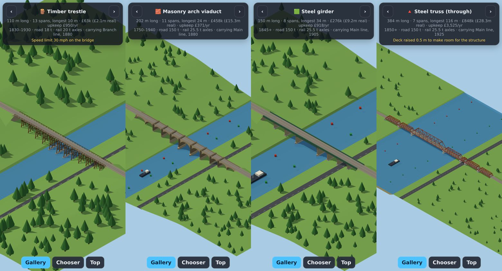
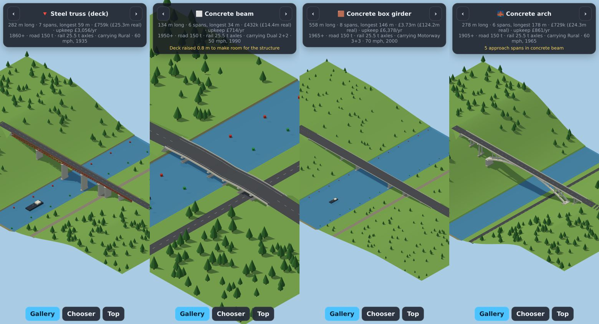
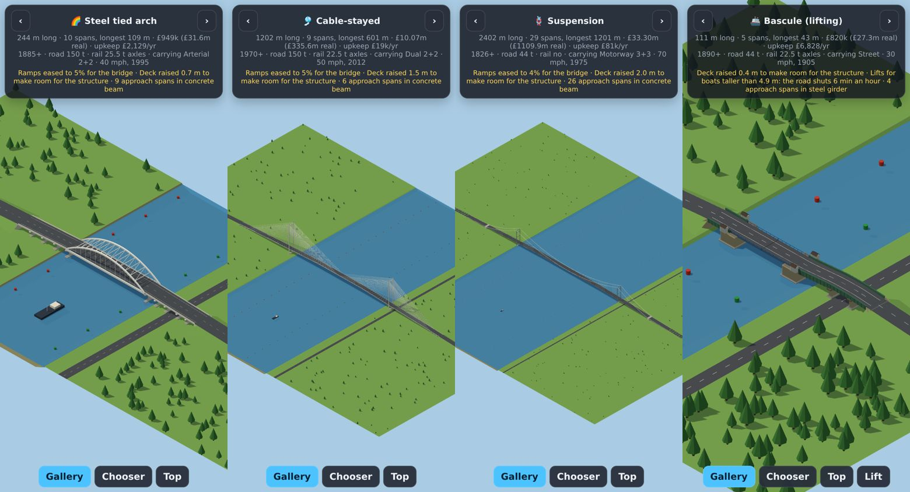
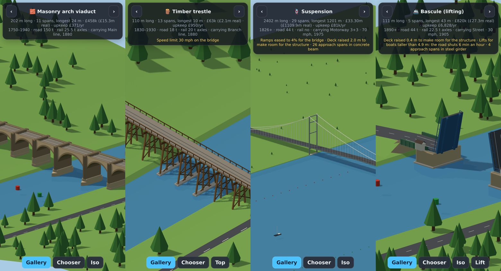
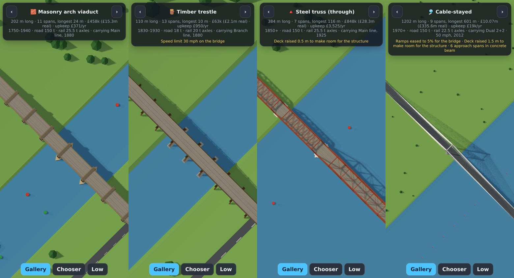
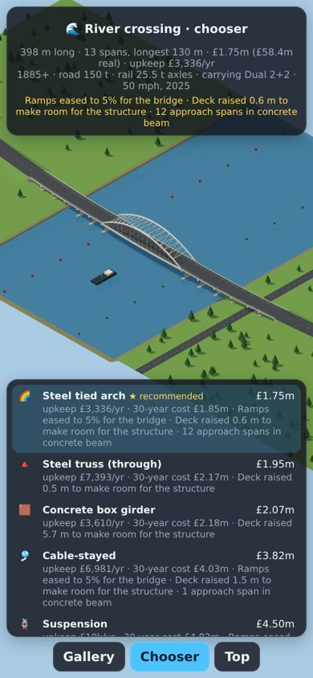
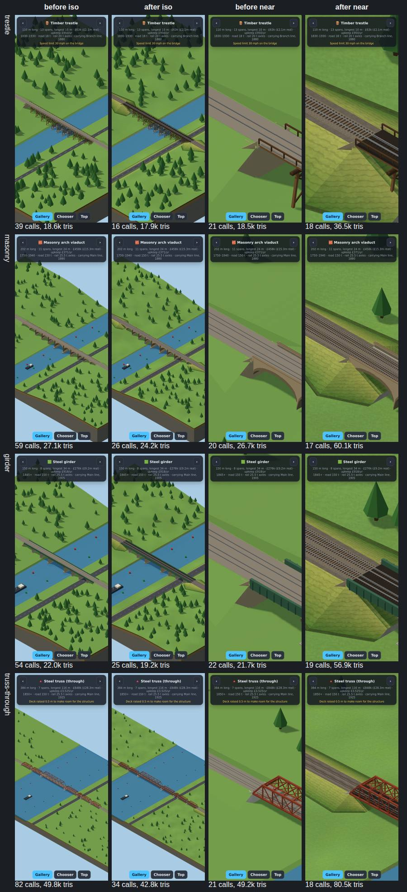
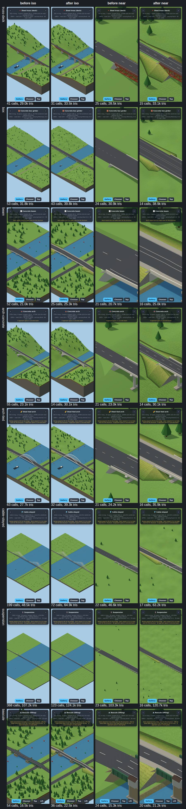

# Report: the bridges library

**The problem.** The user said that "bridges have their supports underneath them so they are
hard to see", and asked for "different types of bridges with different properties and costs".

Today a bridge in the game is a deck with thin grey piers every 24 m, tucked underneath where
the camera can't see them. Its cost is a flat `RAISE_COST` per metre of length per metre of
height. This work adds a library, `src/proto/bridges/`, that replaces both: twelve bridge types
with real differences, a chooser, a support layout, a costing model, and geometry that reads from
the game's camera. It is new files only. Nothing in the game uses it yet. `docs/bridges.md` has
the API and the step-by-step integration plan.

## What was built

- **Catalogue** (`catalogue.ts`). Twelve types:
  - timber trestle and masonry arch viaduct;
  - steel girder, steel truss (through) and steel truss (deck);
  - concrete beam, concrete box girder and concrete arch;
  - steel tied arch, cable-stayed and suspension;
  - bascule (lifting).

  Each has span and length limits, structural depth, loads (road tonnes and rail axle),
  gradient, pier height, speed limits, era, and a cost model: deck per m² rising towards the
  longest spans, piers by height, ends, main pylons or towers, and upkeep. The figures are
  loosely UK and 2020s. For example, a masonry arch reaches 40 m and a suspension bridge
  1,450 m; timber takes 20 t axles, and a suspension bridge takes no trains.
- **Crossing** (`crossing.ts`). What a bridge crosses, in distance along the route:
  - the deck profile from `grade.ts`;
  - the ground;
  - water with a navigation channel (width, air draft, tall boats an hour);
  - roads and railways underneath, with their headroom;
  - keep-outs.

  `extents()` finds the stretches that must be bridged. `resolve` lets the chooser ask the
  solver for a higher deck or gentler ramps.
- **Support layout** (`layout.ts`). Piers are spaced within each type's span, kept out of
  channels and off roads and railways (with setbacks), and stood in the water on footings.
  Arches are sized so the channel sits under the crown, not the haunches. Main-span types put
  their towers or pylons either side of the channel, with back spans, side spans, anchorages and
  approach spans in the era's ordinary type. The total cost comes from the actual layout, and
  each support has a footprint for the land registry.
- **Chooser** (`choose.ts`). It tries every type and refuses in plain words, for example:
  - "Span 126 m over the channel of the river is too long: a concrete beam spans 45 m at most —
    needs a steel truss (deck), steel truss (through) or longer"
  - "Rail too heavy for a timber trestle (22.5 t axles; it takes 20 t)"
  - "Can't carry a railway"
  - "Not invented until 1950"

  The buildable types are ranked by cost, and the recommended default is the cheapest over 30
  years. `override()` is the player's pick.
- **Geometry** (`geometry.ts`, `materials.ts`). Low-poly `BufferGeometry` for every type along a
  curved, sloping deck, one geometry per material (4–9 per bridge). There are 3,000–23,000
  triangles for ordinary bridges and 77,000 for a 2.4 km suspension bridge. The bascule leaves
  are separate objects on pivots, with `setOpen(t)`.
- **Demo** (`bridges-demo.html`, `demo.ts`). A gallery of each type over a river and a road at a
  phone-sized viewport from the isometric camera, and a river crossing where the chooser picks
  the type and the player can tap another.

## Decisions

- **One dimension.** Everything is worked out as distance along the route. The height solver
  already works that way, and obstacles become intervals, which keeps placement simple and fast.
  Plan positions are only added for geometry and footprints.
- **Seen from above.** The parts that tell the types apart are pushed out past the deck edge or
  up above it, because the camera looks down:
  - Masonry piers carry dark pilasters up past the parapet and have cutwaters in the water.
    The arch faces have a darker band of voussoirs.
  - Timber bents splay out and their cap beams stick out.
  - Girder and truss piers have caps wider than the deck.
  - Through trusses have X-bracing across the top.
  - Plate girders are half-through, so two green walls line the deck.
  - Pylons, towers and anchorages stand outside the deck.
  - Cables and hangers are slightly thicker than real, and white.

  The colours are chosen for contrast: sandstone against dark voussoirs, red oxide, heritage
  green, white concrete, grey towers and a blue bascule.
- **Real pounds, one scale.** Costs are real 2020s figures, so they can be checked against the
  world, and `COST_SCALE` turns them into game money. It was set so a 60 m three-span concrete
  bridge carrying a street costs about what `RAISE_COST` charges today (£90k against £77k). The
  real figure is £3.0m, about £4,200/m². Unlike `RAISE_COST`, the price scales with width.
- **The profile is the solver's, but the chooser can ask again.** The solver allows 1.2 m of
  deck. Most types are deeper, and long-span types want gentler ramps. Rather than duplicate
  the solver, the crossing carries a `resolve` callback. The chooser raises the deck or eases
  the ramps and tries again, up to five times and 20 m, and reports it: "Deck raised 0.6 m to
  make room for the structure". Without a callback those types are refused, with the height
  they'd need.
- **Main-span types get approach spans.** A suspension or cable-stayed bridge's main span goes
  over the channel. The rest is ordinary spans in the era's type (masonry, then girder, then
  concrete beam), as with the Humber or Severn approaches. Gradient limits apply per span, so
  the approaches may be steeper than the main span.
- **Recommend on whole-life cost.** The recommendation adds 30 years of upkeep, plus a charge
  for each minute a lifting bridge shuts the road, to the build cost. That's why a cheap timber
  trestle doesn't always win, and why a bascule loses on a busy river.
- **No existing files touched.** The library imports `grade.ts`, `catalog.ts`, `roads.ts` (for
  types) and `land.ts` (for types), and changes none of them. It has its own cached arc-length
  lookup, `pointOn`, because `roads.ts` `pointAt` is linear. It returns exactly the same answer
  (tested), and it took the chooser from about 500 ms to about 20 ms.

## Test results

`npx tsc --noEmit` is clean. `npx vitest run` gives 12 files and 90 tests, all passing: the 60
existing tests plus 30 new ones in `src/proto/bridges/`.

| File | Tests | What they check |
|---|---|---|
| `catalogue.test.ts` | 6 | Sane figures for every type; reach order; UK-like loads; eras and approach types; span pricing; opening time |
| `crossing.test.ts` | 3 | `pointOn` matches `pointAt`; `extents` covers every obstacle and nothing else; load demand |
| `layout.test.ts` | 9 | Piers within the span and out of the channel; boats cleared; footings in the water cost more; road headroom kept; the deck truss refused with a lift; spans out of reach refused; tall piers refused; masonry arches over the channel; suspension towers and anchorages; costs add up; footprints; bascule closures |
| `choose.test.ts` | 7 | Ranking and recommendation; every refusal explained; overrides; eras; loads (timber and main line, suspension and rail, heavy loads); the deck raised when it can be re-solved; every type buildable on its showcase crossing |
| `geometry.test.ts` | 5 | Every type builds with few materials and no NaNs, covering the deck; structure above the deck where expected; masonry piers wider than the deck; follows a curve; bascule leaves lift |

**Timings.** These are desktop timings under Node, not measured on a phone. Choosing takes
7–25 ms per crossing. Geometry takes 5–35 ms for ordinary bridges and 72 ms for the 2.4 km
suspension bridge.

**The chooser on its showcase river.** The crossing is a dual carriageway in 2025 over a 260 m
river with a 120 m channel (12 m air draft), plus a road:

| Type | Build | 30-year | Notes |
|---|---|---|---|
| ★ Steel tied arch | £1.75m | £1.85m | Ramps eased to 5%; deck raised 0.6 m; 12 approach spans |
| Steel truss (through) | £1.95m | £2.17m | Deck raised 0.5 m |
| Concrete box girder | £2.07m | £2.18m | Deck raised 5.7 m |
| Cable-stayed | £3.82m | £4.03m | Ramps eased to 5%; deck raised 1.5 m |
| Suspension | £4.50m | £4.82m | Ramps eased to 4%; deck raised 2.0 m |

The girder, concrete beam and bascule are refused because the span is too long for them. The
deck truss is refused because it's too deep, and there's no room to raise the deck 13 m. The
concrete arch is refused because it isn't deep enough. The timber trestle and masonry are
refused on era (and timber also on load).

## Screenshots

These are from headless Chromium (SwiftShader) at 390 × 844, the default iPhone size.

1. **The gallery at the game's camera angle.**
   - Timber trestle, masonry viaduct, steel girder and through truss:
     
   - Deck truss, concrete beam, box girder and concrete arch:
     
   - Tied arch, cable-stayed, suspension and bascule:
     
2. **Closer:** masonry piers with pilasters and cutwaters, splayed trestle bents, a suspension
   tower and hangers, and the bascule lifted.
   
3. **Straight down**, the hardest case: masonry, trestle, through truss and cable-stayed.
   
4. **The chooser.** The recommended type is starred, and each refused type has its reason.
   

## Known limits

- **Skew crossings.** Obstacles are intervals along the route, so a skew crossing's footprint has
  to be widened by the caller, as `crossings()` in `roads.ts` already does with
  `(half + 1.5) / sin`. Cross-slope of the ground is ignored, so each pier stands on one height.
- **The price of a higher deck.** When the chooser raises the deck or eases the ramps, the
  longer or higher embankments aren't counted in the bridge price. `check()` would count them
  with `RAISE_COST` after integration.
- **Pier spacing.** Spacing is even within each free stretch, not optimised across the whole
  bridge. Next to an obstacle it can leave a short stub span, such as a 4 m approach span beside
  a road.
- **Arches in low crossings.** Masonry arches flatten to segments when there's little height,
  and refuse below a rise of 0.2 × the span. A concrete arch needs a real valley.
- **Movable bridges.** Only a bascule is modelled, not a swing bridge. Closures use the average
  `tallPerHour` until boats are simulated.
- **Curves.** On a curved deck, trusses, cables and tied-arch ribs follow the curve. Real ones
  would be straight chords, but at game scale it reads fine.
- **Integration work still to do.** Nothing is merged across bridges yet: the game should batch
  per material per tile. The demo page isn't in the build inputs in `vite.config.ts`, which
  couldn't be edited. Reason strings are English literals.
- **The figures.** They are informed estimates for a game, not engineering. Loads are
  single-number capacities with no dynamic or fatigue checks.

## Earthworks and track

The user's feedback on the demo: the rebuilt ground at the bridge ends had no texture, so you
couldn't see the grass had been moved; on the steel bridge the rail and its foundations
flickered against the grass; and the track was plain, with no sleepers.

- **Earthworks.** The ground, the embankments and cuttings, spill slopes under the first span,
  benches for the roads underneath and the map's cut edges are now one mesh with one material
  (`earthMaterial()`): a world-space grass texture, slopes shaded from their real normals with
  rougher grass, a pale crest and a lush toe, a ditch at the foot, bare soil or rock in deep
  cuts.
- **Z-fighting.** Fixed at the source, not with offsets: the ballast is a real 0.3 m bed on a
  formation, roads stand on their own pavement, markings are part of the road's surface, and
  structural members run into what they bear on. `findFights()` checks every gallery type, the
  chooser and curved railways, near and far, for faces within 4 cm of each other. The demo's
  camera also keeps its depth range to the scene.
- **Track.** `track.ts`: ballast with shoulders, timber sleepers in chairs (before 1960) or
  concrete on baseplates, rails with head and foot, open timber decks with guard rails on steel
  and timber bridges. From the game's camera the bed is one textured mesh; zoomed in, instanced
  sleepers and real rails replace their painted twins.

Draw calls and triangles per frame (shadow pass included), at 412×915 @2×, before and after.
"Near" is zoomed in on the first abutment, where real sleepers and rails show on rail types.

| Type | Iso before | Iso after | Near before | Near after |
|---|---|---|---|---|
| Timber trestle | 39 · 18.6k | 16 · 17.9k | 21 · 18.5k | 18 · 36.5k |
| Masonry arch viaduct | 59 · 27.1k | 26 · 24.2k | 20 · 26.7k | 17 · 60.1k |
| Steel girder | 54 · 22.0k | 25 · 19.2k | 22 · 21.7k | 19 · 56.9k |
| Steel truss (through) | 82 · 49.8k | 34 · 42.8k | 21 · 49.2k | 18 · 80.5k |
| Steel truss (deck) | 41 · 29.0k | 31 · 33.5k | 25 · 28.5k | 15 · 33.1k |
| Concrete beam | 52 · 21.0k | 25 · 25.3k | 21 · 20.7k | 16 · 25.0k |
| Concrete box girder | 53 · 31.8k | 43 · 39.8k | 24 · 30.9k | 14 · 38.9k |
| Concrete arch | 55 · 23.1k | 14 · 30.1k | 21 · 23.0k | 14 · 30.1k |
| Steel tied arch | 63 · 27.7k | 32 · 39.3k | 21 · 24.2k | 16 · 35.9k |
| Cable-stayed | 199 · 48.5k | 72 · 64.9k | 22 · 46.6k | 17 · 63.2k |
| Suspension | 368 · 107.2k | 123 · 124.1k | 23 · 103.3k | 16 · 120.7k |
| Bascule | 54 · 16.5k | 36 · 22.5k | 24 · 15.3k | 20 · 21.2k |

Draw calls fall everywhere: the old scene drew every dash of the roads underneath as its own
mesh, and the route's grass, surface and ballast separately. The budget for the far view is
at most about 130k triangles for the whole scene (the 3.5 km suspension bridge); the near view
adds at most about 60k for track on screen, drawn in 120 m chunks so off-screen ones are culled.
Nothing new runs per frame.

