# Report: 3D industries

## What was built

All new files; no existing file was changed.

- **Catalogue** (`src/proto/industries/catalogue.ts`). 15 UK industry types with 45 variants and
  14 cargoes: colliery, quarry, forest, farm, sawmill, steelworks, ironstone mine, power station,
  refinery or chemical works, oil field, brewery, food plant, factory, docks and distribution
  centre. For each: inputs and outputs per cycle, base rate, role, site sizes, eras, station kinds
  (lorry, rail, quay), waterside needs and catchment radius.
- **Visual-state contract** (`state.ts`). Production 0–4, input and output fill, per-cargo fills,
  running, recently delivered, year and neglect.
- **Procedural sites** (`kit.ts`, `site.ts`, `models.ts`). One seeded recipe per type, fitted to
  any plot polygon. Each has buildings, stockyards, internal roads, a gated palisade fence, rail
  sidings, lorry bays, quays, floodlights, and anchors for where stations go.
- **Production effects** (`fx.ts`). Every site's moving parts in nine instanced meshes: stockpiles,
  log rows, crate and container stacks, tank roofs and silo grain, herds, winding wheels,
  pumpjacks, crane jibs, gantry trolleys, conveyor loads, smoke, steam, flare flames, lamps and
  glow, parked lorries, wagons and ships, and weeds and rubble.
- **Overlays** (`overlay.ts`). Catchment rings, need and output icons with levels, a "can this
  station serve it" test, and chain helpers.
- **Demo** (`industries-demo.html`, `demo.ts`). A gallery at phone size with an isometric camera.
  It has sliders for production, stock, neglect and year, toggles for running, delivery, night and
  catchment, and a variant and reseed button per site.
- **Docs**: `docs/industries.md` (API and integration plan) and this report.

## Decisions

- **Vertex colours, not textures.** buildgen's facades are canvas textures, which need a DOM and
  one material each. Industrial sites read from a distance by shape and colour, not window
  detail. So the local Kit writes vertex colours into one buffer and a site is one mesh and one
  material. That gives three wins: a site merges into the town's chunks without adding draw
  calls, the builder runs in Node (so tests can count triangles and compare seeds), and it can
  move to a worker. buildgen's `Kit` isn't exported, so `kit.ts` re-implements the few helpers
  needed, in the same style, and adds lathes (cooling towers, kilns, tanks), mounds and beams.
- **Static and moving parts are separate.** Models return moving parts as plain data (`dyn`).
  One shared `IndustryFx` draws all of them with instancing. The static mesh can be baked, and
  the moving parts never make a chunk rebuild.
- **Cheap animation.** Stockpiles, lamps, vehicles and decay change only on `setState` or
  `setNight`. Wheels, cranes, conveyors and smoke update at 12 Hz, as a pure function of the
  clock (no particle state to accumulate), and stop when the site stops.
- **Heaps keep their angle of repose.** Volume goes with stock, so each dimension scales with the
  cube root. A heap at 10% is still recognisably a heap, and the tests check that full is ten
  times the volume of 10%.
- **2D compatibility.** The 2D ids, produced cargo and rates are kept, and a test enforces this.
  The sawmill and food plant now make planks and food. `CARGO_2D` maps back to the five 2D
  cargoes.
- **Branching chains on purpose.** Steel needs coal *and* ore. Ore comes from a mine *or* the
  docks. Limestone is an optional boost. Coal has three customers. Food can be made from grain
  *or* livestock. The docks both import and export.
- **Hillside quarries.** The prototype's ground is a flat plane at y = 0, so a pit cut below it
  would be hidden. Quarries and opencast mines are stepped benches cut into rising ground at the
  back of the site instead, which is also how most British quarries look.
- **Era touches.** Chimney smoke is sooty before 1960 (the Clean Air Act). Lamps are sodium
  orange before 2000 and white LED after. Variants have eras, and `variantFor` picks one a site
  built in a given year would be.

## Test results

`npx tsc --noEmit` is clean. `npx vitest run`: 8 files, 124 tests, all passing (60 existing, 64
new in `src/proto/industries/industries.test.ts`):

- **Catalogue.** The 2D ids, cargo and rates are kept. Every input is produced somewhere and
  every output is wanted. No dead ends: every cargo reaches a town, a sink or the docks, and
  every processor can be fed from primaries or imports. Amounts are between 0.2 and 5, and
  processing always adds value at cargo pay rates. The steelworks branches. Every type has three
  variants, sane sizes, eras and catchments.
- **Plot fitting.** An odd pentagon plot gets a rectangle inside it, facing its road. A `Lot`
  maps the same way buildgen places buildings.
- **Models.** All 45 variants build: one mesh each, 150–6,000 triangles, under 120 m tall, every
  vertex on the plot, a stockpile each, and lorry and quay anchors where the type says. Faces
  point outwards and up. Every type also builds at its minimum size.
- **Determinism.** The same seed gives identical positions and moving parts. A different seed
  gives a different model for all 45.
- **Stockpiles.** Heaps, log rows, stacks, tanks and herds all grow strictly with stock level,
  and are empty at zero. Per-cargo levels override the aggregate.
- **Effects.** Always nine draw calls, and removing sites frees every instance. Wheels turn and
  smoke rises only while running. Lamps light at night. Neglect brings weeds and puts the lights
  out. `update` only works at its own rate.
- **Overlays.** The ring encloses the site at the catchment distance. `serves` respects the
  radii and station kinds. Icons carry levels and optional or starved flags. Chains run from pit
  to town.

Static triangles per variant (default plot size, seed 1):

| Type | Variants | Triangles |
|---|---|---|
| Colliery (`coal_mine`) | victorian, steel_headframe, tower_winder | 508 / 576 / 390 |
| Quarry (`quarry`) | limestone, granite, slate | 458 / 458 / 466 |
| Forest (`forest`) | conifer, broadleaf, clearfell | 3236 / 4148 / 2665 |
| Farm (`farm`) | arable, livestock, mixed | 752 / 590 / 616 |
| Sawmill (`sawmill`) | riverside, modern, estate | 312 / 348 / 298 |
| Steelworks (`steelworks`) | bessemer, integrated, electric_arc | 900 / 968 / 558 |
| Ironstone mine (`iron_ore_mine`) | opencast, shaft, calcining | 332 / 370 / 742 |
| Power station (`power_station`) | compact, classic, cooling_towers | 446 / 652 / 1674 |
| Refinery (`refinery`) | refinery, chemical_works, tank_farm | 908 / 1280 / 1332 |
| Oil field (`oil_well`) | nodding_donkeys, wellsite, screened | 474 / 522 / 820 |
| Brewery (`brewery`) | tower, maltings, modern | 454 / 352 / 656 |
| Food plant (`food_plant`) | flour_mill, biscuit_works, modern | 590 / 402 / 398 |
| Factory (`goods_factory`) | mill, works, modern | 486 / 370 / 388 |
| Docks (`port`) | victorian_dock, bulk, container | 1134 / 916 / 710 |
| Distribution centre (`warehouse`) | railhead, distribution, cold_store | 752 / 640 / 680 |

With all 45 variants in one `IndustryFx`: 9 draw calls and about 3,500 instances.

## Screenshots

Taken with headless Chromium (SwiftShader) from the demo page.

| | |
|---|---|
| 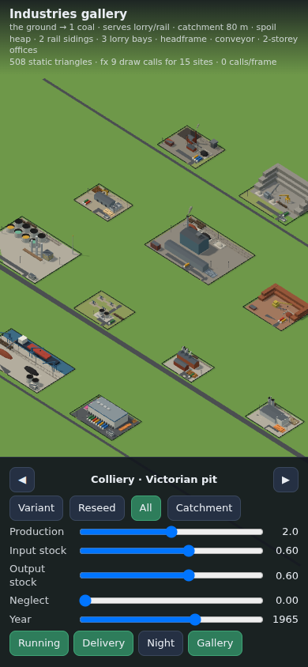 | 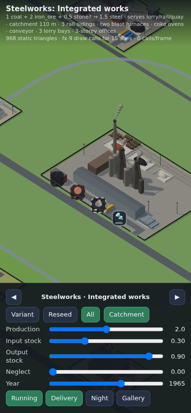 |
| Gallery on a 390 × 844 phone viewport | Steelworks catchment: ring, need icons (coal, ore, optional stone) and steel out |
| 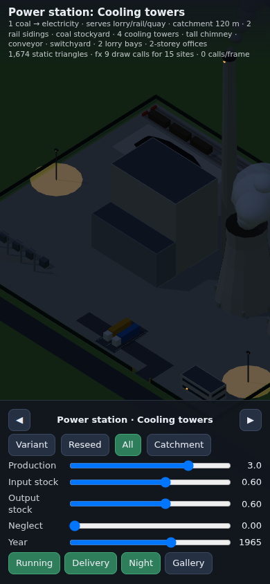 | 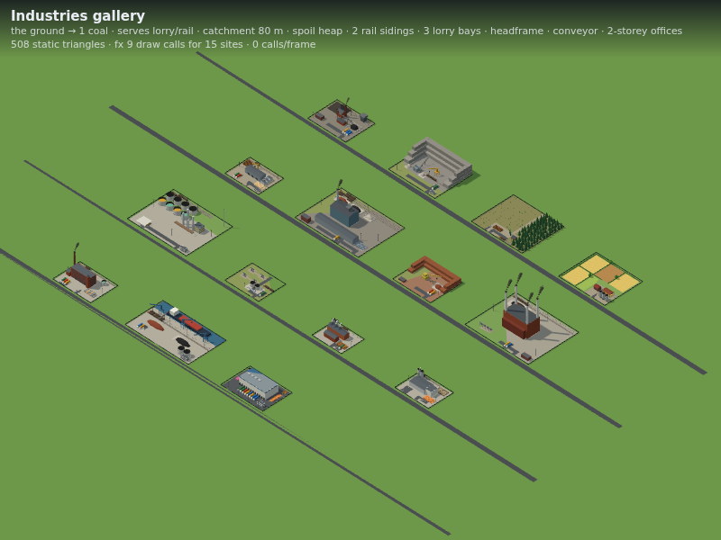 |
| Cooling towers steaming at night, sodium floodlights | The whole gallery (1920 setting: sooty smoke) |

Stock levels and neglect on the same colliery:

| 10% stock | Full | Derelict |
|---|---|---|
| 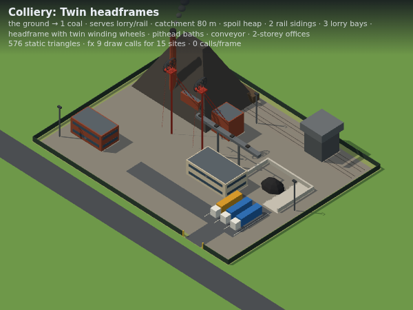 | 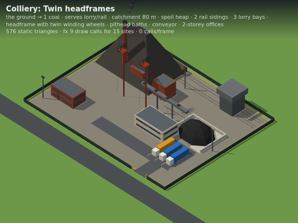 | 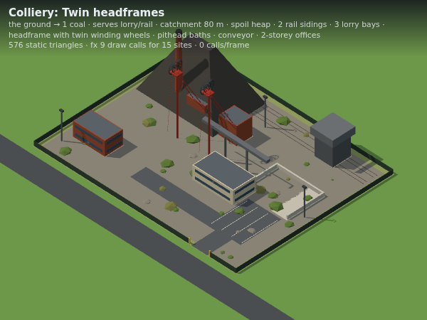 |

More types:

| | | |
|---|---|---|
| 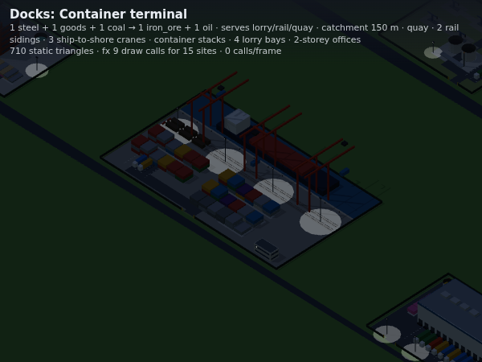 | 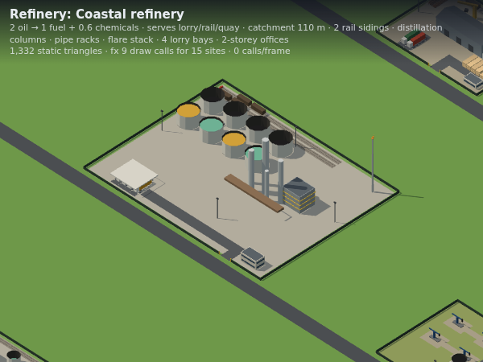 | 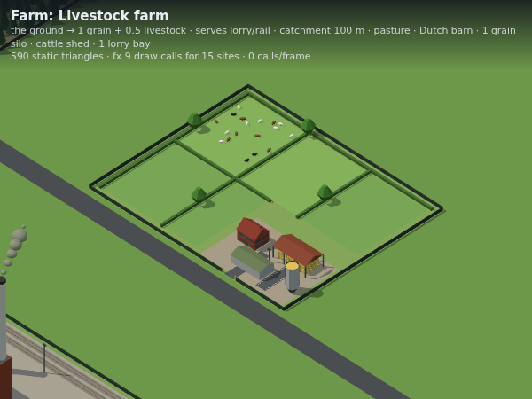 |
| Container terminal at night (2010, LED) | Coastal refinery: oil low, fuel and chemicals high | Livestock farm with a full herd |
| 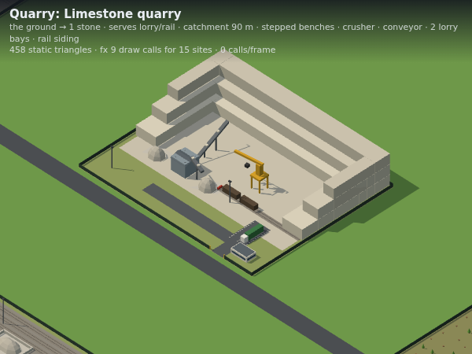 | 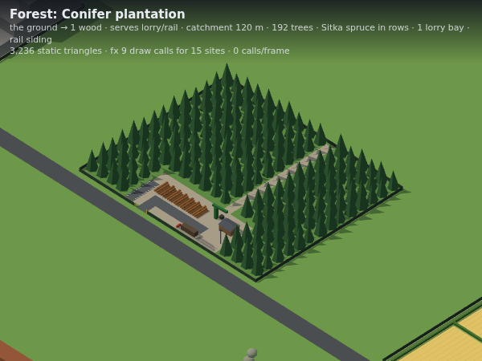 | 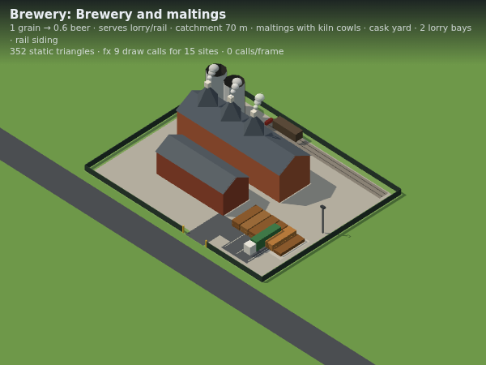 |
| Limestone quarry: benches, crusher, graded stone | Conifer plantation and timber yard | Brewery and maltings with steaming kiln cowls |

## Known limits

- **Plot fitting is a heuristic.** It shrinks and then grows the bounding box in the road's
  frame. It is close to the best rectangle for the near-convex plots roads leave, but not for
  L-shapes, where part of the plot is left as grass. The catchment ring uses the convex hull,
  so it is slightly generous for notched plots.
- **Layouts are proportional.** Recipes place parts as fractions of the fitted rectangle, with a
  few fixed sizes. A plot much narrower than `minSize` will crowd. The economy should respect
  `minSize`.
- **No terrain.** Sites assume flat ground, and quarries rise rather than sink. When height tiles
  arrive, a site will want a levelled platform, or its pads draped over the ground.
- **Water is drawn by the site.** The docks paint their own strip of water behind the quay. With
  real coastlines the quay should sit on the world's water edge instead, and `waterside:
  'optional'` quays (power stations, steelworks, refineries) aren't modelled yet.
- **Smoke is opaque, low-poly puffs** that shrink to fade, not alpha-blended sprites. That's cheap
  and suits the style, but it isn't soft.
- **Night lighting is emissive lamps and additive ground discs**, not real lights, so buildings
  don't light up around them.
- **Lorries, wagons and ships in `berths` are stand-ins**, until the traffic system's own
  vehicles use the anchors.
- **Era affects variant choice, smoke and lamps only.** A 1900 colliery doesn't get
  modernised in 1960 unless the economy rebuilds it with a later year.
- **The demo's gallery uses fixed variants per cell**, not era picks, so the year slider there
  mainly changes smoke and lamps. Changing the year rebuilds the sites.
