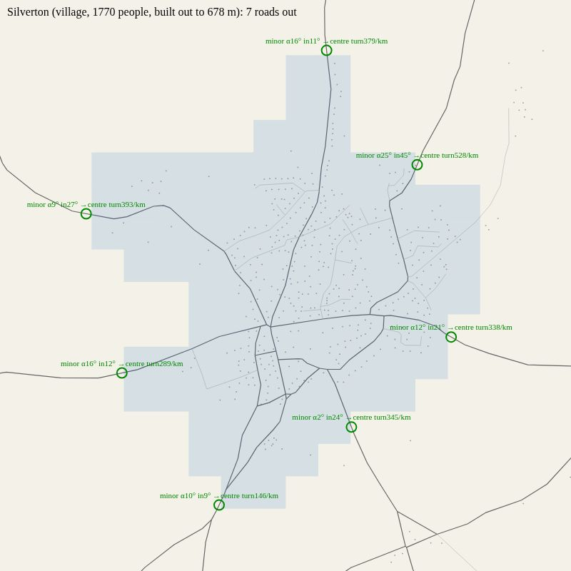
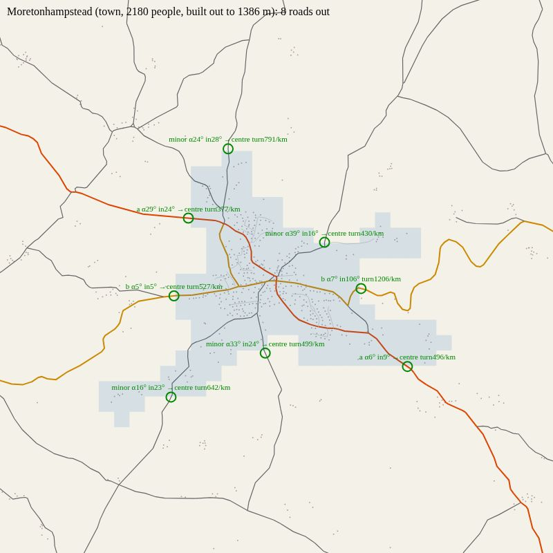
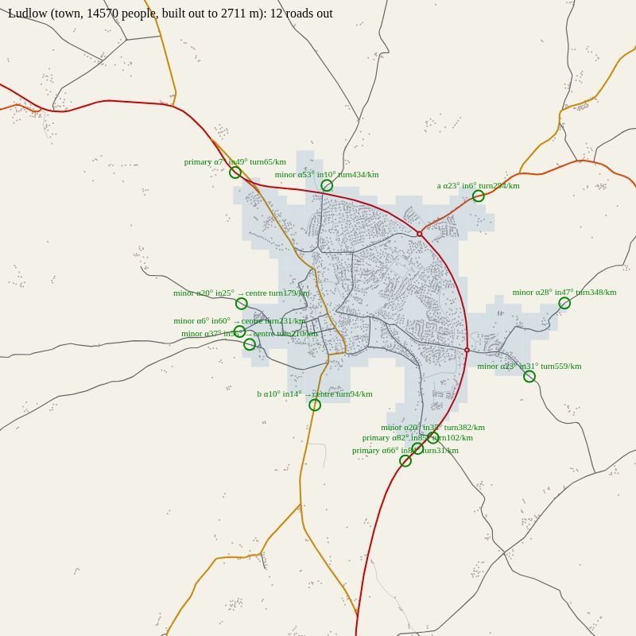
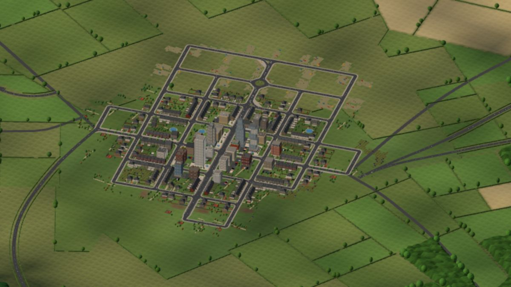
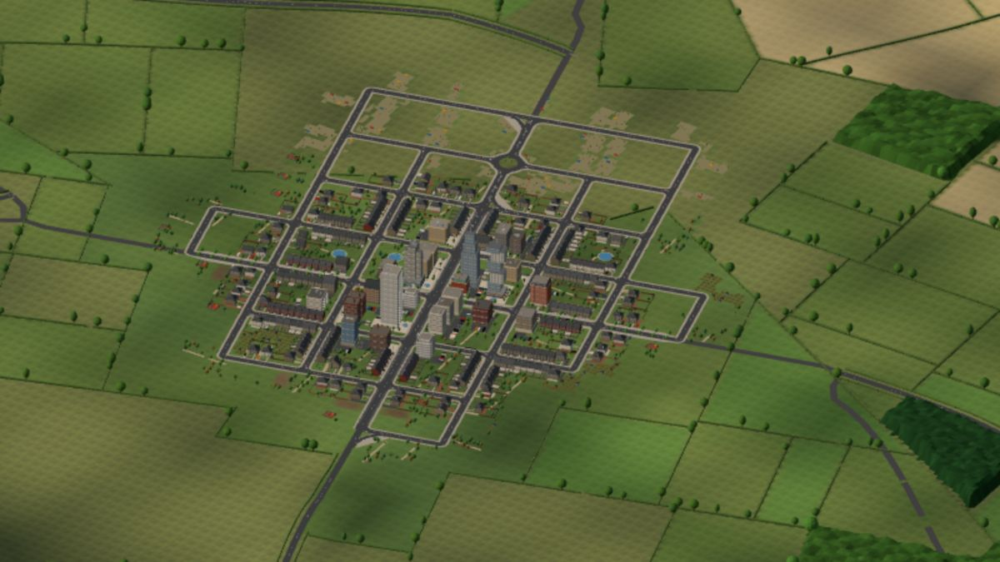

# How roads leave real places, and how the seeded ones now do

Measured by `tools/os/exits.mjs` (26 Sep 2026) over the two OS bakes, `exe` and `teme`: 31 market towns and
330 villages. A place's built-up area is its buildings (4 or more within 150 m) joined to its centre, holes
filled; a way out is where an A road, B road or lane (not a street, drive or track) last leaves it and runs
600 m on into open country. The numbers are `PRIORS.exits` in `src/proto/region/priors.ts`.

| | towns | villages |
|---|---|---|
| ways out of a place (10th / 25th / median / 75th / 90th) | 7 / 9 / 11 / 13 / 15 | 3 / 3 / 5 / 6 / 8 |
| the angle a road meets the edge at (0°: straight out) | 4 / 11 / 25 / 48 / 79 | 3 / 10 / 23 / 45 / 68 |
| within 30° of straight out | 58% | 60% |
| inside, heading off the line to the centre over its last 400 m | 10 / 17 / 29 / 59 / 88 | 11 / 19 / 36 / 61 / 91 |
| followed straight on, reaches the middle | 27% | 58% |
| turn in its first kilometre outside (net) | 5 / 16 / 40 / 66 / 109 | 8 / 19 / 42 / 83 / 138 |
| angle between one way out and the next | 4 / 11 / 24 / 43 / 67 | 13 / 28 / 59 / 101 / 144 |
| what they are (primary / A / B / lane) | 32 / 42 / 65 / 196 | 109 / 112 / 206 / 1202 |

The rule they show: a road out of a place runs radially through one of its main streets, straight for its
first stretch, and bends towards where it's going only once it's clear of the houses. Where two roads want the
same way out they share it and fork outside. Three of the real places (`node tools/os/exits.mjs --svg <dir>`
draws every town; green rings are the ways out found, with the angle at the edge and inside, and the turn per
kilometre outside):

## The seeded start town, before and after (seed 42, 1600×900, the same camera)

Before: the lanes came in to the nearer end of the high street from wherever the finder had them, meeting the
town's corners at any angle, three of them side by side.

After: every settlement has four spokes (both ends of its high street and of its main cross street, each facing
out along its street); a lane leaves by the spoke facing where it goes, runs straight along that street for
150 m and more, then sweeps into its course; two lanes wanting one spoke share it and fork outside
(`worldmap/routes.ts` `spokeFor`, `stem`, `joinStems`, `forks`).

What this doesn't fix, and the rest of the realism stream is for (`docs/briefs/realism.md`): the town itself is
still a rotated grid with stub streets ending in the fields and a square edge; real towns grow along their
radials, with streets branching off them as T-junctions and closes, and a ragged edge that follows the roads.
