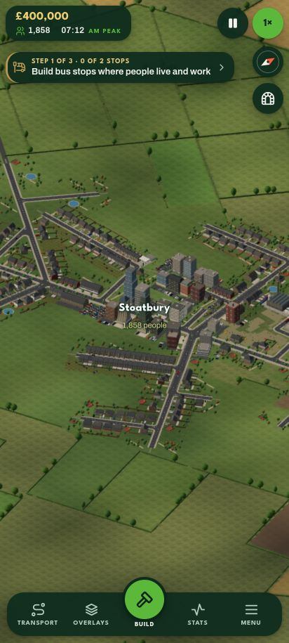
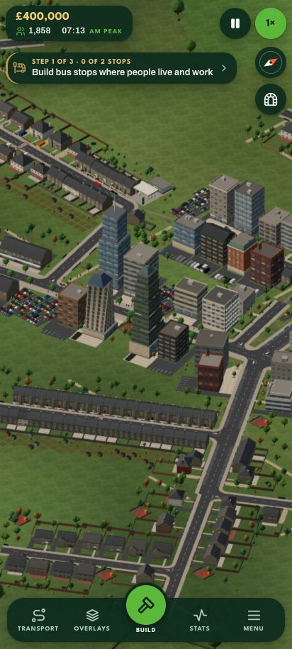
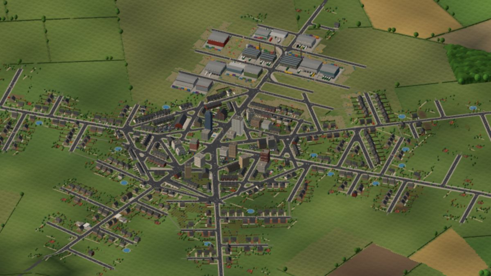
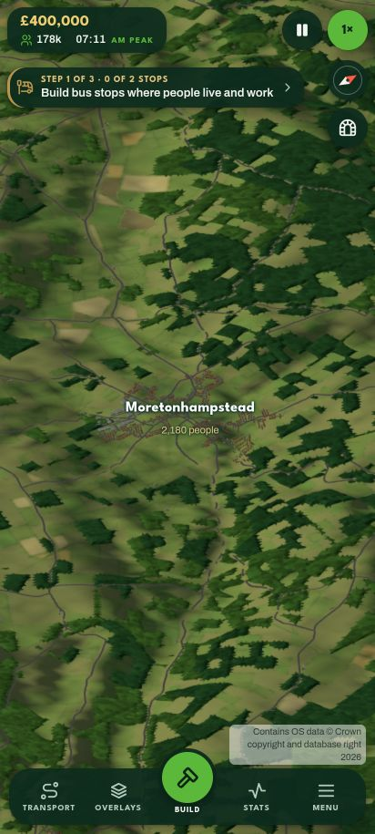
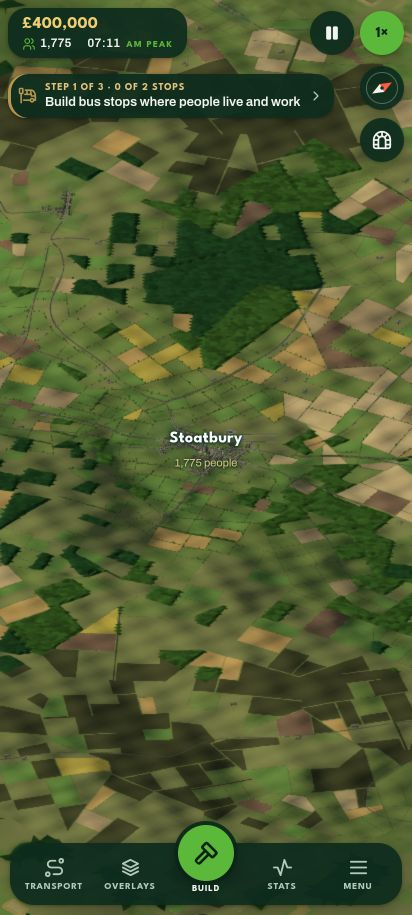
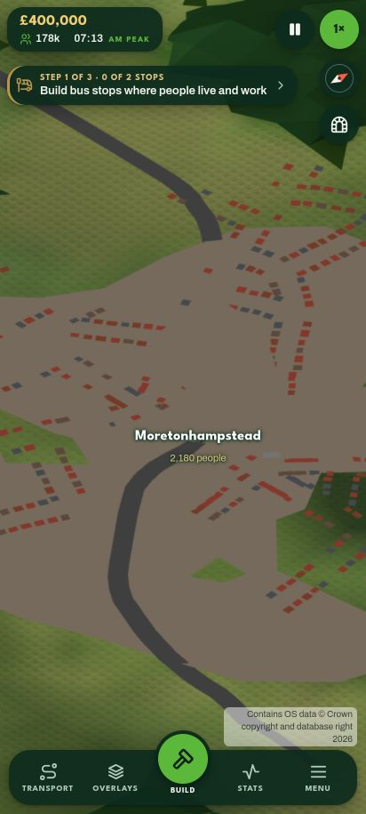
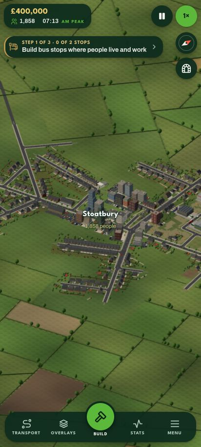
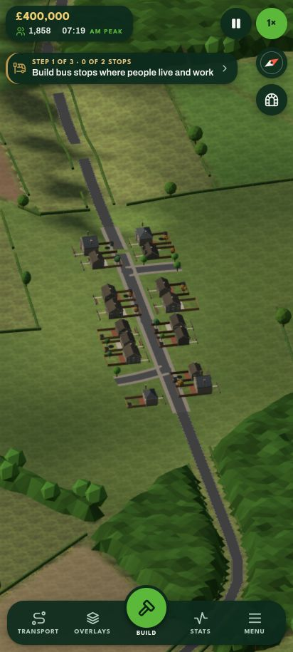
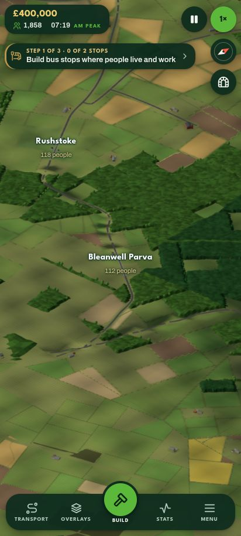

# How roads leave real places, and how the seeded ones now do

Measured by `tools/os/exits.mjs` (26 Sep 2026) over the two OS bakes, `exe` and `teme`: 31 market towns and
330 villages. A place's built-up area is its buildings (4 or more within 150 m) joined to its centre, holes
filled; a way out is where an A road, B road or lane (not a street, drive or track) last leaves it and runs
600 m on into open country. The numbers are `PRIORS.exits` in `src/proto/region/priors.ts`.

| | towns | villages |
|---|---|---|
| ways out of a place (10th / 25th / median / 75th / 90th) | 7 / 9 / 11 / 13 / 15 | 3 / 3 / 5 / 6 / 8 |
| the angle a road meets the edge at (0°: straight out) | 4 / 11 / 25 / 48 / 79 | 3 / 10 / 23 / 45 / 68 |
| within 30° of straight out | 58% | 60% |
| inside, heading off the line to the centre over its last 400 m | 10 / 17 / 29 / 59 / 88 | 11 / 19 / 36 / 61 / 91 |
| followed straight on, reaches the middle | 27% | 58% |
| turn in its first kilometre outside (net) | 5 / 16 / 40 / 66 / 109 | 8 / 19 / 42 / 83 / 138 |
| angle between one way out and the next | 4 / 11 / 24 / 43 / 67 | 13 / 28 / 59 / 101 / 144 |
| what they are (primary / A / B / lane) | 32 / 42 / 65 / 196 | 109 / 112 / 206 / 1202 |

The rule they show: a road out of a place runs radially through one of its main streets, straight for its
first stretch, and bends towards where it's going only once it's clear of the houses. Where two roads want the
same way out they share it and fork outside. Three of the real places (`node tools/os/exits.mjs --svg <dir>`
draws every town; green rings are the ways out found, with the angle at the edge and inside, and the turn per
kilometre outside):

## The seeded start town, before and after (seed 42, 1600×900, the same camera)

Before: the lanes came in to the nearer end of the high street from wherever the finder had them, meeting the
town's corners at any angle, three of them side by side.

After: every settlement has four spokes (both ends of its high street and of its main cross street, each facing
out along its street); a lane leaves by the spoke facing where it goes, runs straight along that street for
150 m and more, then sweeps into its course; two lanes wanting one spoke share it and fork outside
(`worldmap/routes.ts` `spokeFor`, `stem`, `joinStems`, `forks`).

What this doesn't fix, and the rest of the realism stream is for (`docs/briefs/realism.md`): the town itself is
still a rotated grid with stub streets ending in the fields and a square edge; real towns grow along their
radials, with streets branching off them as T-junctions and closes, and a ragged edge that follows the roads.

## How a place is put together (`tools/os/towns.mjs`, the same 31 towns and 330 villages)

| | towns | villages |
|---|---|---|
| ways out / of them radials (roads that, followed in, reach the middle) | 11 / 5 (45%) | 5 / 3 (59%) |
| angle between one radial and the next (10th / 25th / median / 75th / 90th) | 11 / 20 / 43 / 82 / 142 | 23 / 48 / 87 / 138 / 197 |
| built-up area (ha) | 205 / 291 / 468 / 720 / 1034 | 33 / 47 / 76 / 126 / 238 |
| long axis over short (over 2 is linear) | 1.3 / 1.36 / 1.63 / 1.92 / 2.2; 19% linear | 1.2 / 1.36 / 1.65 / 2.2 / 2.66; 29% linear |
| edge reach along the radials over between them | 0.87 / 1.15 / 1.71 / 2.77 / 3.22 | 0.63 / 0.96 / 1.35 / 1.95 / 2.62 |
| side streets off the radials, per km of radial | 10 / 12 / 15 / 18 / 24 | 3 / 5 / 8 / 11 / 15 |
| of them closes (dead ends) | 9 / 14 / 18 / 22 / 26% | 0 / 0 / 15 / 33 / 50% |
| a side street's length (m) | 33 / 55 / 98 / 191 / 373 | 31 / 60 / 133 / 413 / 1144 |
| a close's length (m) | 49 / 67 / 103 / 165 / 270 | 49 / 66 / 106 / 177 / 430 |

The rule they show, for the generator: a place is its radials first, three to five roads meeting at the
middle, spread round it unevenly (the next one 45° to 90° on, rarely under 20°); the houses run further
out along the radials than between them, so the edge follows the roads, ragged, not a circle or a square;
inside, streets branch off the radials as T-junctions every 60 to 80 m in a town (every 120 m in a
village), one in five of them a close about 100 m long, the rest running on to meet another street. These
are `PRIORS.towns`.

## The start town grown along its radials (seed 42)

`layStreets` now lays a place from `PRIORS.towns`: its radials meet at the middle (the high street's two
and 2–4 more for a village, 4–6 for a town, none within 30–40° of another, each starting on the high
street a block or two off the middle as a T), the houses run further out along them than between them,
cross streets join neighbouring radials part way out, side streets and closes branch off at the measured
rate, through side streets are joined end to end by back streets so they end on a street, and the city's
and the towns' industrial estate is a small grid beside one radial's outer end, a T off it. No street
crosses another: a side or back street that would meet a radial ends on it as a T; one that would cross
another street, or run alongside one within 25 m of its node, is left out (before that rule, seed 42's
start town had fifteen streets the careful builder refused; now none on five seeds). Every radial's
end is a spoke, so the lanes leave along them.

At 412×915, the start town from 900 m and from 400 m (the towers at the centre and the buildings are
vernacular's, not this stream's):

 

And from 1600×900, the same camera as the before-and-after above:

On the real towns' yardsticks (`compare.mjs`, the places table in `seeded-vs-real.md`): 5 radials per
town and 3 per village as measured; junctions in towns 0.33 dead ends / 0.65 T / 0.03 crossroads
(real 0.31 / 0.65 / 0.04); the street piece between junctions 71–72 m (real 71–79); orientation order
0.02–0.09 (real 0.01–0.05 in the core).

Still to judge as a player: the ribbons run far out along every radial (real towns are linear on one or
two roads, not all); the closes end in the fields (real ones end in a turning head); the estate's rows
are square to its road where real ones bend with the land.

## Side by side at 412×915: Moretonhampstead (Exe bake, 2,180 people) and the seeded start town (seed 42)

The same phone view, 6 km up and 1 km up, over the real town as the game streams it from the OS bake
and over the seeded start town as the game builds it. At 1 km the real region draws its buildings as
footprints and only its main road, so that pair compares layout, not looks. The seeded pair is the town
after the step below (`side-seeded-*.jpg`); the pair before it, the town grown along straight radials
with two lanes out, is kept as `side-seeded-*-before.jpg`.

From 6 km: both are a compact blob at a meeting of roads, with the houses running out along them, and
a web of lanes round them. (Before, the seeded town had five lanes out and little between them.)

 

From 1 km: both are ribbons of houses along three to five radials meeting near the middle, side
streets off them, a ragged edge; the ribbons bend with their roads and thin out towards their ends.
The seeded centre is towers (vernacular's choice for a town centre, not this stream's).

 

## The ribbons bend and thin, and a town has more lanes round it (seed 42, 412×915)

Judged as a player against the pair above, the seeded town before this step was straighter than the
real one, its ribbons ended squarely, and it had two or three lanes where the real town has a dozen.
Three more rules, measured over the same 31 towns and 330 villages (`tools/os/towns.mjs`, now also
each radial's bends and the houses along it; `PRIORS.towns`, `PRIORS.exits.minorPerPlace`):

| | towns | villages |
|---|---|---|
| a radial's net turn from the edge in to the middle (°, 10th / 25th / median / 75th / 90th) | 12 / 33 / 64 / 108 / 148 | 6 / 18 / 44 / 83 / 124 |
| the same per km of its run inside | 5 / 12 / 24 / 46 / 67 | 6 / 15 / 39 / 72 / 117 |
| how much its heading changes from one 100 m to the next, inside (°) | 6 / 8.5 / 11.3 / 13.5 / 17.4 | 4.5 / 7.7 / 11.3 / 15.6 / 20.2 |
| its net turn over its first 600 m outside (°) | 3.5 / 7.8 / 16.5 / 28.9 / 44.4 | 2.9 / 7.9 / 18.4 / 34.4 / 55.9 |
| buildings within 40 m of it per 100 m, by quarter of its run from the middle out (medians) | 4.7 / 6.3 / 5.6 / 3.0 | 3.3 / 5.7 / 5.3 / 2.4 |
| the same beyond the edge, by 200 m (median; 75th) | 0; 0.5–1.5 | 0; 0.5–1.5 |
| B roads and lanes out of a place (all of `PRIORS.exits.byClass`, per place) | 8.4 | 4.3 |

The rules they show: a radial is never straight; it turns some 64° between the edge and the middle of
a town and wanders 11° from one 100 m to the next, in sweeping bends rather than kinks; the houses
along it are as dense over its middle two quarters, half as dense over its last quarter, and stop at
the edge (a quarter of radials straggle on for a few hundred metres); and a town has about eight B
roads and lanes out of it, a village four, whatever the A roads add.

The generator now does the same (`layStreets`, grid plan or not): every radial bends with a steady
drift one way and a curvature that carries over from block to block and wanders, both drawn from the
priors, the high street running straight only through the middle; a radial that would cross one laid
before it ends at the block before; the side streets, square off a bending radial, meet the next
radial or another street at every angle, so one that would meet too flat, or pass within 25 m of
another street's node, ends 25–30 m short of it as a close instead of being left out, and one that
would cross another street ends on it as a T. The scenery (`towns.ts`) thins the houses along a
radial to the measured profile: all of the middle's to half way out, the third and last quarters'
shares after that, fewer still at the very end. And `suggestLinks` gives every town and village its
share of lanes: a town or city takes every neighbour's lane on the Gabriel graph, a village up to four,
and a place still short takes lanes to its nearest neighbours, nearest first, none through a third
place and none within 12° of a lane it already has.

On seeds 42, 7 and 1234 (`seeded-vs-real.md`): towns have 11–12 ways out (real 11), villages 4 (real
5 with their A roads, 4.3 without); lane km 1,313–1,655 (was 871–1,136; real 2,523–3,368); a town's
radials wander 6–7° from one 100 m to the next by the same measure (real 11.3; the generator's blocks
are 85 m, so the finer wiggle of a real centreline isn't there, and a village's radial is two blocks,
too short for the measure); the houses along a town's radials run 0.60–0.66 of the middle's over the
last quarter (real 0.51), a village's 0.44–0.47 (real 0.44); the junction shares, street pieces and
orientation order stay where they were. The start town keeps its size: 1,775 people and 216
buildings against 1,858 and 230 before (the bends are drawn from a random stream of their own, so
the rest of a place's layout is what it was), and the twelve towns' scenery has 3% fewer buildings.

 

## Hamlets (seed 42, 412×915)

The bakes' smallest named places, 65–170 per 1,000 km² on top of the villages (`PRIORS.settlements`),
were missing from the plan, and with them most of the lanes a real 50 km square has. The plan now
makes them from that prior (capped at 220 so a plan is still made in under three seconds): a hamlet
is a few houses along one lane, no shops, with two ways out and a close or two at most; its lanes
join it to its nearest neighbours as a village's do. On seed 42 the hamlets stand 1.26 km from their
nearest neighbour at the median (real 1.1–1.24 km), have 2 lanes each and about 95 people, and the
lane km rise from about 800 to 1,100–1,140 (real 2,500–3,400: the rest is the farm lanes and tracks
no place owns).

 

Judged as a player: from 2.5 km, two hamlets a lane apart with their names, the lane wandering
between them, as the bakes show; from 400 m, a dozen houses in a line along the lane with their
gardens, a close off it either side. Still to do: the closes end in the fields rather than a turning
head, and the far ends of the lane run straight where a real lane would bend at the last house.
