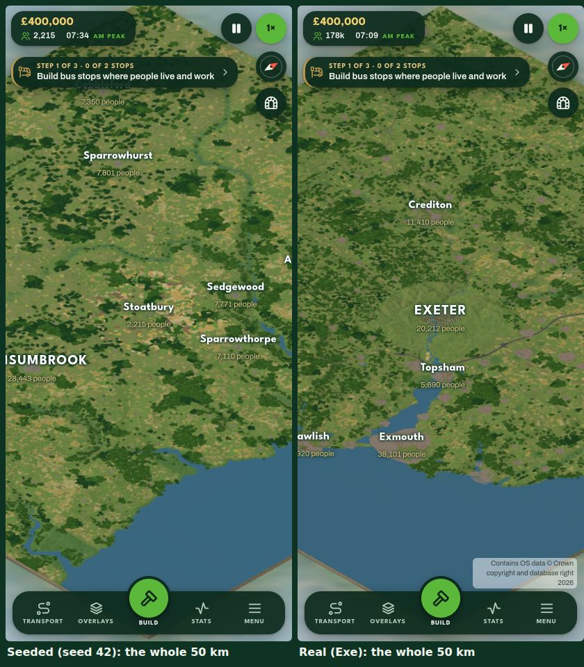
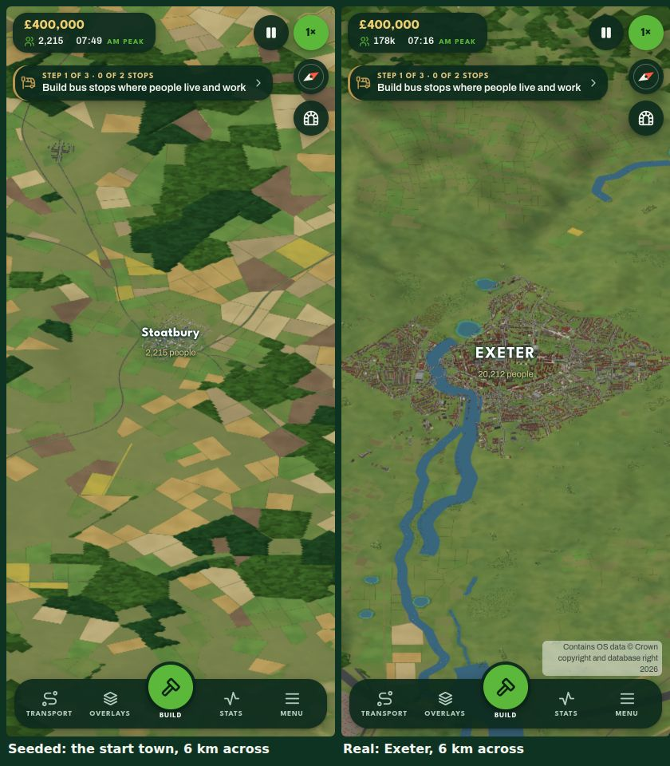

# Seeded against real: the 50 km plans on the same yardsticks

Made by `tools/os/compare.mjs` (2026-09-26 08:46 UTC). The real columns are the
bakes through `real/world.ts`; the seeded ones are `planWorld` for those seeds, at its defaults.
Seeded maps start with lanes only (PLAN.md decision 3), so their A road rows are empty; the trunk
planner's A roads are the priors' concern. `PRIORS.follow` measured every 50 m of the real roads
over Terrain 50: A roads 3.4–2.8% median and 10.6–9.4% at the 90th;
minor roads 4.2–3.2% and 12.6–10.2%. (The rows here sample every 100 m of the plan's
routes over the plan's heights, so they read a little lower.)

| | real: exe | real: teme | seeded: 42 | seeded: 7 | seeded: 1234 |
|---|---|---|---|---|---|
| land (km²) | 2077 | 2401 | 2007 | 1885 | 1291 |
| towns and cities per 1,000 km² | 8.7 | 5 | 7 | 8 | 11.6 |
| villages per 1,000 km² | 129 | 156.6 | 79.7 | 75.9 | 104.6 |
| town to nearest town (km, median) | 6.2 | 11.1 | 6.1 | 7.1 | 5.8 |
| village to nearest place (km, median) | 1.4 | 1.4 | 2 | 2 | 1.8 |
| largest places (people) | 120900, 38100, 33500 | 15800, 15600, 14600 | 28400, 23500, 7800 | 27500, 23300, 7900 | 26600, 23300, 8100 |
| A road km | 419 | 373 | 0 | 0 | 0 |
| B and minor road km | 3368 | 2523 | 872 | 878 | 770 |
| A road grade, median / 90th (%) | 2.1 / 6.1 | 1.6 / 5.8 | n/a | n/a | n/a |
| B road and lane grade, median / 90th (%) | 3.1 / 9.3 | 2.6 / 7.9 | 1.3 / 3.9 | 1.3 / 3.8 | 1.4 / 4.1 |
| land height, median / 90th (m) | 119 / 240 | 159 / 290 | 241 / 298 | 246 / 295 | 229 / 298 |
| railway km | 172 | 95 | 0 | 0 | 0 |
| plan made in (ms) | 3882 | 2468 | 2350 | 1989 | 1583 |

## Side by side at 412×915 (26 Sep, 10:00)

The same WORLD pipeline, the same camera: seeded (seed 42) on the left, the real Exe region on the right.

## What it says

- **Places: already wired.** World50's `planWorld` takes its counts from `PRIORS.settlements`. Its
  towns (7–12 per 1,000 km²) and villages (76–105) sit where the priors put them: 5–12 towns, 71–74
  villages and 65–170 hamlets. The real columns count Open Names' hamlets of 150 people or more as
  villages, which is why they read higher. Spacing matches too: a village's nearest place is
  1.8–2.0 km away, against the priors' 1.8–1.9 km.
- **Lanes are too gentle.** The seeded lanes climb at 1.3% median and 4% at the 90th, where the real
  B and minor roads climb at 2.6–3.1% and 8–9%. `PRIORS.follow.minor` is measured over 50 m and reads
  3.2–4.2% and 10–13%. Real lanes go over the hills, and the seeded ones go round them. This is
  world50's `routes.ts` lane profile: take its grade and wander from `PRIORS.follow` (and
  `roadClimb('minor')`).
- **Too few lanes:** 770–880 km on a seeded map against 2,500–3,400 km of real B and minor roads. The
  real network joins far more places to each other and to farms (countryside and world50).
- **The land is too high:** a median of 229–246 m against 119–159 m for the real regions (terrain).
  The real 90th percentiles are close (240–290 against about 298), so the seeded land is a plateau:
  its low ground isn't low enough.
- **The biggest place:** a seeded city is 26,000–28,000 people. Exeter is 121,000, but the Teme's
  biggest town is 16,000, so seeded maps sit between the two.
