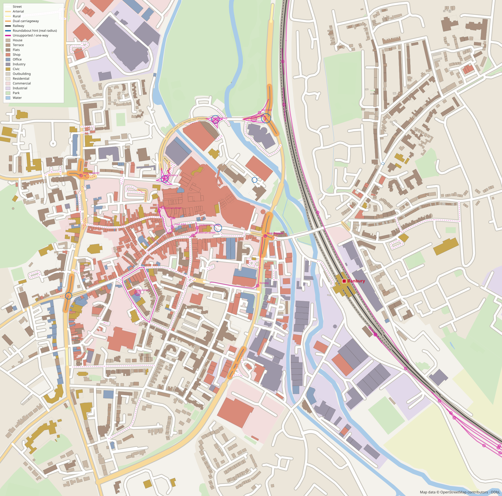
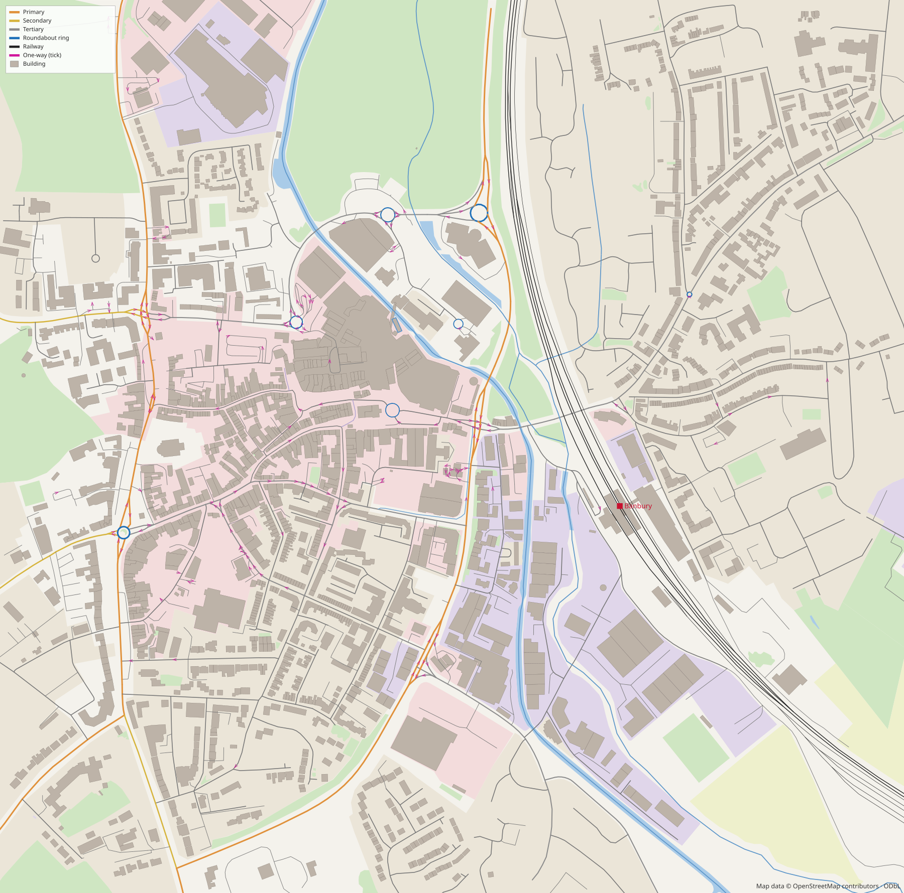

# OpenStreetMap importer prototype: report

The importer takes a real piece of a UK market town from OpenStreetMap and turns it into
the game's network, plots, zones and water. It does this without changing any engine file.
The API and integration plan are in [`../osm.md`](../osm.md).

Map data © OpenStreetMap contributors, ODbL.

| As the game builds it | Raw OSM data |
|---|---|
|  |  |

In the import drawing:

- Roads are drawn at their catalogue width and coloured by family: street, arterial, rural
  and dual.
- The paired main line is drawn as double track, with dashes where a track is single.
- Blue circles are roundabout hints at their real radius.
- Plots are coloured by kind, with their fitted rectangles drawn faintly over the real
  footprints.
- Everything unsupported is magenta. A dashed magenta line is a one-way road built two-way.

## The fixture

- **Where.** Banbury, Oxfordshire: a 1.5 × 1.5 km box (52.0548–52.0682 N,
  1.3430–1.3210 W). It covers:
  - the high street and Market Place;
  - Banbury Cross and Castle Roundabout, and five other roundabouts and a mini;
  - the Concord Avenue / Cherwell Street relief road, which has dual sections at each
    junction;
  - the town-centre one-way system;
  - Banbury station on the Chiltern Main Line, with its sidings;
  - the Oxford Canal and the River Cherwell;
  - the Tramway and Swan industrial estates east of the railway.
- **How it was fetched.**
  - The main Overpass instance (`overpass-api.de`) reset the connection and then returned
    an HTML error page from this environment, and `overpass.private.coffee` timed out.
  - The VK mirror (`maps.mail.ru/osm/tools/overpass`) answered, so the data was fetched
    from there, once, on 2026-09-24. The OSM base timestamp is 2026-09-24T07:24Z.
  - Nothing was hand-authored.
- **What's in it.** 19,874 elements (17,107 nodes, 2,758 ways and 9 relations), 1.6 MB.
  - `fetch-fixture.mjs` filters out footways, paths, driveways and parking aisles.
  - It keeps only the tags the importer reads (addresses, websites and the like are
    dropped).
  - It writes one element per line, so a refresh gives a readable diff.
  - The fixture's `attribution` field carries the ODbL notice.

## What it builds from the fixture

The whole import takes about 0.5 s in Node.

| | Count |
|---|---|
| OSM road and rail pieces after cutting at shared nodes | 1,203 |
| Network nodes / segments | 932 / 1,026 (1,015 road, 11 rail) |
| Roundabouts collapsed to a node (plus 1 mini) | 6 + 1 |
| Carriageway or track pairs joined into one centreline | 25 |
| Tag-only splits joined back up / slivers merged / duplicates dropped | 78 / 14 / 2 |
| Buildings → plots | 1,608 (7 skipped: 5 roofs, 1 bridge, 1 under construction) |
| Zones | 122 (12 residential, 10 commercial, 8 industrial, 82 park, 2 farmland, 8 water) |
| Stations | 1 (Banbury, on the paired main line) |

Road types the importer chose (segments):

| Type | Segments | Type | Segments |
|---|---|---|---|
| `street` | 482 | `street-20-2.4-0-0` (service roads, 20 mph) | 425 |
| `arterial-1-30-0-0-0` | 44 | `arterial-1-30-0-1.8-0` | 22 |
| `arterial-1-40-0-0-0` | 12 | `arterial-2-30-0-0-0` | 8 |
| `dual-2-40-0` | 10 | `dual-3-40-0` | 3 |
| `arterial-1-40-0-1.8-0` | 3 | `arterial-2-40-0-0-0` | 2 |
| `street-30-2.4-0-1.5` | 2 | `rural-50`, `rural-60` | 1 each |
| `rail-main` (paired) | 6 | `rail-branch` (a lone track) | 5 |

Building kinds:

| Kind | Buildings |
|---|---|
| House | 481 |
| Shop | 425 |
| Terrace | 231 |
| Flats | 199 |
| Office | 81 |
| Industry | 69 |
| Outbuilding | 51 |
| Civic | 71: 21 pub, 13 hall, 13 surgery, 9 school, 9 church, 5 corner shop, 1 petrol |

## Mapping decisions

### Roads

- **Families.**
  - A road is a dual or motorway only when two carriageways were actually paired.
  - Two lanes or more each way on one carriageway → Arterial 2+2.
  - Trunk, primary and secondary roads → Arterial, or Rural at 45 mph or more (or at
    40 mph with `sidewalk=no`).
  - Tertiary and below → Street, unless they're 40 mph and above, which makes them Rural.
  - Service roads and living streets → the 20 mph street.
- **Lanes.**
  - A two-way road's `lanes` is split between the directions; `lanes:forward` and
    `lanes:backward` win when present.
  - A paired carriageway's `lanes` is its own lanes, and the wider carriageway sets the
    type.
  - A lone one-way street is built two-way at about the same width (3 lanes one-way →
    2 each way).
- **Speed.**
  - `maxspeed` is read in mph, km/h, UK zones and `GB:nsl_*`.
  - When it's missing: 30 mph on urban classes, 20 on service roads and living streets,
    60/70 on trunk roads and 70 on motorways.
  - Speeds snap to the nearest the catalogue has for that family. Banbury's 30 mph dual
    sections become the 40 mph dual, the slowest there is, and the report says so.
- **Kerbside.**
  - `cycleway*` (lane or track) adds a cycle lane.
  - `parking:lane:*` and `parking:*` (not `no`) add parking.
  - `busway*`, `bus:lanes` and `lanes:bus` add a bus lane.
  - A bus lane beats parking, because the catalogue doesn't have both on one kerb.
  - `sidewalk:*:width` of 3.5 m or more gives wide pavements.
- **`approx`.** Every segment carries a list of what was rounded (speed, lanes, a dropped
  bus or cycle lane), so the game can say how far its road is from the real one.

### Graph

- **Cutting and joining.**
  - Ways are cut at every node another way uses. Closed ways are also cut in thirds, so
    no piece is a loop.
  - At the end, runs that only changed tags are joined back up. That's 78 joins here.
    OSM splits the high street wherever `lit` or `surface` changes; the game wants a
    segment from junction to junction.
- **Roundabouts.**
  - The pieces of a `junction=roundabout` (or `circular`) ring are grouped by the nodes
    they share and collapsed to their length-weighted centre. Every road that met the
    ring now meets that node.
  - The hint keeps the mean radius of the ring's centreline. Banbury Cross is 10 m,
    Castle Roundabout 15 m.
  - Banbury Cross is mapped as 8 separate ways and still comes out as one roundabout.
  - A ring that doesn't close is collapsed anyway and flagged. One with a radius over
    45 m is flagged as a possible gyratory.
  - `highway=mini_roundabout` nodes become `mini` hints.
- **Pairing.**
  - One-way ways are chained into runs. A run breaks where it branches, where the name or
    ref changes, or where it would double back on itself, as the two halves of a road do
    where it splits round an island.
  - Two runs pair where they run anti-parallel within 40 m (60 m for motorways and trunk
    roads) for at least 25 m, and share a ref or name.
  - Near a chain's end the match snaps to the end, because carriageways flare apart
    approaching a roundabout.
  - The matched stretch is replaced by a centreline sampled halfway between the two. Every
    node where something else joins either half is projected onto the centreline.
  - Nodes closer together than the reservation's width are merged. A side road crossing
    both carriageways becomes one crossroads, and its piece across the gap disappears.
  - Railways pair the same way, within 6.5 m in either direction.
- **Tidying.**
  - Pieces under 1.5 m are merged into their junction before pairing, and pieces under
    3 m after.
  - Two segments between the same nodes along the same line are merged.
  - Ways folded into a junction this way are recorded on the node, so every OSM way can
    still be traced to a segment.

### Buildings

- **Rectangle.** Each footprint gets the minimum-area bounding rectangle (rotating
  calipers on the convex hull), keeping the real polygon beside it.
  - On median, the rectangle covers 1.05× the footprint's area.
  - It's turned so its front faces the nearest road that can have frontage, within 60 m.
  - `front` is the measured gap from the back of the pavement to the building. Garden
    depths use the game's defaults for the kind.
- **Kind.** Checked in this order:
  1. The building's own tags: `amenity`, `shop`, `office`, `craft`, then `building=*`.
     `church`, `school`, `pub` and similar map to buildgen's civic archetypes.
  2. A shop, pub or office point inside the footprint.
  3. The land use it stands in. Industrial → industry; commercial → shop, or office when
     large; residential → house, terrace or flats by size and party walls.
  4. Its size alone.
  - A house counts as a terrace when it shares two walls (four nodes) with neighbours.
  - Garages and sheds are marked `minor`.
- **Height.**
  - `height` (m or ft) if given.
  - Otherwise 3 m per storey from `building:levels`, plus 2.5 m per roof level or 2 m for
    a pitched roof.
  - Otherwise a default by kind: house 7.5 m, terrace 8.5, shop 9, flats 12, office 13,
    industry 8, civic 10 (a church 14).
  - 141 buildings here have storeys tagged, and 2 have heights.

### Land and water

- **Zones.**
  - Residential and commercial come from `landuse`.
  - Industrial comes from `landuse=industrial`, `garages`, `port` or `depot`.
  - Park comes from parks, gardens, pitches, recreation grounds, grass, cemeteries,
    allotments and woods.
  - Farmland comes from farmland, farmyards, meadows and orchards.
  - Water comes from `natural=water` (including the canal's multipolygon) and reservoirs.
  - Railway land, construction sites and military land are counted but not zoned.
  - `net.zoneAt` returns `industrial` inside industrial zones, so the network grows
    factories there.
- **Water.**
  - `isWater(p)` checks water areas, plus waterway lines at a width by kind: river 14 m,
    canal 9, stream 2, drain 1.5.
  - It uses a 40 m grid, so each test is cheap.
  - It's passed to the `Network` constructor.

## What isn't supported, and why

Each entry is in `unsupported`, with a local position, a latitude and longitude, and the
OSM ways. They're highlighted in magenta in the drawing.

| Kind | Count | Why, and what the importer does |
|---|---|---|
| One-way street | 88 | The engine has no one-way roads. They're built two-way at about the same width and flagged `oneway` (46 of them are one-way service roads). |
| Gyratory / one-way loop | 4 | The town-centre one-way system (George Street, Albert Street, Marlborough Road, High Street), and loops round Cherwell Drive and Castle Street. Built two-way; the loop is listed with its length. |
| Slip road | 1 | Concorde Avenue's `tertiary_link`. One-way slip roads are left out; the junction designer adds its own. |
| Interchange | 0 | Four or more slip roads within 250 m would be reported as one grade-separated junction. There are none in this box. |
| Railway siding | 15 | Sidings, yards and crossovers: the game has no depots or yards. A crossover is implied by double track. |
| Pedestrian street / road area | 3 / 1 | Market Place and two unnamed pedestrian ways and areas: the game has no pedestrian-only streets yet. |
| Busway | 1 | The bus station approach: no bus-only roads yet. |
| Loop dropped | 3 | Two short pieces of Concord Avenue and one of Warwick Road ran between nodes that merged into one junction when the carriageways were paired. They're recorded on that junction. |
| Incomplete / large roundabout | 0 | Every ring in Banbury closes and is under 45 m. |
| Level crossing | 0 | Road and rail share no node in this box. They would be kept on separate nodes and listed. |

Other simplifications:

- **Bridges and tunnels.** Every node is at y = 0. `bridge`, `tunnel` and `layer` are
  recorded per segment for the grade solver. Roads that cross without sharing a node
  don't join, so bridges don't create false junctions.
- **Mainline tracks beyond two.** Where more than two running lines run side by side,
  as through the station, the two closest pair into double track. The rest are kept as
  single-track branch lines. Platforms aren't imported.
- **Pairing is geometric.** Carriageways more than 40 m apart, or named differently, stay
  unpaired, and are built as two two-way roads.
- **Junction geometry** (kerbs, flares, signals) isn't imported. The junction designer
  re-derives it; only roundabouts and minis are carried over as hints.

## Tests

`npx vitest run`: 11 files, 135 tests, all passing. 75 of them are new, in four files
under `src/proto/osm/`. `npx tsc --noEmit` is clean.

- **`tags.test.ts` (31 tests).**
  - Speed, one-way and lane parsing.
  - Way classification.
  - A 25-row mapping table, from tags to catalogue id (each id checked to exist).
  - Rounding notes, and railway types.
- **`graph.test.ts` (10 tests), on small hand-made datasets.**
  - **Dual pairing.** The centreline lies at z = 0 and is typed `dual`. A side road on one
    carriageway meets it at a T. A road crossing both becomes one four-way crossroads.
  - **Roundabouts.** A ring in four ways collapses to one node with four legs and a
    radius of 20 ± 1 m. A ring missing a piece is flagged. Mini-roundabouts come through
    as `mini`.
  - **One-ways.** A lone one-way street is built two-way and listed with a position.
    Slip roads are left out and listed. A one-way loop is found.
  - **Railways.** Parallel tracks drawn in opposite directions pair into `rail-main`. A
    lone track is `rail-branch`, and its siding is listed.
- **`buildings.test.ts` (22 tests).**
  - The minimum rectangle of a turned L-shape.
  - A 19-row kind table: tags, points inside, zones, party walls and size.
  - Height from height, feet, storeys, roof storeys and defaults.
  - A house beside a street faces it, with the right width, depth and a 6 m front garden.
- **`import.test.ts` (12 tests), on the Banbury fixture.**
  - The projection's axes, scale and round trip.
  - The attribution is present.
  - Network, building and zone counts.
  - Both named roundabouts are complete, with sensible radii and at least three legs.
  - Concord Avenue and Cherwell Street are paired, and so is the main line.
  - The station sits on a railway.
  - `isWater` is true on the canal and false at Banbury Cross.
  - **Joining.** Wherever two imported OSM ways share a node, their segments share a
    node, or meet the roundabout that replaced the ring. That's more than 800 such
    pairs, and none is broken.
  - **No duplicates.** No two segments run between the same nodes along the same line,
    and no segment is a loop.
  - Every unsupported entry has a position inside the box.
  - Every segment has a catalogue type and every plot a height.

## Next

1. **One-way roads in the engine.** Then pairing can stay for true dual carriageways, and
   the one-way system, the slips and interchanges can be imported as they are.
2. **Swap the projection** for the world-tiles projection. Fetch and import per tile,
   stitching edge nodes by OSM id.
3. **Hints into the junction designer.** Seed `Junction.form` and `R` from `hints` when
   `commitRoads()` first designs an imported junction.
4. **Lots into the land registry.** Move them in as claims (ENGINE.md, next step 1). Then
   imported footprints and generated plots share one "who owns this" answer.
5. **Footprint-true buildings.** The building generator could extrude `poly` where the
   rectangle is a poor fit, that is, where `fill` is low.
