# Report: the people and animals library

**What it is.** A library under `src/proto/people/` that fills the town with people and
animals. It draws queues at stops and platforms, walkers on the pavements, shift changes at
the works gate, shoppers, drinkers outside the pub, the school run, dog walkers in the park,
cats on walls, pigeons, ducks, sheep and cows. It's placed from flow numbers (the economy's
job) and animated entirely on the GPU. It adds only new files: the library, its tests,
`people-demo.html`, `docs/people.md` (the API and integration plan) and this report. No
existing file is changed.

## What was built

| Area | Done |
|---|---|
| **Figures** | Procedural low-poly people. **Near:** at most 150 triangles, and a figure with no hat, bag or umbrella shows 96. **Middle distance:** 52. **Far:** a 2-triangle card, and beyond that nothing. They vary in height, build and age: children (bigger heads for their size), adults, and the elderly (stooped, slower, some with sticks). Hair comes in bald, short, bob, long and bun. |
| **Clothing by era and role** | Five era buckets from 1900 to 2030 set palettes, hats, coats, skirt lengths, skin-tone mix and phones. The roles are office wear with ties and briefcases, school uniform in the school's colours (caps and boaters early on, rucksacks later), and industry workers, who get flat caps, then hard hats (1966+), then hi-vis (1986+). There are also overalls, bus drivers and rail staff in invented liveries, the police (the Shire Constabulary, a made-up force: navy with a teal band, custodian helmets or peaked caps, hi-vis from 1986), nurses (caps and aprons before the sixties), shoppers with bags, joggers (not before 1975), cyclists (with helmets later), wheelchair users, people with pushchairs, and umbrellas that go up when `store.rain` is set. |
| **Animation on the GPU** | The vertex shader places each instance on its route from the clock and poses it. **Walking and running** are keyed to distance, so feet don't slide. **Standing:** sway and glances. **Waiting:** weight shifts and looks up the road. **Phone:** head down. **Chatting:** gestures. **Sitting:** benches, wheelchairs. **Children:** jumping about. **Cycling:** two-bone IK on the pedals. **Pushchairs:** pushed. **Wheelchairs:** pushing the rims. **Boarding and alighting:** one-off walks to and from the doors. There are no skeletons. Hats, hair, skirts and coats are reshaped per figure in the same shader. |
| **Animals** | One quadruped body plan stretched to eight dog breeds (labrador, dachshund, terrier, spaniel, whippet, collie, bulldog, poodle), a cat, sheep and a Friesian, Hereford or black cow. They walk, trot, sniff, sit, lie and graze, and wag their tails. **Dogs on leads** are drawn with a sagging lead to the owner's hand, worked out in the shader from the owner's position on the same walk. **Loose dogs** run rings round a standing owner or nose about. **Birds:** pigeons peck and bob their heads; ducks paddle. |
| **Placement from flows** | `Crowds.set(flows, clock)` diffs flows by id. There are nine kinds: `queue` (stop or platform), `walk` (footways, both ways, keeping loosely left), `ride`, `commute` (shift-change streams), `cross`, `loiter` (shop windows, pub, gate, square), `park`, `school` and `animals`. `board()` and `alight()` hand people to and from buses and trains. Helpers build sites from the game's geometry: `footwaysOf()` from kerb and back-of-pavement offsets, `stopSite()` from a stop's position and side, and `parkLoop()`. |
| **Stability** | Every figure comes from a seed (the flow id and its number). Only the first *count* show, so a count going from 12 to 13 adds one person and nobody else moves, and a crowd that outgrows what was made for it is extended in place. After a bus leaves, the queue re-forms: the same people shuffle up and take any seats freed in the shelter. |
| **Detail and budget** | Detail per group comes from how tall a person looks on screen, with hysteresis so it doesn't flicker. The budgets per level are served from the middle of the view out, and groups past a budget drop a level. Groups fade (a 0.6 s dither) when they change level, groups are culled with a margin so they appear while still off screen, count changes ease in one figure at a time, and first-time builds are capped per frame. The five budget presets have the same names as `main.ts`'s quality tiers. |
| **Demo** | `people-demo.html` is phone-sized with the game's isometric camera. It has a high street with a zebra and cyclists, a bus stop with a shelter and a bus that calls, a station platform with a train, a works gate at shift change, a park with a pond, a school and fields. The controls are a clock slider (play and pause), a waiting-count slider with a "Bus" button, an era picker, rain, a crowd-size picker (500 / 2,000 / 5,000), view buttons and a rotating turntable of every role and breed. |

## Decisions

- **Records, not skeletons.** A figure is 32 floats: route leg, speed, timings, looks. The
  shader does the rest, so the CPU never touches a figure after it's built. Per-frame CPU work
  is one projection per group, plus copying four numbers per visible figure (count, index and
  the group's fade).
- **Routes as arcs.** Footways and paths are fitted with a chain of straight and circular legs
  that join smoothly. A figure on a leg it isn't on is collapsed, but it still costs its vertex
  work. So fits are kept to as few legs as possible: a straight footway is one leg, and a park
  loop is a four-leg running track rather than a ten-leg outline. The fitting was tuned after
  profiling showed park walkers at about ten records each.
- **Streams sampled from their rate, not scheduled.** The game's clock runs about 240 times
  walking pace, so a figure that set off at 05:40 couldn't reach the gate by 06:10. The first
  version scheduled each commuter and showed the stream still at the station when the shift
  began. The fix: the path carries the concurrent number the flow implies (rate × walk time,
  capped at the total). It eases in with the window and out after it.
- **Dithered fades.** Figures stay in the opaque pass, so there's no sorting, and their
  shadows fade with them.
- **The game's own material.** The shader patches `MeshLambertMaterial` (plus a matching
  depth material for shadows), so lighting, shadows and fog match the rest of the scene.
- **Only the figures a count can show are uploaded.** Records are in figure order, so the
  first *count* are a prefix, and only that prefix is copied. This cut the instances drawn for
  500 walkers from 827 to 584.
- **A CPU twin of the shader** (`recordAt`, `figures()`) lets tests check where people
  actually are, and would let the game pick a person under a tap.

## Bugs found and fixed along the way

- **three.js caches an instanced geometry's maximum instance count the first time it's
  drawn.** Growing the buffers silently dropped everyone past the first 256, such as the
  school yard. The cache is now cleared when buffers grow.
- **Count functions captured the first flow object**, so later numbers from the economy were
  ignored. Each flow now has one stored copy, refreshed on every update.
- **Offset lines were wrong at their first point.** A direction was used before it was
  normalised, which put pavement walkers in the road.
- **The queue and its boarders were built separately**, so the person walking to the bus
  looked slightly different from the one who'd been queueing. They now share one
  constructor.

## Tests

`npx vitest run`: **92 passed** (the existing 60, plus 32 new in `src/proto/people/`).
`npx tsc --noEmit`: clean.

- `track.test.ts`:
  - arc maths;
  - fitting a curve to two smooth legs within 0.3 m;
  - straight lines as one leg;
  - reversal;
  - offsets to the left;
  - looping, ring and one-off motion;
  - the spread of any first *n* of a stream.
- `wardrobe.test.ts`:
  - determinism;
  - children smaller, elderly slower;
  - caps, then hard hats, then hi-vis by era;
  - 1905 hats and long skirts, 2025 phones;
  - the made-up constabulary's colours, bus crews, nurses and school colours;
  - props for riders;
  - no joggers before 1975.
- `flows.test.ts`:
  - a queue shows exactly the waiting count on the correct pavement;
  - 12 → 13 moves nobody;
  - growing past capacity reshuffles nobody;
  - boarding takes the front four to the door, with the same looks, and the rest shuffle up;
  - alighters step onto the pavement;
  - walkers stay inside the footway band, go both ways and keep left on average;
  - crowds are identical from the same seeds;
  - dog walkers have leads;
  - a shift stream exists only in its window;
  - the school yard fills before the bell and empties after;
  - near, middle, far and nothing by zoom;
  - the near budget is respected;
  - a count change fades in rather than popping;
  - winding the clock back on long sessions moves nobody;
  - still figures never move.
- `geometry.test.ts`: the triangle budgets.

## Performance

**Swiftshader numbers are pessimistic.** They come from headless Chromium on swiftshader, a
CPU rasteriser, at 412 × 860 CSS pixels and a pixel ratio of 1. A phone GPU is typically one
to two orders of magnitude faster at this kind of work, so treat these as relative costs
between settings, not frame times. The scenery was hidden, so the timing is people only. Each
frame was forced to finish with a one-pixel read.

Frame time is per frame, with the sun's shadow on (and off in brackets):

| Visible figures | Near (full figures) | Middle | Far (cards) |
|---|---|---|---|
| **500** | 208 ms (100) · 84 k tris · 584 instances | 104 ms (57) · 32 k tris | 15 ms (14) · 1 k tris |
| **2,000** | 855 ms (357) · 330 k tris · 2,286 instances | 358 ms (186) · 124 k tris | 42 ms (36) · 4 k tris |
| **5,000** | 1,979 ms (872) · 821 k tris · 5,683 instances | 808 ms (490) · 308 k tris | 97 ms (96) · 10 k tris |

- **Draw calls.** Near and middle distance are one per kind of mesh on screen (people, dogs,
  pushchairs, wheelchairs in this crowd, so 4), plus one each for the shadow: **8**. Far is
  **1** (cards cast no shadow). In the demo town, people add 10–14 calls.
- **Instances and figures.** Instances run above figures because dogs, pushchairs and
  wheelchairs are instances of their own. Triangles count collapsed optional parts too.
- **Shadows** roughly double the cost at near and middle distance. The `Fast` and `Fastest`
  budgets turn people's shadows off.
- **Placement and update, per frame, on this container's CPU:**
  - `crowds.set()` with the demo's 24 flows: **0.2–0.7 ms**.
  - The same with 24 stress flows: 0.1–0.2 ms.
  - `store.update()` for 40–70 groups, whatever the figure count: **0.1–0.5 ms**. It's
    dominated by per-group projection and the per-figure copy of four floats.
  - A phone CPU might be three to five times slower. `crowds.set()` doesn't need to run every
    frame: counts only change as the clock does.
- **Building a group** (first time on screen) takes about 20 µs per figure record, measured
  here: 2,540 records took 50 ms, including warm-up. It's capped by `buildsPerFrame`.

At the game's usual zoom (`view.h` ≈ 300 m on a phone), a person is about 4–5 px tall, so
nearly everything is drawn as cards. Full figures appear only when zoomed in, which is exactly
when there are few of them on screen.

## Screenshots

All are at phone size with the game's camera, in `docs/reports/people/`.

| | |
|---|---|
| Bus stop, 18 waiting: shelter seats, a long queue doubling up | 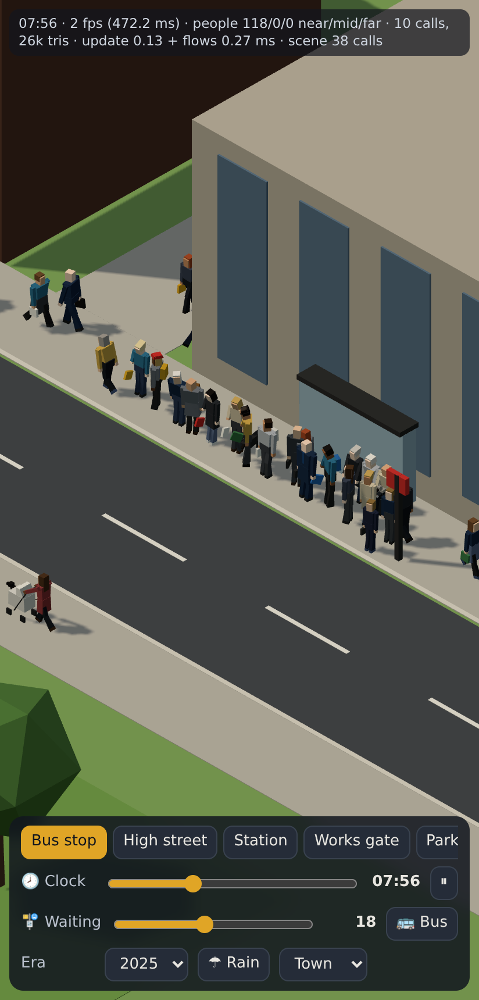 |
| The bus calls: the front of the queue boards, others get off and walk away | 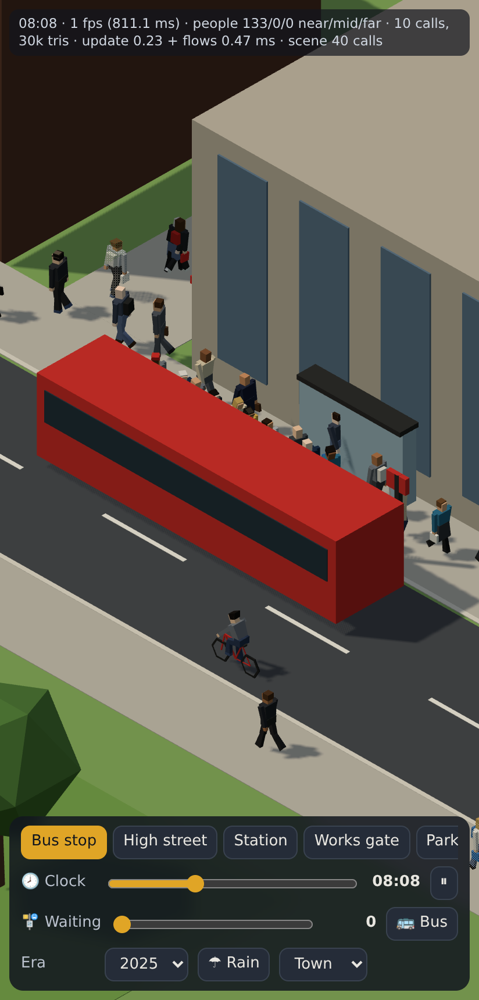 |
| Rain: umbrellas up | 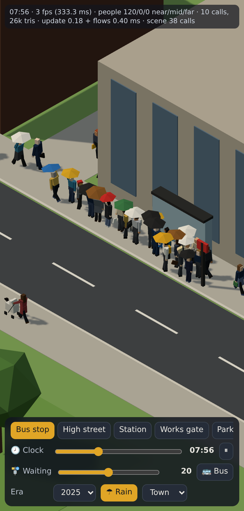 |
| Platform: spread along it, back from the edge | 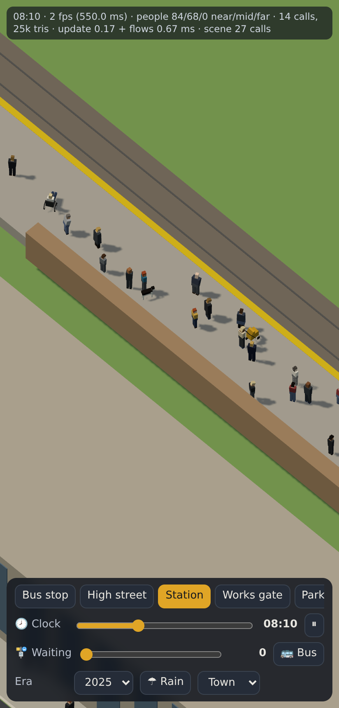 |
| Train in: to the doors, and off onto the platform | 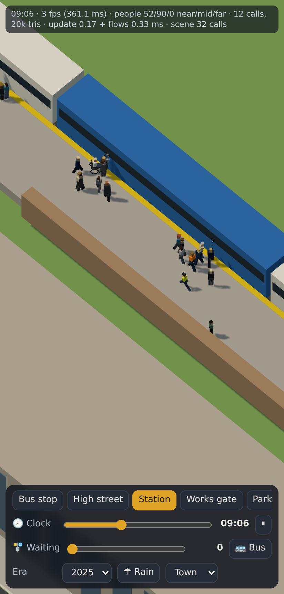 |
| Works gate, 05:58: the 06:00 shift streaming in (hi-vis, hard hats) | 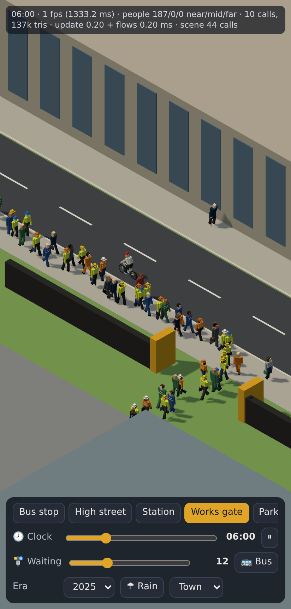 |
| School run, 08:44: pupils with parents, the yard filling, parents at the gate | 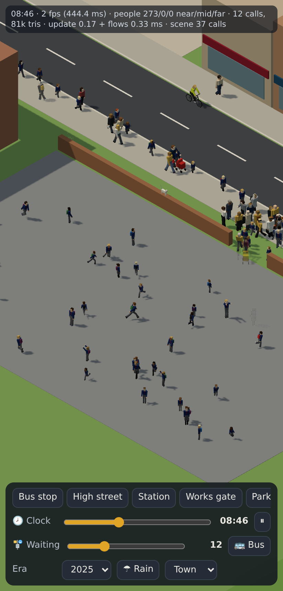 |
| Park, 18:00: dog walkers with leads, a bench, ducks | 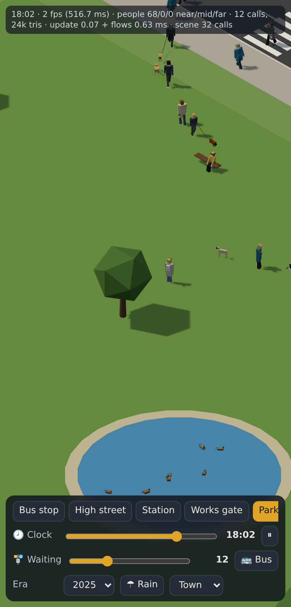 |
| High street in 1905 and 1975 | 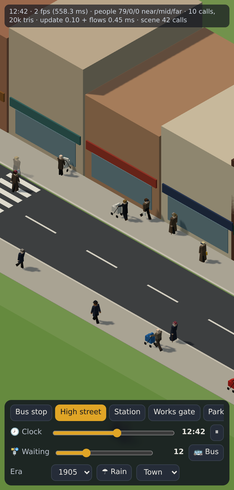 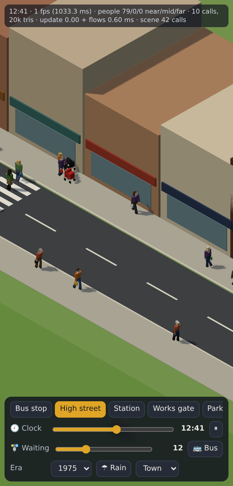 |
| Turntable: every role in 2025, 1955 and 1905 | 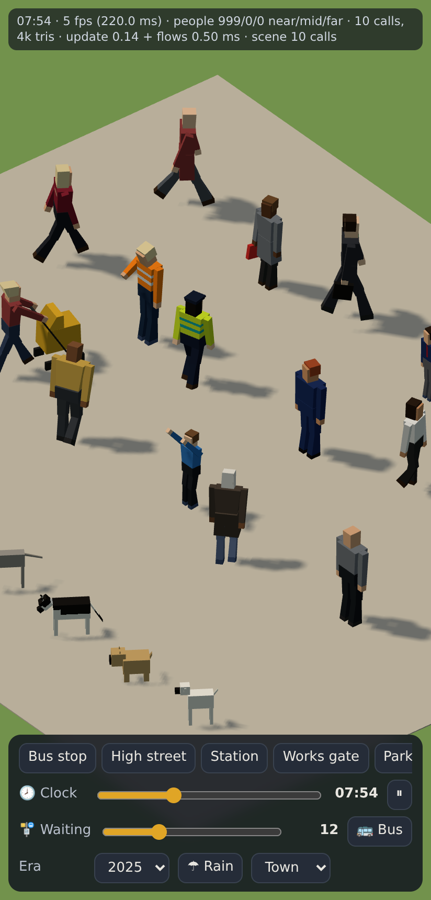 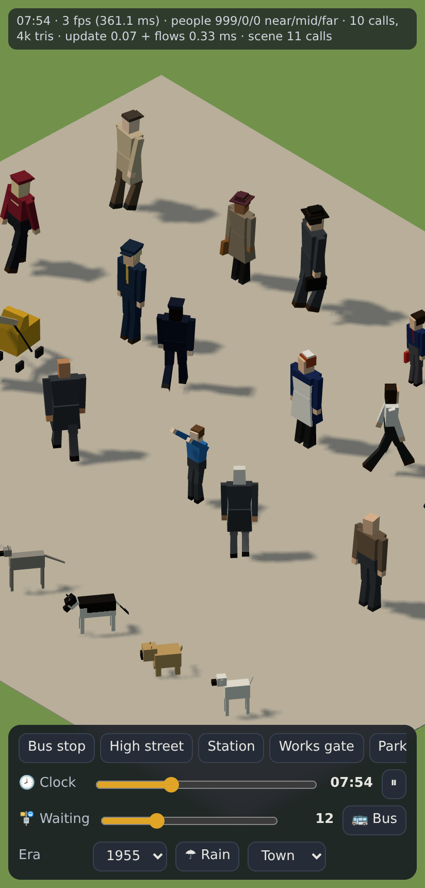 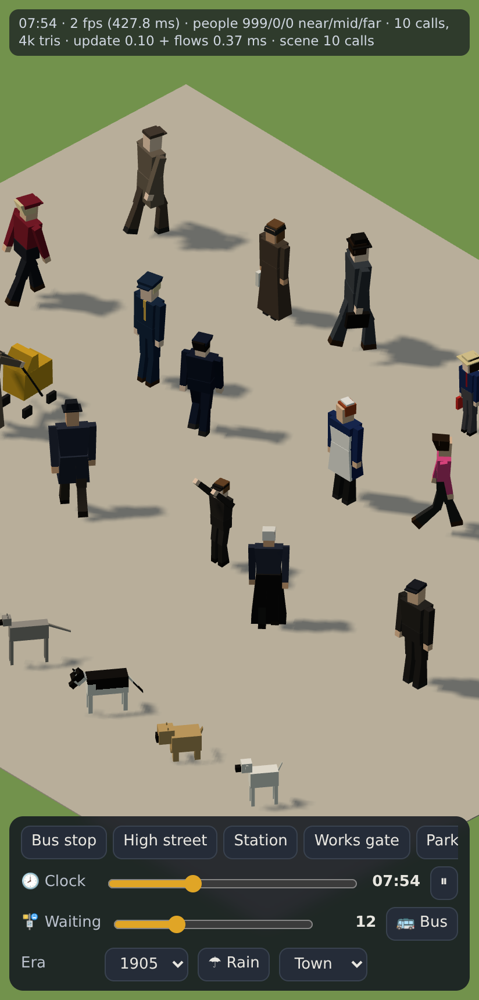 |
| Dogs | 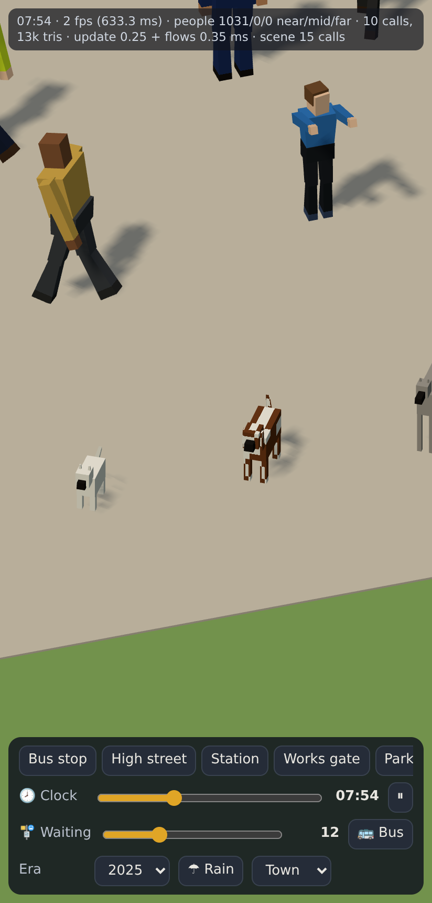 |
| Middle distance, and far (cards) | 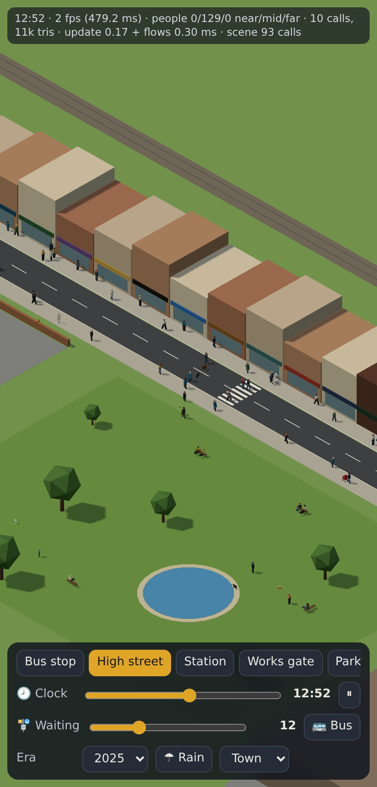 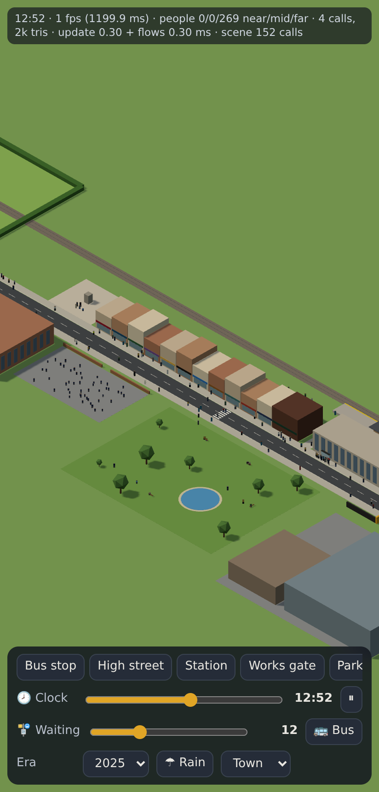 |
| Fields: sheep and cows | 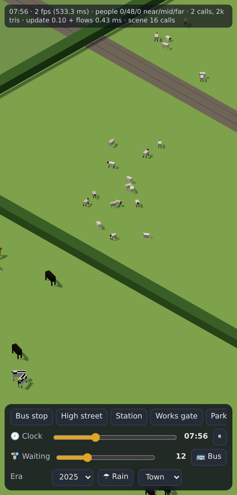 |
| 2,000 figures near, middle and far (pixel ratio 1) | 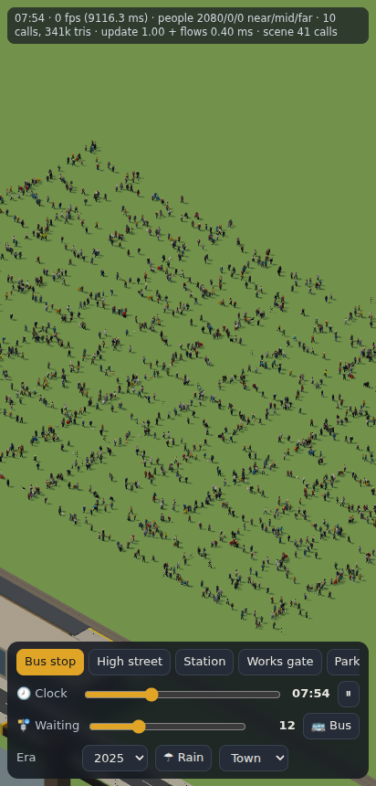  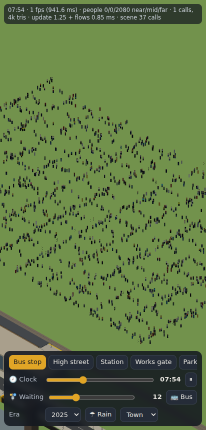 |

## Known limits

- Crossings aren't gated by signal phases, and people don't avoid each other (they pass
  through when their speeds differ). Footways don't know about street furniture.
- Every leg of a route costs a draw of each figure on it. Routes need to stay at a few arcs,
  or the next step is a small route texture.
- The streams at a shift change show density, not individual journeys. Particular crowds
  (off a given train) use `alight()`.
- Coats follow the era, not the season. There's no night-time thinning beyond what the flows
  say.
- Cats sit on given spots on walls; nothing finds walls for them yet.
- The quadruped is boxy by design. The collie's markings and cow patches are a per-pixel
  pattern, not modelled.
- Not yet measured on a real phone. The budgets in `BUDGETS` are guesses to tune there.
