# Report: terminals

The question was: "maybe we have road terminals or rail terminals as add-ons that become
available for purchase as they grow?" This builds that: loading facilities bought for an industry,
three tiers per transport mode, which cap how far the industry can grow and unlock as it presses
against them.

## What was built

All new files are in `src/proto/terminals/`. The API and integration plan are in
[`docs/terminals.md`](../terminals.md).

- **Catalogue** (`catalogue.ts`). Nine tiers:
  - road: loading bay, lorry depot, road freight terminal;
  - rail: private sidings, rail freight terminal, marshalling yard;
  - water: jetty, quay, bulk or container terminal.

  Each has cost, upkeep, build time, berths, t/h per berth, queue space, stock, catchment bonus,
  era, stop-time factor, land needed and the handling kit it can take. There are seven fits
  (standard, conveyor, rapid loader, loading gantry, tank farm, grab cranes, container cranes),
  each suiting one cargo class: bulk, general or liquid.
- **Rules** (`rules.ts`), all pure:
  - capacity and the production level it allows;
  - the 2D growth review held to that cap;
  - pressure, and unlocking the next rank;
  - offers with prices and reasons, and a plain-words suggestion;
  - buying, upgrading alongside, refitting, removing and reopening;
  - idle ageing (warn, mothball, cut back, close), upkeep, and output shared between modes;
  - stop times, towns' goods depots, and one `report()` call for the economy.
- **Layout** (`layout.ts`). Starters go at the site's own anchors. Bigger tiers go on land beside
  the site, behind it, or out over the water, and never overlap. A room check feeds the land
  registry.
- **Models** (`models.ts`). One vertex-coloured mesh per site's terminals, in the industries kit
  style. Cranes, belts and gantry trolleys, floodlights, stockpiles and parked vehicles are plain
  data for the existing `IndustryFx`.
- **Demo**. A Terminals panel in `industries-demo.html` (`panel.ts` and hooks in `demo.ts`).
- **One change to the industries code**. `buildIndustry(..., { bare: true })` leaves out a site's
  own bays, sidings and loading canopies but still records their anchors, so bought terminals
  replace them rather than doubling up. The rest of each recipe draws from the same random
  sequence, and a test checks bare and full builds have identical anchors.

## Decisions

- **A terminal is the site's station for a mode, and tiers are upgrades.** One terminal per mode
  per site, so up to three: road, rail and water. That keeps the choice legible on a phone (three
  ladders, not a scatter of stations) and it is what "add-ons that become available as they grow"
  describes. A line's stop at an industry becomes "its terminal for my vehicle's mode".
- **Capacity is berths times a rate per berth, shared by loading and unloading.** A berth either
  loads or unloads, so a processor's inputs and outputs compete for the same berths. One formula
  covers primaries, processors, sinks, hubs, the docks and towns:

  ```
  levels per hour = berths / Σ (flow at level 1 / rate for that cargo)
  ```

  Terminals in parallel add up.
- **The 2D growth rule is kept as it is and capped.** The level rises x1.12 above 60% collected
  and falls x0.96 below 15%, between 1 and 4. It can't rise past what the terminals move. Nothing
  new has to be learnt: terminals are simply why growth stops.
- **Unlocking needs pressure and ownership.** The next rank opens when the stockyard is full with
  the berths busy, vehicles queue, or growth is capped, and only once the player owns a terminal
  of the current rank. A site can't race up the ladder while it's ignored, and a grade once earned
  stays, so a bad month doesn't take an option away.
- **Vehicles are told apart from concrete.** A full stockyard with idle berths is "Add lorries:
  the lorry depot is only 15% used", not an upgrade.
- **Fits by cargo class, never zero.** A rapid loader is magnificent for coal and poor for crates,
  but not useless. Mixed sites can always move everything. The best fit for the site's own traffic
  is recommended, in era: rapid loaders from 1965 and container cranes from 1968.
- **Upgrades are built alongside.** The old terminal keeps working until the new one opens, and
  costs half its price off the new one. Waiting 60 days for a marshalling yard shouldn't stop a
  colliery.
- **Idle terminals decline slowly.** A warning at 30 days, mothballed at 90, then cut back a rank a
  year later, down to closing. An abandoned yard costs a fifth of its upkeep while it waits for
  the player to notice. The docks' own quay is only ever mothballed.
- **Sharing by comparative advantage.** Splitting each cargo by raw speed sent crates to the rapid
  loader because it outpaces a lorry depot even at crates. Weighting by how much better a terminal
  is at a cargo than at the others sends coal by rail and crates by road, as a player would expect.
- **The starters keep the 2D stations' numbers.** Cost and stock match the 2D loading bay (1,000,
  200), lorry depot (5,000, 600) and rail station (6,000, 800). The ladder then spans 50 to 1,800
  t/h, so small pits reach level 4 on rank 2 while steelworks, power stations, refineries, the
  docks and the distribution centre need rank 3 (table below).
- **Starters at the anchors, the rest on land beside the site.** The site's recipe already knows
  where its bays and sidings belong. Bigger tiers don't fit inside a plot that's full of works, so
  they take a strip beside, behind or over the water, and each such strip is a land claim the
  registry can refuse.
- **The water's edge doesn't move.** Quays and jetties are built out from a fixed waterline just
  behind the back fence. Upgrading a jetty to a quay reclaims more land; it never moves the coast.
- **Same kit, same fx.** Terminals are drawn with the industries `Site` helpers, one mesh with one
  material, and their moving parts go through `IndustryFx` via `fxModel()`. There are no new draw
  calls, and they bake into chunks like the site. Track ballast is darker and rail heads brighter
  than on the sites' own sidings, because from the isometric camera a yard is read by its tracks.
- **A stand-in economy.** The real economy layer is being ported separately, so `estimateFlows()`
  turns a level, the terminals and a service level into a month of plausible flows. It's enough to
  drive the demo and "what if" previews, and it's the shape (`SiteFlows`) the economy fills.
- **The Terminals view shows the selected site alone.** A 220 m marshalling yard reaches into the
  neighbouring cells of the gallery.

## How big a terminal each industry needs

The production level each tier alone supports at its best fit. At least 4 (bold) means that tier
alone lets the site reach full production.

| Industry | t/h at level 1 (out + in) | Loading bay | Lorry depot | Road freight terminal | Private sidings | Rail freight terminal | Marshalling yard | Jetty | Quay | Bulk or container terminal |
|---|---|---|---|---|---|---|---|---|---|---|
| Colliery | 66 | 1.21 | 3.39 | **9.7** | 3.64 | **18.9** | **53.0** | – | – | – |
| Quarry | 72 | 1.11 | 3.11 | **8.9** | 3.33 | **17.4** | **48.6** | – | – | – |
| Forest | 54 | 0.93 | 2.59 | **7.4** | 2.78 | **14.8** | **41.5** | – | – | – |
| Farm | 81 | 0.82 | 2.30 | **6.6** | 2.47 | **7.1** | **19.8** | – | – | – |
| Sawmill | 162 | 0.31 | 0.86 | 2.47 | 0.93 | **4.9** | **13.8** | – | – | – |
| Steelworks | 300 | 0.23 | 0.63 | 1.81 | 0.68 | 1.89 | **5.3** | 0.54 | 2.42 | **8.7** |
| Ironstone mine | 60 | 1.33 | 3.73 | **10.7** | **4.0** | **20.8** | **58.3** | – | – | – |
| Power station | 240 | 0.33 | 0.93 | 2.67 | 1.00 | **5.2** | **14.6** | 0.80 | 3.75 | **13.5** |
| Refinery | 216 | 0.35 | 0.97 | 2.78 | 1.04 | 3.47 | **9.7** | 0.83 | 3.47 | **12.5** |
| Oil field | 60 | 1.25 | 3.50 | **10.0** | 3.75 | **12.5** | **35.0** | – | – | – |
| Brewery | 96 | 0.68 | 1.90 | **5.4** | 2.04 | **6.1** | **17.0** | – | – | – |
| Food plant | 162 | 0.34 | 0.96 | 2.76 | 1.03 | **4.2** | **11.9** | – | – | – |
| Factory | 159 | 0.33 | 0.93 | 2.65 | 0.99 | 3.31 | **9.3** | – | – | – |
| Docks | 180 | 0.31 | 0.88 | 2.50 | 0.94 | 3.13 | **8.8** | 0.75 | 3.13 | **11.3** |
| Distribution centre | 360 | 0.15 | 0.42 | 1.21 | 0.45 | 1.52 | **4.2** | – | – | – |

No starter alone takes any industry to level 4, and every industry can reach it by climbing its
ladders (both are tested). Terminals in different modes add, so a colliery can also get there
with a lorry depot and private sidings.

## Test results

`npx tsc --noEmit` is clean. `npx vitest run`: 9 files, 159 tests, all passing. That is the 124
existing ones, unchanged, plus 35 new ones in `src/proto/terminals/terminals.test.ts`:

- **Catalogue.**
  - Every mode's ladder rises in cost, upkeep, throughput (more than doubling), berths, stock,
    catchment, build time and era, and its stops get quicker.
  - The starters match the 2D stations' cost and cap.
  - Every cargo has a class, and every fit is better at exactly one class and never zero.
- **Capacity and growth.**
  - The cap is throughput over output, and terminals add.
  - Every industry reaches level 4 on its top tiers, no starter gets any there, and a steelworks
    needs rank 3.
  - Fits favour their class and are recommended for the site's cargo.
  - Stops get shorter up the ladder.
- **The 2D review.** It rises, holds, falls, respects 1 and 4, and is capped by terminals.
- **Pressure.**
  - A loading bay at a colliery stockpiles, opens rank 2 (lorry depot and rail freight terminal,
    no water) and says "Colliery output is stockpiling: a lorry depot would move 4.5x more".
  - Rank 3 needs rank 2 owned, nothing unlocks without pressure, and idle berths ask for vehicles.
  - A power station's trains queue for a bigger rail terminal.
  - With nothing to buy, the suggestion says what's in the way.
- **Offers.**
  - Water isn't offered away from water, and not at all for a sawmill.
  - The docks start with a quay.
  - Every refusal has its reason and code: rail line, road, era, grade, and a later fit refused
    early.
  - The room check blocks land beside and behind but not the site's own anchors.
  - A town depot only unloads.
- **Buying.**
  - Build times, and upgrades built alongside at the new price less half the old.
  - Nothing more can be ordered in that mode until the upgrade opens.
  - Locked tiers and wrong fits are refused.
  - Refit, remove (25% back), reopen (10%), and the docks' quay can't be removed.
  - The state passed in is never mutated.
- **Idle.**
  - A marshalling yard warns at 30 days, is mothballed at 90, is cut back twice and then closes;
    the grade is kept.
  - Mothballed upkeep is a fifth; service forgives idle days; the docks' quay never closes.
- **Sharing.** Coal leans to the rapid loader and crates to the depot. No mode without vehicles
  gets anything, and no terminal gets more than its berths or vehicles can take.
- **Layout.**
  - For all 15 types, every rank, with and without water: starters are inside the plot, annexes
    are outside it and clear of each other, and water tiers are beyond the waterline.
  - Starters use the anchors, and rail moves off the side when the back is water.
  - Bare builds keep the anchors, have fewer triangles, and have no bays or sidings of their own.
- **Models.**
  - Every tier and fit at every site that can use it builds as one mesh within budget (700,
    1,600 and 2,600 by rank) and under 45 m tall, with every vertex on the plot, on the
    terminal's own ground or over its water.
  - The same inputs give the same triangles and moving parts, and a different fit changes them.
  - Berths and cranes match each tier.
  - A power station gets hopper houses rather than a silo.
  - The fx stays at 9 draw calls.

Highest triangles for each tier and fit at any site (default plots):

| Tier | Standard | Conveyor | Rapid loader | Gantry | Tank farm | Grab cranes | Container cranes |
|---|---|---|---|---|---|---|---|
| Loading bay | 40 | 170 | | | 302 | | |
| Lorry depot | 214 | 354 | | | 472 | | |
| Road freight terminal | 374 | 574 | | | 706 | | |
| Private sidings | 98 | 228 | | | 216 | | |
| Rail freight terminal | 334 | | 530 | 390 | 1,126 | | |
| Marshalling yard | 692 | | 888 | 748 | 1,484 | | |
| Jetty | 404 | 464 | | | 656 | | |
| Quay | 408 | 448 | | | 940 | 436 | |
| Bulk or container terminal | 542 | | | | 1,716 | 578 | 656 |

A colliery with a road freight terminal and a marshalling yard with a rapid loader is
1,262 triangles beside its own 434. The docks' quay shows 0 because the docks recipe draws it.

The panel was also driven by clicking in headless Chromium: open, tap a locked tier (its reason
appears), buy, review, buy, refit, auto on, off and on again, rail line off, buy sidings, four
idle months (both terminals mothballed), reopen, remove, change site and back (each site keeps its
own terminals), close. There were no page errors.

## Screenshots

Headless Chromium (SwiftShader) at 412 × 915, from the Vite dev server's `/industries-demo.html`.

Growing a colliery:

| | | |
|---|---|---|
| 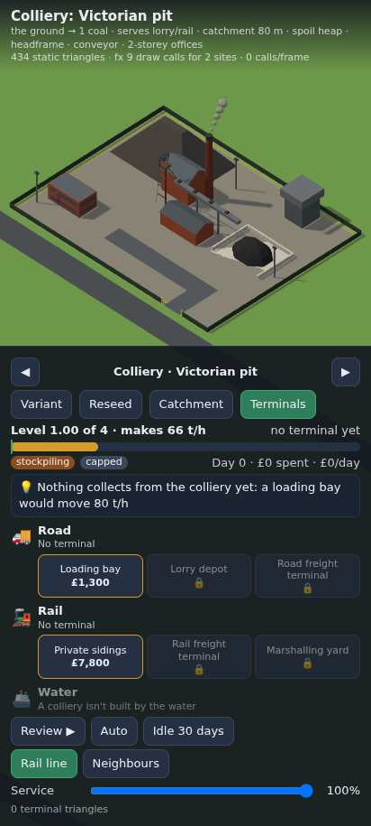 | 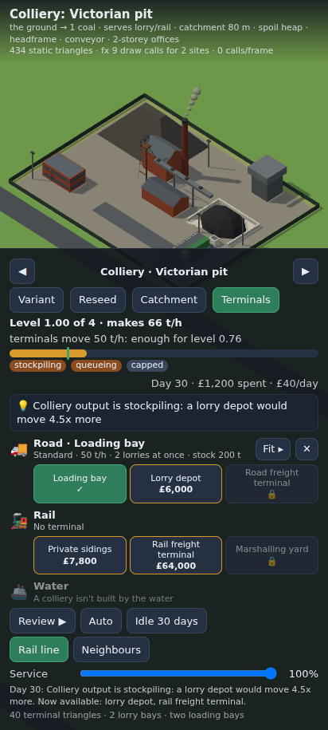 | 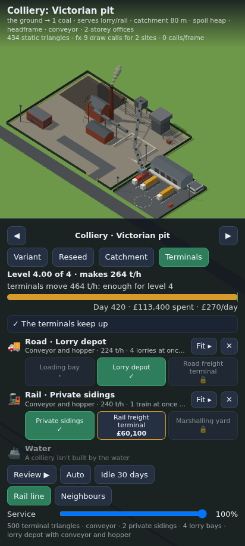 |
| Nothing yet: "a loading bay would move 80 t/h". Road and rail open at rank 1; water is refused, with the reason | One review with a loading bay: stockpiling, queueing and capped. The lorry depot and rail freight terminal unlock | A lorry depot and private sidings, both with conveyors: level 4 after 14 reviews, "the terminals keep up" |

What the rules say when growth is stuck:

| | | |
|---|---|---|
| 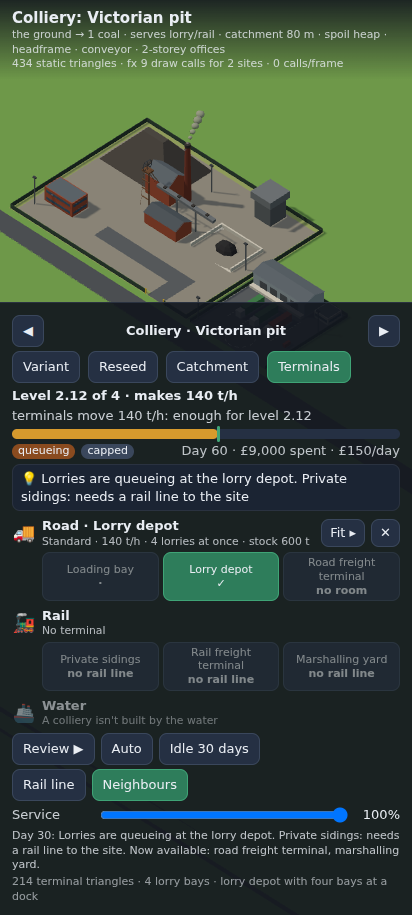 | 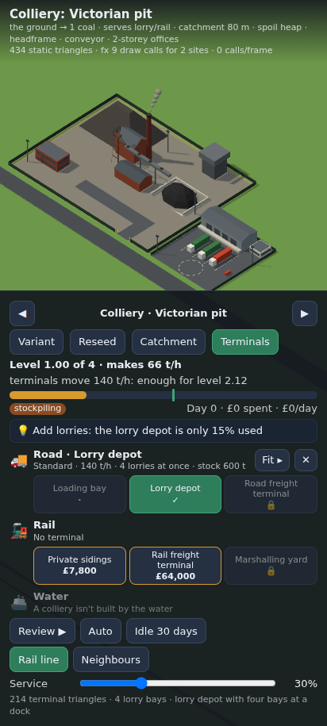 | 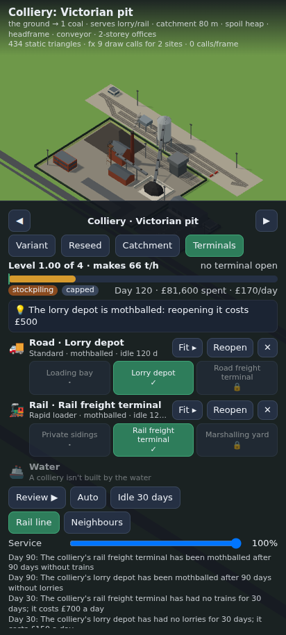 |
| No rail line and neighbours either side: every rail tier says "no rail line", the road freight terminal "no room", and the suggestion names the cheapest fix | A depot with vehicles lifting 30%: "Add lorries: the lorry depot is only 15% used" | 120 days with no vehicles: warned at 30, both mothballed at 90, and the log says so |

Bigger sites:

| | | |
|---|---|---|
| 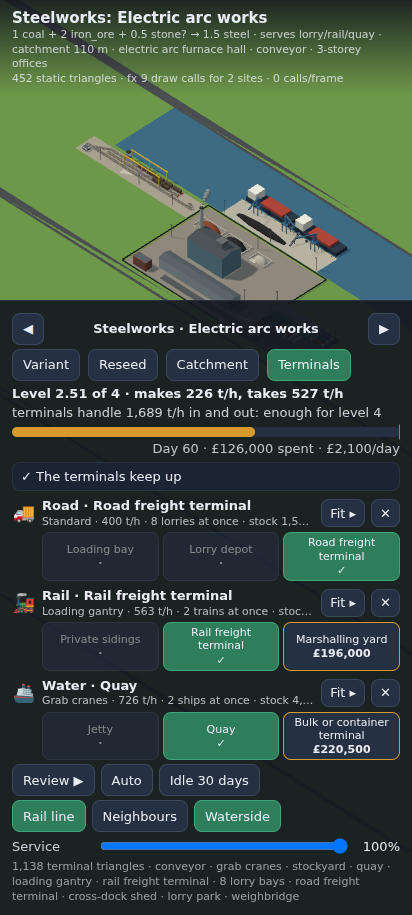 | 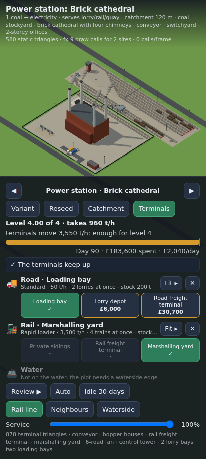 | 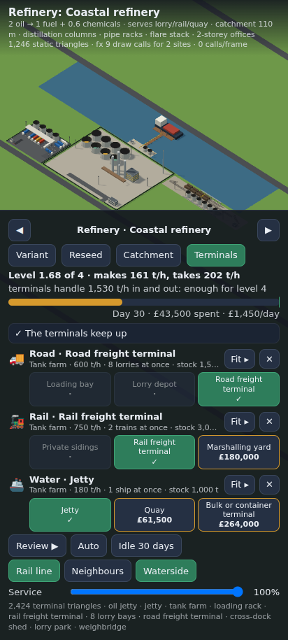 |
| Steelworks on the water: quay with grab cranes, rail freight terminal with a loading gantry, road freight terminal. In and out traffic shares the berths | Power station: a marshalling yard with hopper houses (it only takes coal in) at level 4 | Coastal refinery with tank farms at the road terminal, the rail terminal and an oil jetty |
| 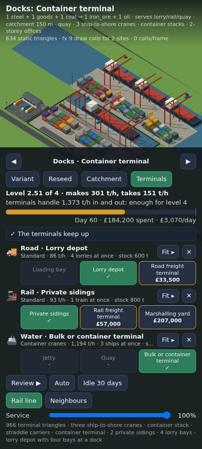 | 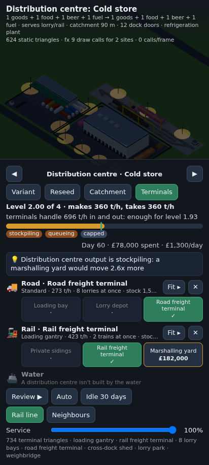 | |
| The docks' container terminal built out beyond the old basin, plus a lorry depot and sidings | Distribution centre at night: "output is stockpiling: a marshalling yard would move 2.6x more" | |

The models close up (panel hidden):

| | | |
|---|---|---|
| 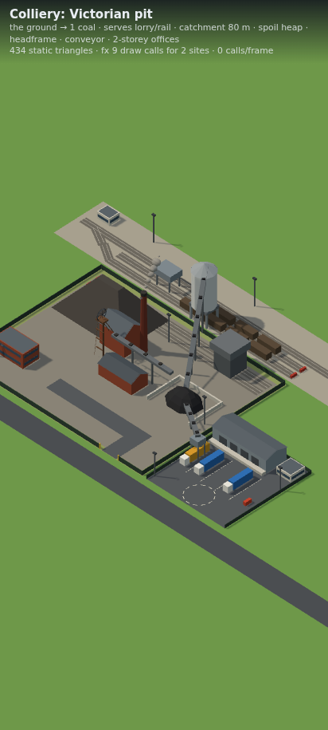 | 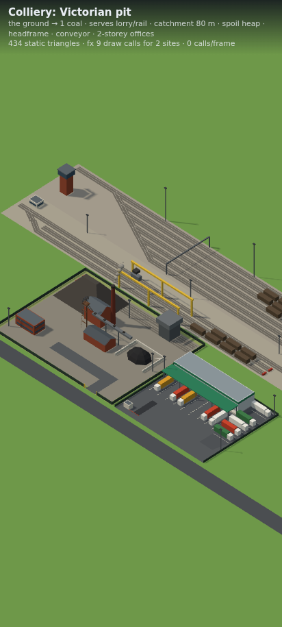 | 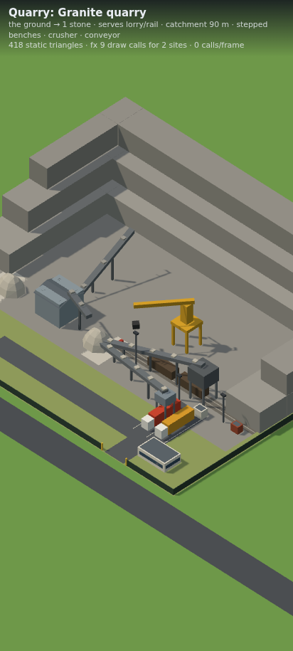 |
| Lorry depot with a hopper; rail freight terminal with a rapid loader silo fed from the heap | Road freight terminal with canopy and lorry park; marshalling yard with fan, ladder, signal gantry and control tower | Quarry starters: a hopper over a loading bay and a bunker over the siding, both belt-fed from the stone heaps |
| 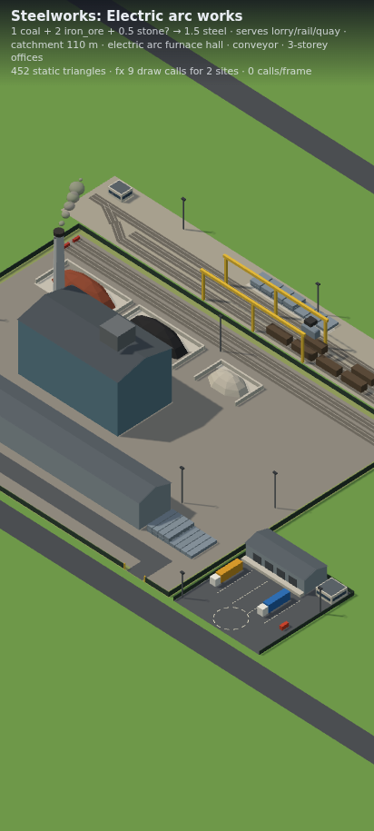 | 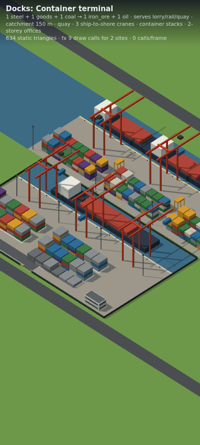 | 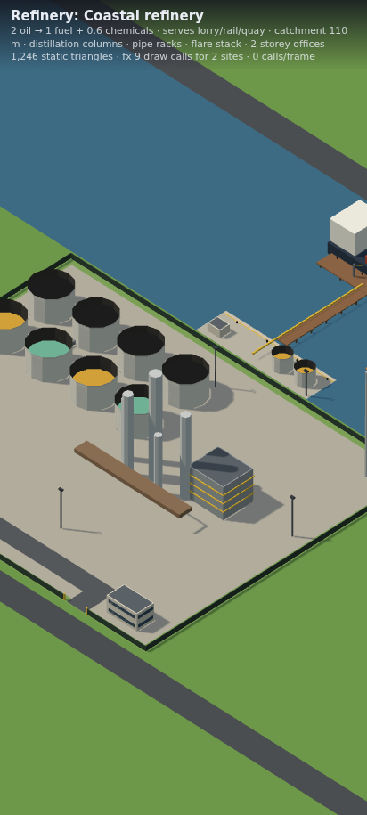 |
| Steelworks: an overhead crane runway over the loading roads, with steel stacked alongside | Three ship-to-shore gantries, container stacks and straddle carriers | Oil jetty: trestle, T-head, pipe and loading arms, with a tanker alongside |
| 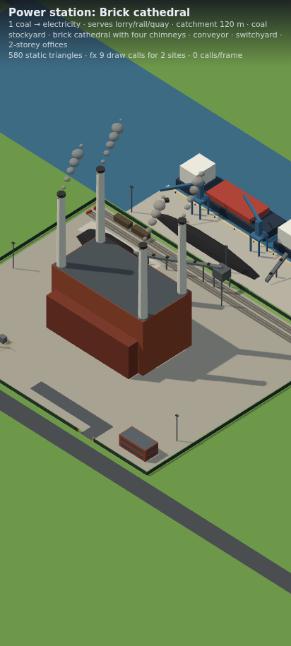 | | |
| Power station quay: grab cranes over a coal stockyard | | |

## Known limits

- **No real economy yet.** Flows come from `estimateFlows()`, a month of plausible numbers, not a
  simulation. Costs, upkeep and rates are a first pass against the 2D game's costs and have not
  been balanced against revenue.
- **One terminal per mode.** A steelworks takes bulk in and sends steel out, but its rail
  terminal can carry only one fit, so it's fitted for its heavier class and handles the other at
  standard. A second terminal per mode, or two fits on a rank-3 tier, would fix that.
- **One rate for loading and unloading.** The berths are shared, which is right, but a fit speeds
  both equally. The hopper house is drawn, not modelled separately.
- **Fixed input shares.** For `any` processors, hubs and the docks' exports, the cap assumes the
  inputs arrive in equal shares. The economy can pass a `SiteSpec` built from what really arrives.
- **Placement is rectangles.** Annexes are rectangles in the site's frame, beside, behind or over
  the water. There's no connection geometry to the road or rail network: tracks end at the pad's
  edge. The site's fence stays between the site and its annex, with belts and pipes crossing it.
- **Starters use the recipe's spots, including its crowding.** A farm's silos stand on its bay pad,
  as they did in the original recipe.
- **The docks' own quay has no terminal model.** The docks recipe draws it, so refitting it doesn't
  change the picture until it's upgraded to a bulk or container terminal.
- **Water is a stand-in.** The waterline is assumed to be just behind the back fence, and the demo
  paints a water plane there. With real coastlines it should come from the world.
- **Towns' goods depots are rules only.** `townSpec()` gives their demand and all the rules apply,
  but there's no depot model yet.
- **Mothballed terminals look the same** as open ones, except that no vehicles stand in them.
- **The land check is the demo's.** The Neighbours toggle stands in for the land registry. The
  wider catchment ring is only drawn in the demo.
- **Screenshots are SwiftShader**, so shadows and antialiasing are softer than on a phone's GPU.

## On the anchors: tiers bought, then demolished

These were re-taken after the review fixes, with `?anchors=1`: the site's gate, lorry bays,
sidings and quay are marked in magenta. Starter tiers sit on those marks. Bigger tiers sit on
land beside the plot: on the frontage by the bays, behind the works in line with the sidings (or
off the far side when the back is water), or out into the water from the bank.

| Colliery | Colliery, rail demolished | Steelworks | Steelworks, quay and road demolished |
|---|---|---|---|
| 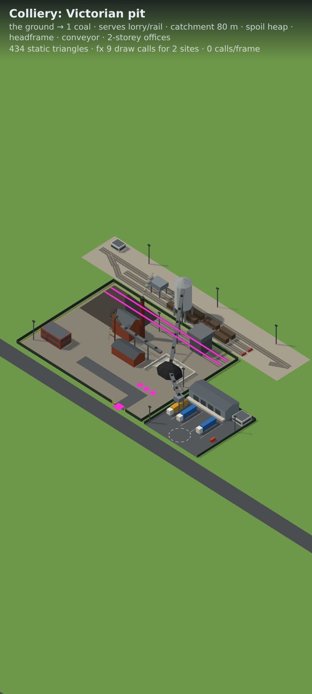 | 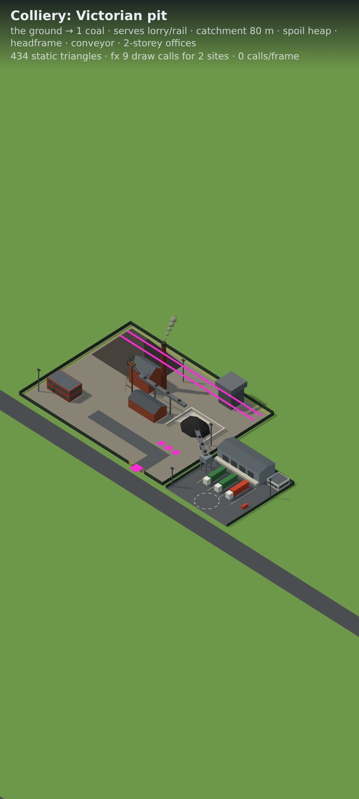 | 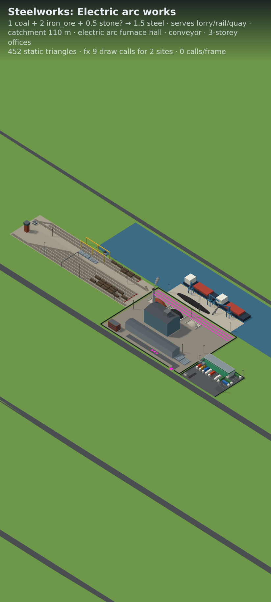 | 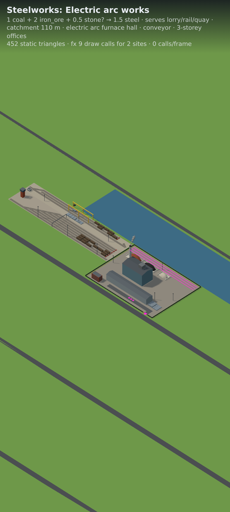 |

| Docks | Docks, back to their own quay | Refinery | Refinery, depot and jetty demolished |
|---|---|---|---|
| 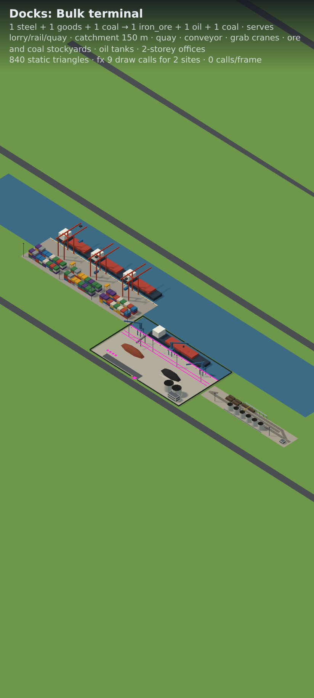 | 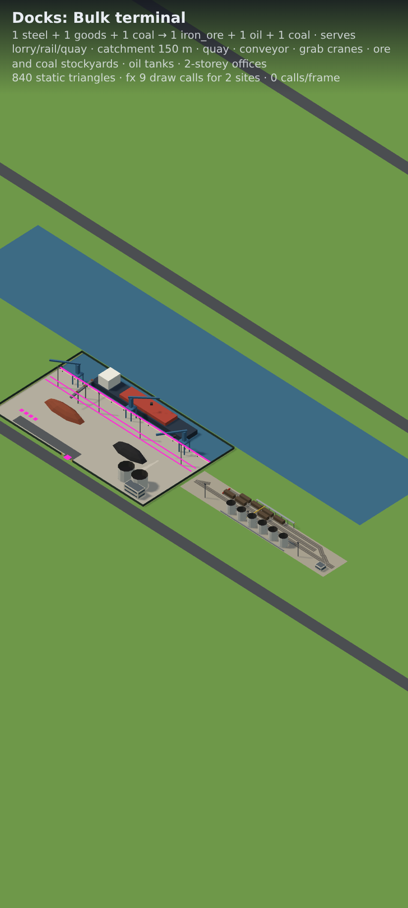 | 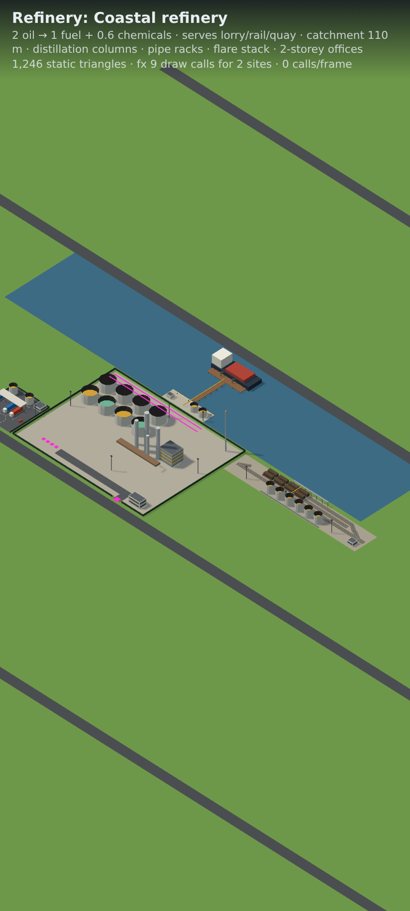 | 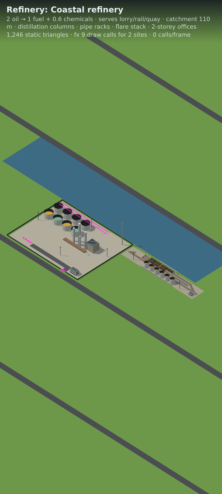 |

| Quarry | Quarry, sidings demolished | Power station | Power station, rail demolished |
|---|---|---|---|
| 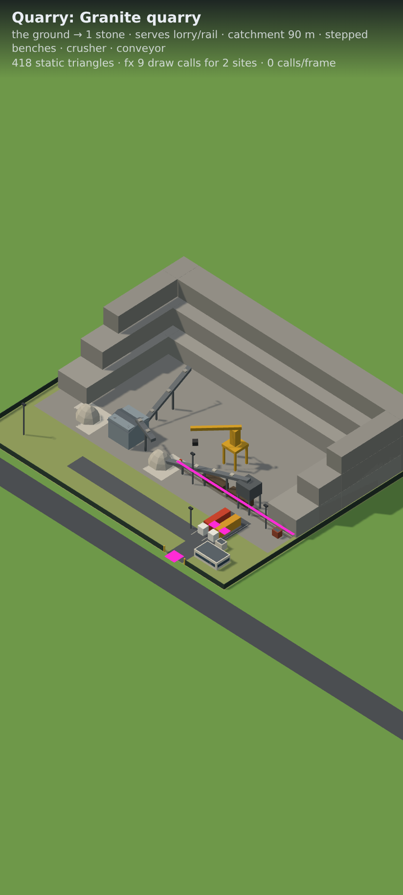 | 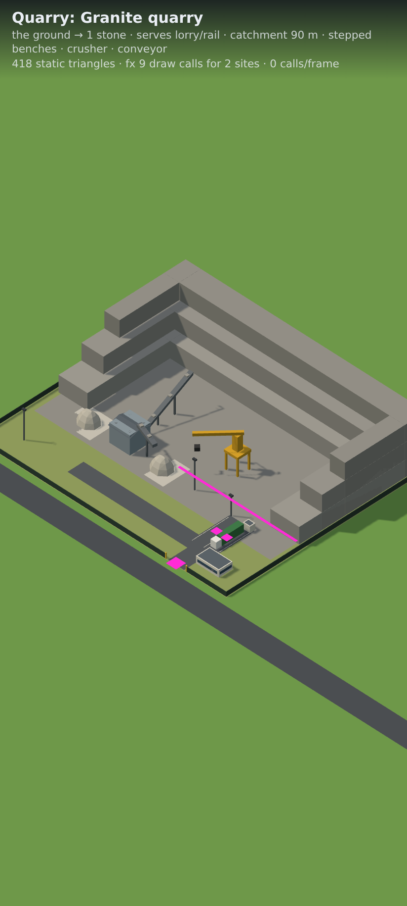 | 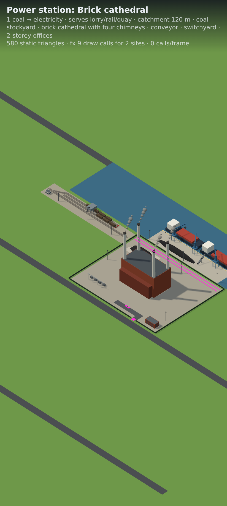 | 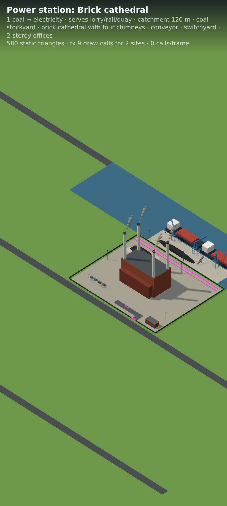 |

| Sawmill | Sawmill, road terminal demolished | The panel |
|---|---|---|
| 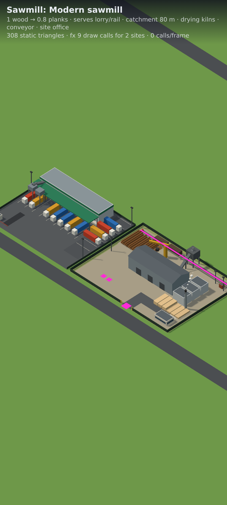 | 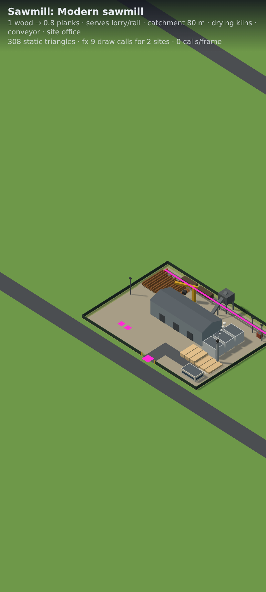 | 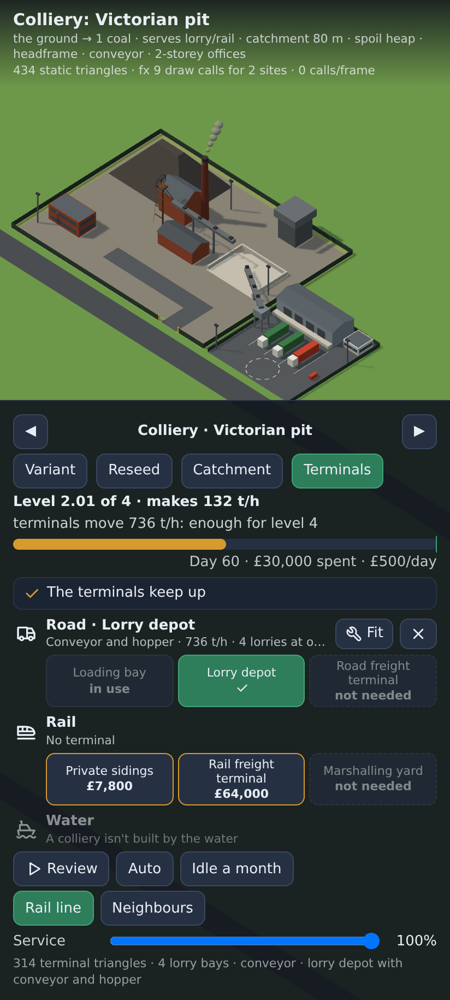 |
