# Report: the vehicle library

**Branch:** `claude/vehicles-lib` · **Code:** `src/proto/vehicles/` · **Showroom:** `vehicles-demo.html` ·
**Guide and brand bible:** [`docs/vehicles.md`](../vehicles.md)

Every car, lorry, bus and train in `traffic.ts` is a few instanced boxes today. This branch adds a
library to replace them: **966 procedural low-poly models** from **32 invented makers**, in
**75 body styles** from 1900 to 2030, liveried by **37 invented operators**, at three levels of
detail, with real UK dimensions and economy stats. It's all new files; nothing else in the repo
changed, and the integration into `traffic.ts` is a written plan rather than code.

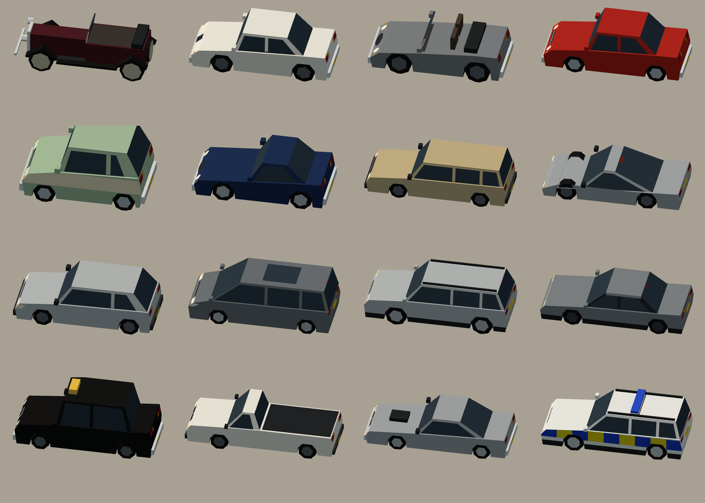

## What's in the folder

| File | What it does |
|---|---|
| `types.ts` | Model, dimensions, hitches, stats; paint zones; light codes and per-instance flags |
| `kit.ts` | The geometry kit: extruded side profiles with cut-in arches, cross-section lofts, boxes, cylinders, discs, decals, profile clipping. Faces wind themselves outward |
| `parts.ts` | Shared parts: wheels, mid-LOD axle blocks, mirrors, light bars, beacons, end lamps, plates, the far box |
| `cars.ts` · `vans.ts` · `lorries.ts` · `buses.ts` · `rail.ts` · `craft.ts` | The builders, one per family |
| `specs.ts` | Real dimensions, design knobs and stats per style, size class and year |
| `brands.ts` · `operators.ts` | The brand bible and the operators with liveries by era and vehicle type |
| `models.ts` | Expands the brands' model lines into the catalogue, with police cars, multiple-unit and tram cars, sets and hitches |
| `era.ts` | Eras, styling by year, colour fashion by decade, UK plate formats, fleet numbers, plate textures |
| `appearance.ts` | One vehicle's look: owner, four livery colours, plate or fleet number |
| `render.ts` | The instanced renderer and its patched Lambert shader; ground glow for beams and street lamps |
| `spawn.ts` | A realistic mix by area and year; trains by year |
| `articulation.ts` | Trailers and bendy buses following their hitch; offsets along a train |
| `economy.ts` | The buyable fleet by year |
| `realnames.ts` | ~1,300 real makes, models and UK operators for the name-safety check |
| `vehicles.test.ts` | 27 tests |
| `demo.ts` + `/vehicles-demo.html` | The showroom |

## Counts

| Category | Models | Styles | Near · mid · far triangles, average (max) | Budget |
|---|---|---|---|---|
| Cars | 489 | 14 (hatchback, saloon, estate, coupé, convertible, SUV, pickup, people-carrier, sports, supercar, vintage, cab, police) | 283 (376) · 61 (114) · 10 | 400 · 120 · 12 |
| Vans | 75 | 6 (small, panel, Luton, minibus, ice-cream, ambulance) | 266 (376) · 76 (126) · 10 | 450 · 140 · 12 |
| Lorries | 157 | 10 (box, curtain-sider, tipper, flatbed, tanker, bin lorry, gritter, mixer, recovery, tractor unit) | 391 (534) · 112 (162) · 17 | 700 · 200 · 24 |
| Trailers | 38 | 9 (box, curtain, tanker, tipper, flat with loads, container skeletal, car transporter, timber, livestock) | 307 (480) · 68 (152) · 10 | 600 · 160 · 12 |
| Buses and coaches | 48 | 7 (single-deck, double-deck, bendy front and rear, coach, vintage saloon, half-cab decker) | 255 (302) · 63 (106) · 10 | 800 · 220 · 12 |
| Rail | 125 | 21 (tank and tender steam, tender, shunter, diesel and electric locos, DMU and EMU driving and intermediate cars, high-speed power cars and coaches, tram sections, heritage tram, rack railcar, coaches, hopper, van, tank, container flat, car carrier, timber, brake van) | 360 (542) · 102 (170) · 10 | 900 · 250 · 12 |
| Boats | 18 | 5 (narrowboat, barge, coaster, container ship, car ferry) | 194 (588) · 86 (168) · 14 | 900 · 240 · 24 |
| Aircraft | 16 | 4 (light aircraft, turboprop, airliner, wide-body) | 236 (304) · 168 (216) · 16 | 900 · 240 · 24 |
| **Total** | **966** | **75** | | |

- **Makers and lines:** 32 makers with 119 model lines, which expand into generations and body styles.
- **Operators:** 37 operators with 65 liveries: bus companies, coach lines, trams, four railway eras,
  freight, hauliers, a council, a police force, an ambulance service, cabs, ice-cream vans, canal
  carriers, ferries and an airline.
- **Colour fashion:** 10 decade palettes.
- **Combinations:** about **35,000** distinct looks, counted conservatively as
  - each car model × its era's palette × roof and two-tone options;
  - each fleet model × the liveries that fit it;
  - each commercial × trade colours.

  That's before the seeded per-model options (roof racks, rails, sunroofs, spoilers, bonnet scoops,
  cladding, pillar colour, doors, loads, cranes), which are baked into the 966 geometries.
- **Buyable fleet:** 10 offers in 1910, 20 in 1935, 66 in 1960, 85 in 1985, 92 in 2010 and 97 in 2030.
- **Traffic mix in 2000, by share of spawns:**

  | Area | Cars | Taxis | Buses | Vans | Rigid lorries | Artics |
  |---|---|---|---|---|---|---|
  | City centre | 56% | 10% | 13% | 16% | 5% | – |
  | Industrial estate | 37% | – | 3% | 19% | 16% | 25% |
  | Motorway | 56% | – | 6% (coaches) | 12% | 3% | 23% |

## Decisions

- **Procedural, not modelled.** A kit of parts and a design record per model gives hundreds of
  distinct vehicles from a few thousand lines. Every model is seeded from its id, so the
  catalogue and geometry are identical on every run and nothing needs to be saved.
- **Side profiles for road vehicles, cross-section lofts for rail, ships and aircraft.** A car or
  bus reads by its silhouette, so its body is a side profile swept across the width, with the
  arches cut in and a greenhouse that leans in. A train reads by its roof curve and nose, so it's a
  loading-gauge cross-section swept along the length, and a nose is just more, smaller sections.
  The same loft makes hulls, fuselages, the mixer drum and the bin-lorry body.
- **Vertex colours and four paint zones, no textures.** This matches the flat low-poly look of
  `buildgen.ts`, costs no texture memory or atlas management, and lets one geometry wear any
  livery. The zones are body, band, roof and accent; each builder decides where they fall, so an
  operator's livery works on a bus, a van or a train alike. A texture atlas is only needed if
  lettering ever has to be readable (see limits).
- **One geometry per model and level of detail, one InstancedMesh each, one shared material.**
  Per-instance data is a matrix, the body colour (`instanceColor`), three more colours, a flags
  word and an odometer. The shader turns baked lamp codes on from the flags (with indicators
  blinking and beacons flashing on the GPU), and spins the wheels from the odometer, so the sim
  never touches geometry.
- **Flat-shaded, non-indexed geometry.** It's the look the game already has, and at these
  triangle counts the extra vertices cost less than the complexity of indexed flat normals.
- **Real dimensions first.** Lengths, widths, heights, wheelbases and axle positions follow UK
  vehicles of each class and era, for example:
  - a 1960s small saloon is about 3.8 m long;
  - a 2010s hatchback about 4.3 m;
  - a modern double-decker 10.5 × 2.55 × 4.3 m;
  - a 13.6 m trailer has its kingpin 1.6 m from the front and a tri-axle bogie at 1.31 m spacing;
  - a Mk-style coach is 23 m, and a 1970s-style power car 17.8 m.

  Tests hold every model to real-world limits and check the geometry fits its stated size.
- **Articulation as data.** Tractors and bendy fronts carry `hitch.rear`, trailers `hitch.front`.
  `follow()` drags the trailer's axle group towards the hitch, which gives real off-tracking
  round bends; a test drives an artic round a 15 m bend and checks the hitch stays joined and the
  trailer lags without folding.
- **Names checked by machine, then by eye.** The brief asked for no names within two edits of a
  real make or operator. The test does that against a compiled list, and it caught about forty
  of my first drafts: Pennard ≈ Panhard, Lumora ≈ Lumo, Vellmar ≈ Velar, Brantley ≈ Bentley,
  Hepworth ≈ Kenworth, Oakshire ≈ Yorkshire, Pellow ≈ Yellow Buses, Wessex & Mercia ≈ Wessex
  Trains and West Mercia, Aurelle ≈ Aurelia, Kinetta ≈ Ginetta, Contrail ≈ Great Central, and more.
  All were renamed. Plain English words (colours, "express", "timber") are allowed to match;
  invented words aren't.
- **The library doesn't touch the game.** Other sessions are editing `traffic.ts`, `main.ts` and
  `vite.config.ts`, so the showroom is served by the dev server rather than added to the build
  inputs, and integration is a step-by-step plan in `docs/vehicles.md`.

## Performance

Measured in headless Chromium with SwiftShader (software WebGL) at 390 × 844. On a server with
no GPU the fps figures mostly measure SwiftShader's fill rate: the empty world alone runs at about
the same fps. The draw calls, triangles and JavaScript time are the numbers that carry over to a
phone.

| Scene | Vehicles (drawn / simulated) | Draw calls (vehicles / all) | Triangles | JS per frame | fps (software) |
|---|---|---|---|---|---|
| Centre, 1995, day | 21 / 425 | 18 / 37 | 33k | 0.46 ms | 15 |
| Centre, 1995, night (beams, pools, lit windows) | 23 / 425 | 20 / 41 | 33k | 0.74 ms | 19 |
| Industrial estate, 1975 | 35 / 596 | 31 / 50 | 34k | 0.46 ms | 15 |
| Motorway, 2020, zoomed in | 133 / 1,618 | 59 / 82 | 46k | 1.5 ms | 12 |
| Motorway, 2020, whole loop (far level) | 1,222 / 1,618 | 75 / 98 | 47k | 3.7 ms | 10 |
| Showroom, 2025 cars | 62 / 94 | 62 / 82 | 47k | 0.5 ms | 13 |
| Turntable, one car | 1 | 1 / 2 | 362 | 0.08 ms | 30 |

- **Triangles are small.** 1,222 vehicles at the far level add about 16k triangles to a world of
  about 30k. A near street scene adds a few thousand.
- **JavaScript is about 2–3 µs per vehicle.** That's composing a matrix and writing a few floats,
  so 2,000 vehicles cost under 5 ms on this server's CPU.
- **Draw calls are what to watch.** It's one call per distinct model and level on screen. The
  spawner's pools (60 models in the parade) keep this near 60–75 however many vehicles there
  are. On a mid-range phone, 100 or so calls is comfortable, and there's room to merge the far
  level into one `BatchedMesh` if county-sized maps need it.
- **Geometry memory is about 47 KB per model at the near level** (300 triangles, flat-shaded),
  built on demand and cached. Building all 966 models at every level takes about half a second in Node,
  and in a game only the handful in use get built.

## Screenshots

All at phone size with the game's isometric camera unless noted. Regenerate with the Vite dev
server and headless Chromium (see `docs/vehicles.md`).

| | | |
|---|---|---|
| 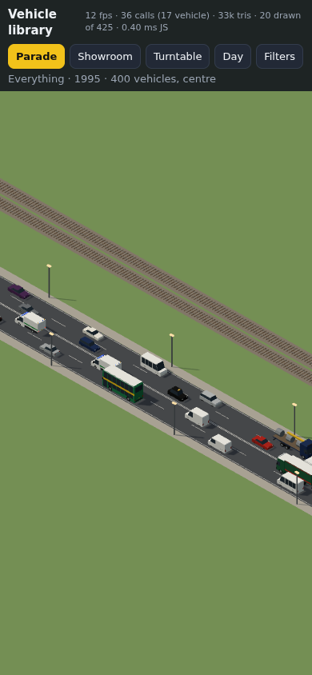 Parade, 1995 | 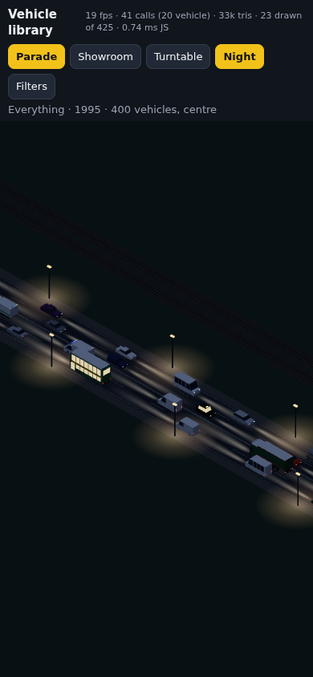 Same, at night: headlamp beams, lit bus windows, street-lamp pools | 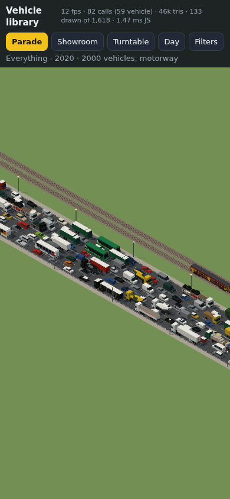 1,600 vehicles on an eight-lane motorway, 2020 |
| 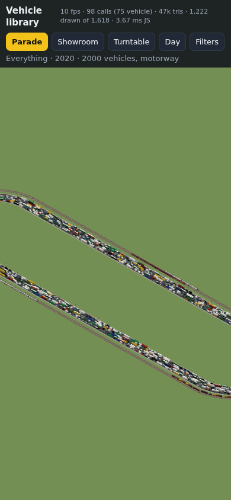 The whole loop, mostly at the far level: 75 vehicle draw calls | 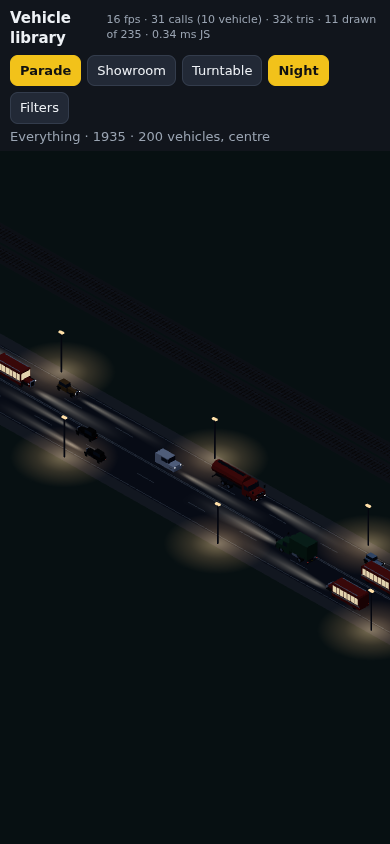 1935 at night: vintage cars and buses | 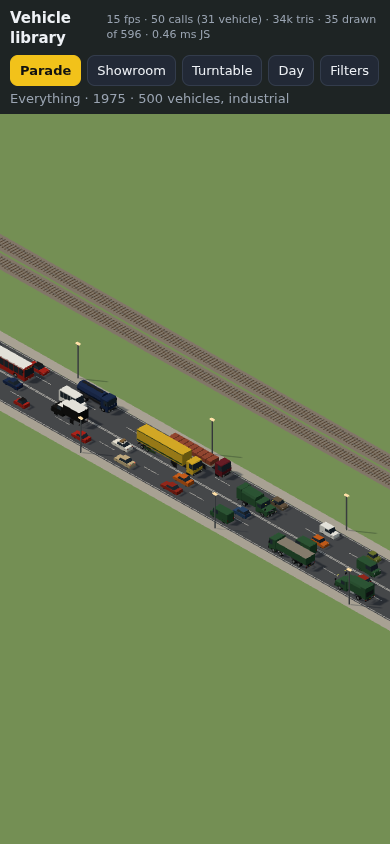 Industrial estate, 1975: artics and tippers |
| 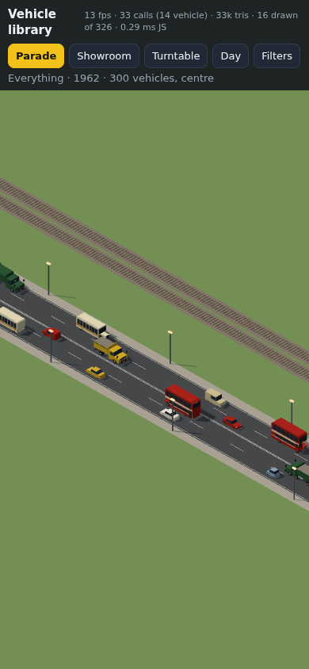 1962: half-cab deckers and chrome bumpers | 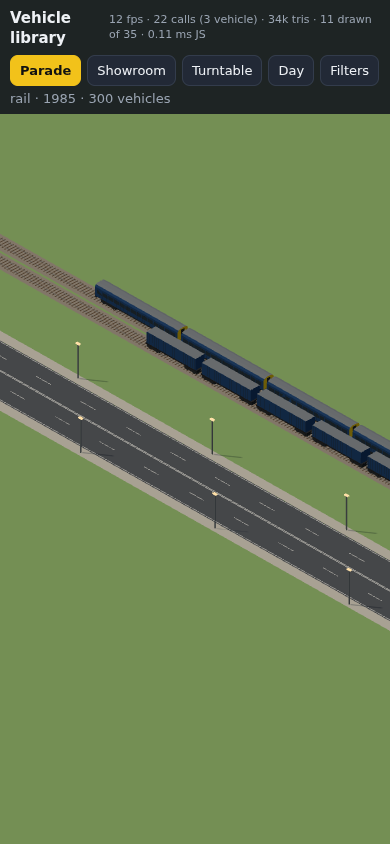 Rail, 1985: blue and grey | 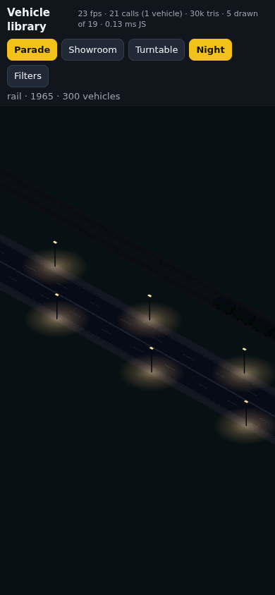 Rail at night, 1965 |
| 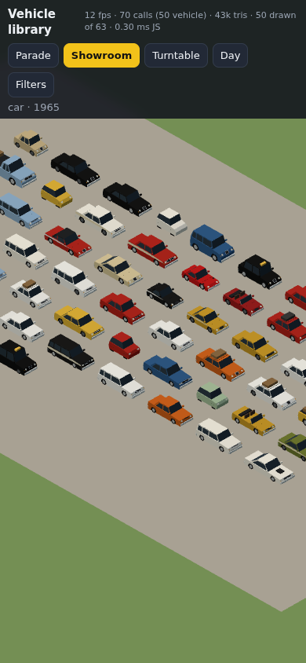 Showroom: cars of 1965 | 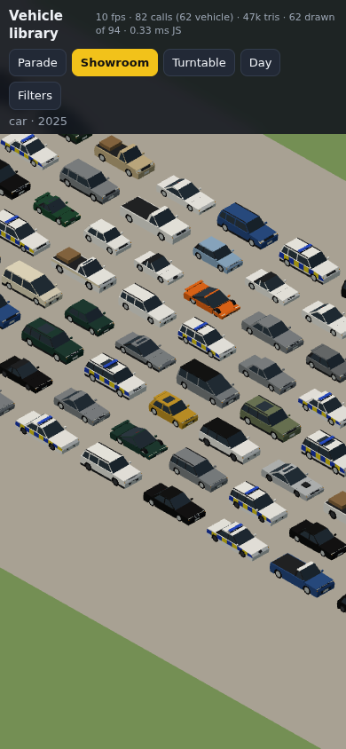 Showroom: cars of 2025 | 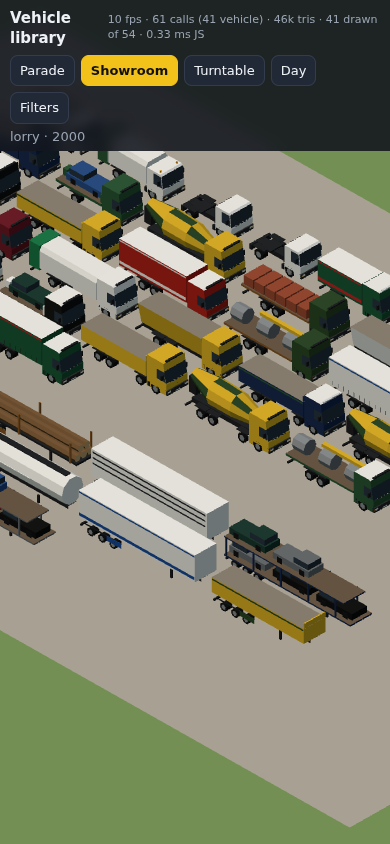 Showroom: lorries and trailers, 2000 |
| 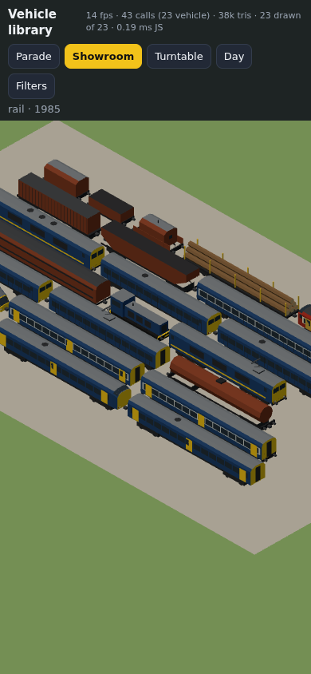 Showroom: rail, 1985 | 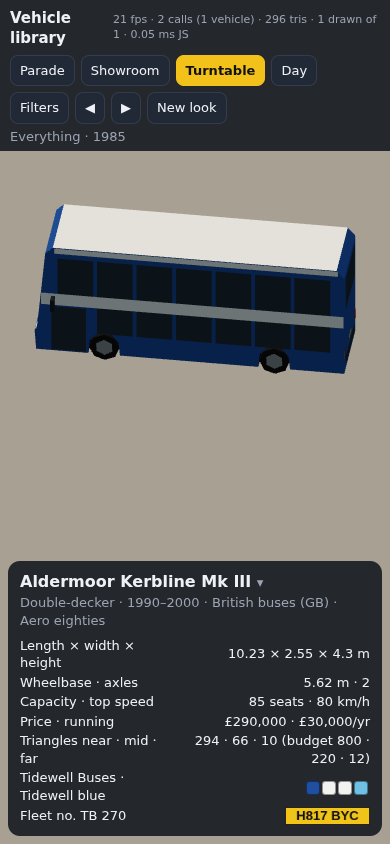 Turntable with its spec card | 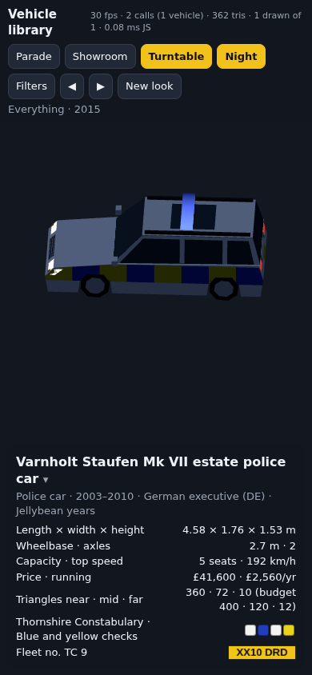 Police estate at night, beacons flashing |
| 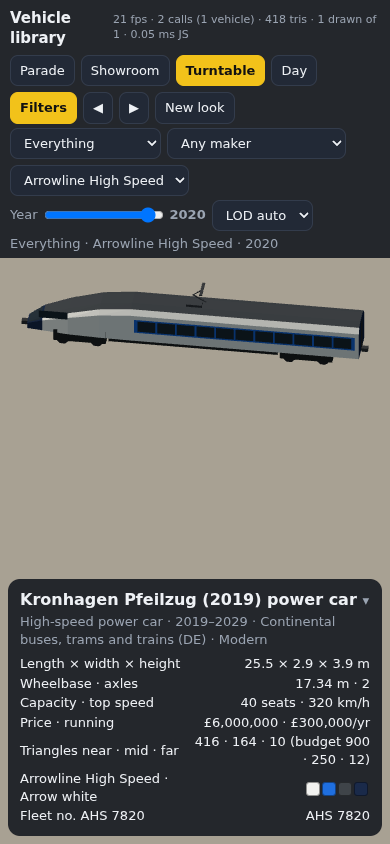 Filters open: a 2019 high-speed power car in Arrowline white | 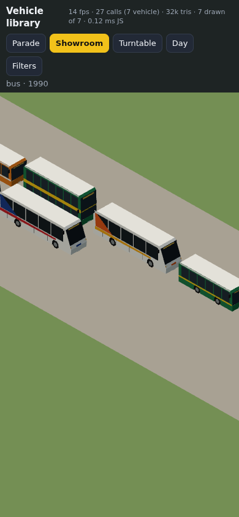 Showroom: buses of 1990 | |

Close-ups (desktop-size sheets):

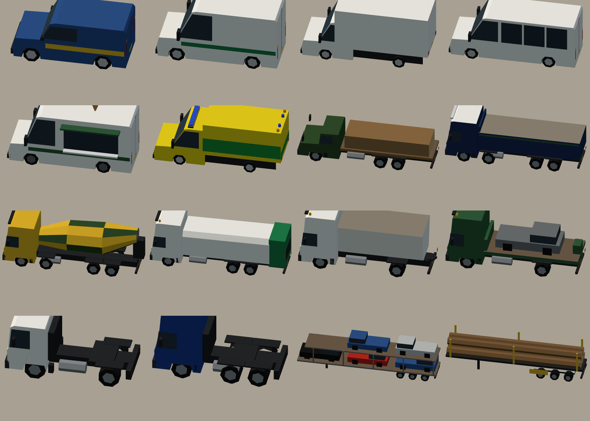
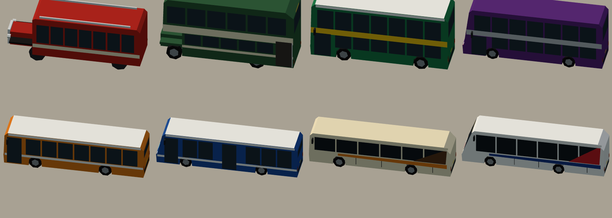
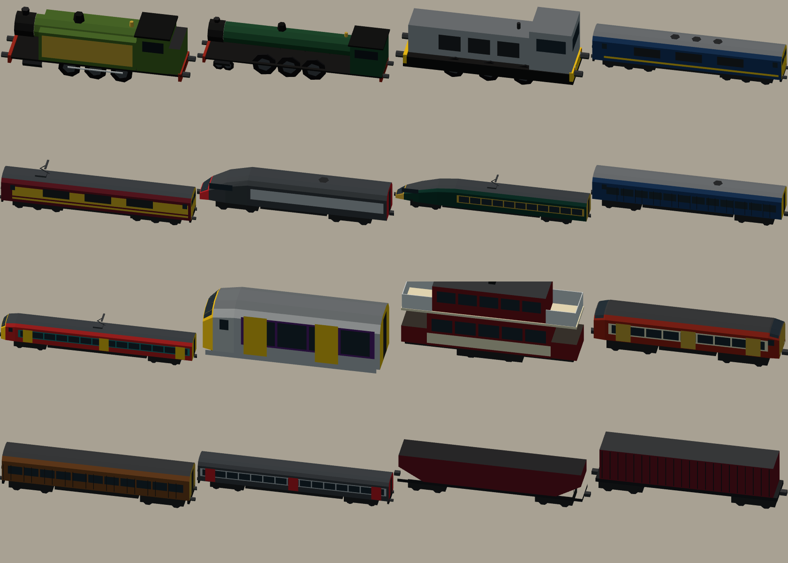
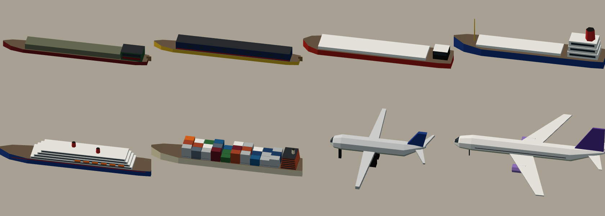
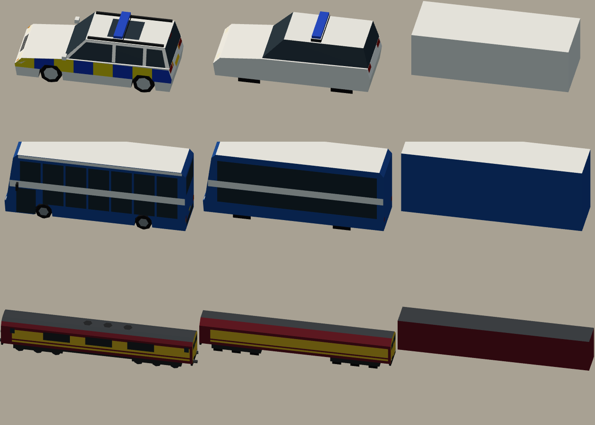

## Tests

`npx vitest run` passes: 87 tests, of which 27 are new. The new ones cover:

- **catalogue:** size and coverage, determinism, unique ids and names, and that brands, styles
  and sets all resolve;
- **hitches:** present on everything articulated;
- **operators:** well-formed liveries within their years, and a livery for every fleet style in
  every year;
- **dimensions:** within real-world limits by category, class sizes by era, axle layouts and
  wheelbase, and geometry fitting the stated size;
- **geometry:** within its budgets, cheaper at each level of detail, deterministic and finite,
  with lamps on every road vehicle, beacons on emergency vehicles and outward-facing faces;
- **names:** the name-safety check, and a check that the checker does catch near misses;
- **looks:** deterministic liveries and plates, UK plate formats by year, colour fashion by
  decade, service liveries on police cars, ambulances and cabs;
- **traffic:** the mix by area and period, artics joined at the hitch round a bend, train
  offsets, and something to buy in every era.

`npx tsc --noEmit` is clean.

## Known limits

- **Not wired in yet.** `traffic.ts` still draws boxes; the steps are in `docs/vehicles.md`.
- **No readable lettering.**
  - Plates and fleet numbers are text (and a canvas texture for close-ups), but on the models
    they're plain white or yellow quads.
  - There are no operator names, logos or cab-front names on the bodywork. An atlas would be the
    next step if the camera ever gets close enough to read them.
- **The far level is a box**, not an impostor. From the game's usual height that's right, but a
  long-lens view of a car park would look blocky.
- **Rigid bodies.**
  - Front wheels don't steer and nothing tilts or pitches beyond what the sim's matrix gives.
  - Pantographs don't rise, doors don't open.
  - Tram sections and bendy halves articulate only through `follow()` in the traffic layer.
- **Draw calls grow with variety.** They grow with the number of distinct models on screen, not
  the number of vehicles. The spawner keeps pools small; a mode that showed every model at once
  (like the showroom) costs one call per model.
- **Shadows.** Near and middle instances cast shadows. On weak phones, switch off shadow casting
  for the middle level with the existing adaptive-quality tiers.
- **Night glow is a trick.** Beams and pools are flat additive quads, not lights: they don't bend
  round corners or light the vehicles.
- **Some shapes are simple.**
  - Aircraft wings, ship superstructures and container stacks are blocky.
  - The half-cab's open platform and the ice-cream van's hatch are decals.
  - Early (pre-1920) road vehicles are thin on the ground: a few vintage lines and one bus.
- **The data is approximate.**
  - Colour popularity is loosely after UK surveys, not real data.
  - Prices and running costs are balanced game numbers in constant pounds.
  - The name check is lexical. It can't see a sound-alike or a semantic echo, so the names were
    also read by hand, and the list of real names can't be exhaustive.
- **Build and dev server.** `vehicles-demo.html` isn't in `vite.config.ts`'s build inputs,
  because that file is off limits here, so `npm run build` skips it. The dev server serves it.
