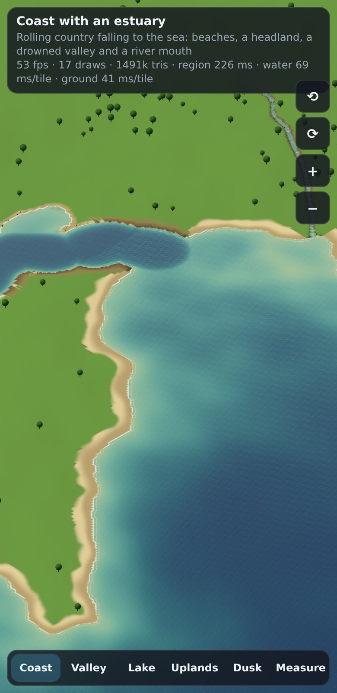
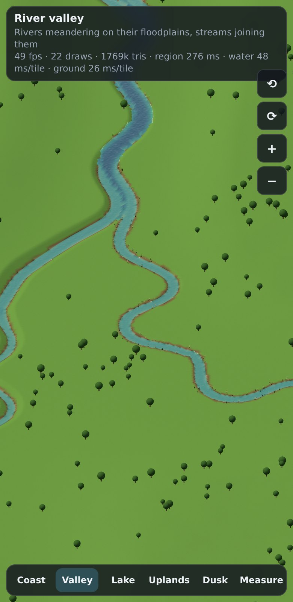
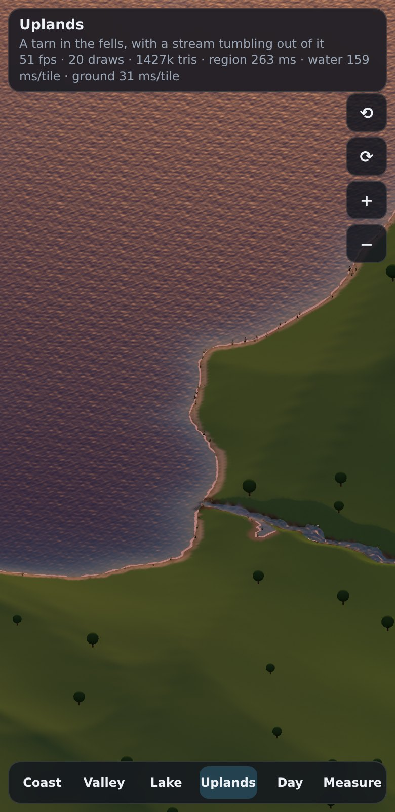
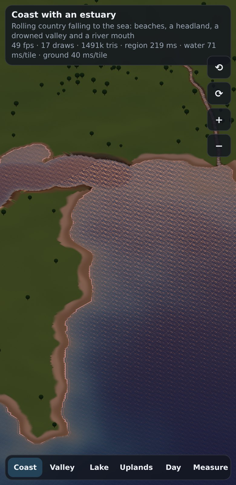
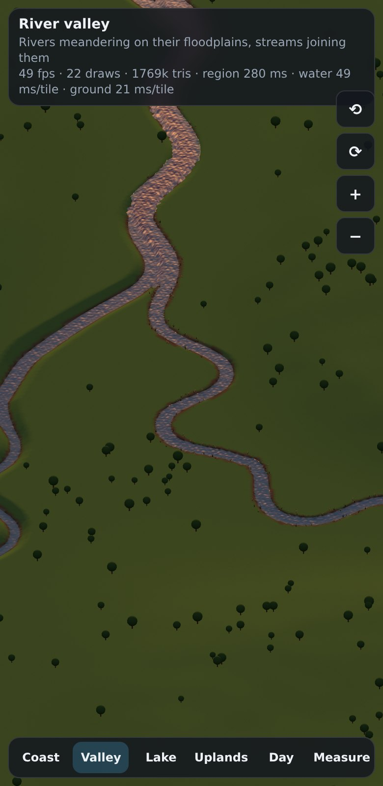
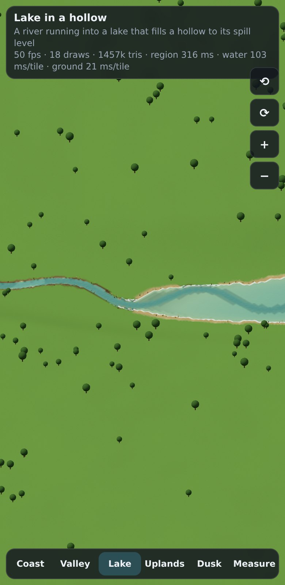
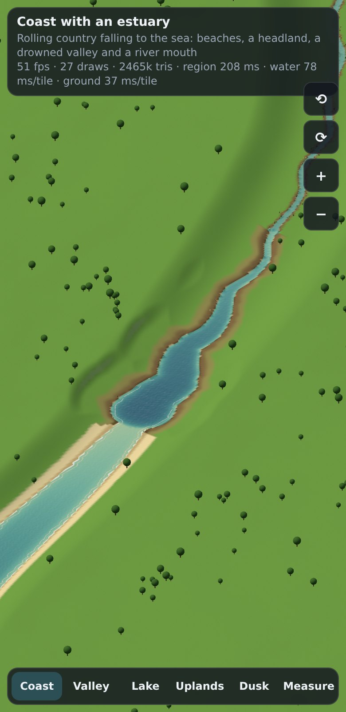
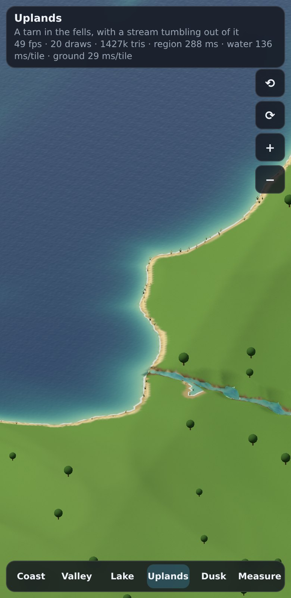
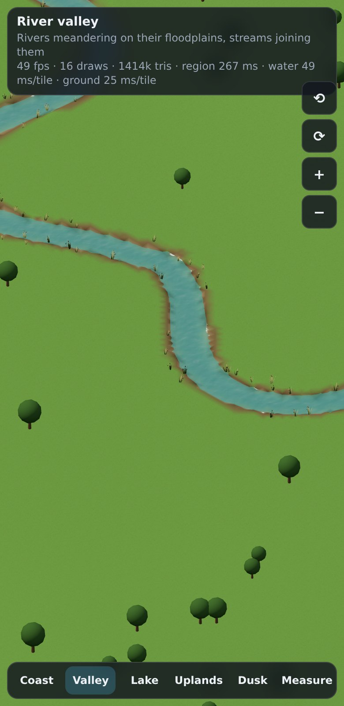
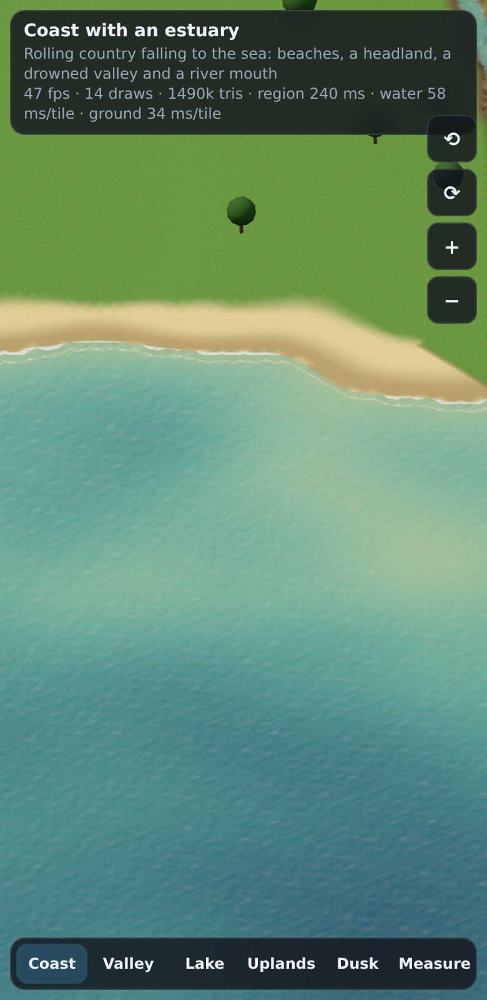

# Report: the water system

Branch `claude/water-system`, from `claude/terrain-lib`. The code is new files under
`src/proto/water/`, plus `water-demo.html`, `docs/water.md` (the API and integration plan) and
this report. The one change outside them is a few small additions to
`src/proto/terrain/procedural.ts`, marked "for the water system": the ground without the
terrain's own river channel (`sampleBase`, `baseAt`), the river field (`riverField`, and an
optional output of it from `sample`), and a guard so a lake's level never depends on which query
came first. Nothing the terrain already did changes. All 97 existing tests still pass, and there are 23 new ones.

Today's water was one perfect circle with a flat colour and a sand ring. Now every shoreline
comes from the ground, rivers run downhill in networks and widen as they go, and the water is
shaded by depth.

  

## What was built

| File | What it does |
|---|---|
| `flood.ts` | Priority-flood (fill levels, drainage tree, flood order), flow accumulation, connected labelling, an exact Euclidean distance transform. |
| `region.ts` | Hydrology for an 8 km region with 2 km of margin on a 32 m grid: the sea by connectivity, lakes in hollows too deep to breach, the river network with widths, depths, levels, meanders, estuaries, speeds, classes and bank reach. |
| `rivers.ts` | River reaches, the channel profile, a spatial hash of segments, capsule rasterising, line smoothing and resampling. |
| `water.ts` | `WaterSystem`: the queries (`isWater`, `depthAt`, `waterLevelAt`, `flowAt`, `distanceToShore`, `watercourseAt`, `crossings`…), 1 km tile rasters, and `WaterTerrain`, the ground with channels cut as a height source. |
| `types.ts` | Kinds, river classes, the navigation and clearance table `NAV`, and the parameters. |
| `coast.ts` | `Coastal`: a seaward fall for procedural terrain, so it has a real coast with rias and estuaries. |
| `surface.ts` | The water mesh per tile, shore colours for the ground, reed placements (plain arrays). |
| `material.ts` | The water shader, day and dusk lighting, the ripple texture, the ground patch, reeds (three.js). |
| `claims.ts` | Water outlines as land registry claims. |
| `hooks.ts` | Canals with locks, quays, navigation grids and ship routes, bridge height windows and pier bans. |
| `demo.ts`, `water-demo.html` | The phone-sized demo. |

## Decisions

### Hydrology on regions, detail on demand

- **Why regions.** Lakes and rivers are not local: whether a hollow holds water, and how big a
  river is, depend on ground kilometres away. So the non-local work (flooding, drainage,
  catchments) is done once per 8 km region on a 32 m grid, with 2 km of margin so catchments
  reaching in from outside are counted. A region takes about 150–210 ms, which is about
  3 ms for each of its 64 tiles.
- **Why detail on demand.** Everything finer than 32 m (the shoreline, the channel a river cuts,
  depth, flow) is a pure function of the point, worked out when asked. Tiles and point queries
  go through one function (`settle`), so a raster point and a point query agree exactly (a test
  checks it), and tiles meet their neighbours without seams.
- **Determinism.** Regions are keyed by index and built only from the source and the parameters;
  tiles only from regions and the source. The same tile comes out bit-identical whichever tile
  was asked for first (tested).

### Sea and lakes

- **The sea** is ground below sea level connected to open water: the region's edge, or a body of
  at least 2 km². An inland hollow below sea level isn't sea; it fills like any hollow.
- **Priority-flood** (Barnes, Lehman and Mulla 2014, with the plain queue for hollows) gives, in
  one pass, the level each cell's water would stand at, a drainage direction for every cell with
  no pits or loops (flats drain towards their outlet), and the flood order for accumulating
  catchments.
- **Fill or breach.** Filling every hollow to its spill level turned the procedural terrain's
  noise pits into hundreds of ponds, and every dip along a valley floor into a ribbon lake. A
  hollow now becomes a lake only if it is deeper than `4 m + 1.2·√(catchment km²)` and bigger than
  0.1 km². Shallower ones are breached: the river through them keeps its level falling and cuts
  through the sill, as a real river erodes one. Big rivers breach deeper dips than brooks.
- **Shorelines at the fine scale** come from the ground: a point is in a lake if its ground is
  below the level and it is within a cell of the lake's grid cells. Over flats, the water must be
  a little deeper the further it is from those cells, so shorelines curve round instead of ending
  on cell edges. A lake stands 0.3 m below its spill point, and water under 8 cm deep doesn't
  count, so a lake doesn't spread a film over a flat floodplain.
- **The source's own water** (the procedural terrain's lakes, OpenStreetMap water later) is kept
  as it is. Those lakes are the terrain's, with its wobbly shores.

### Rivers

- **From the drainage.** A stream starts at 0.5 km² of catchment. Reaches run between sources,
  confluences, the sea and the region's edge, so the rivers join into networks. On real data
  that is all there is.
- **On the procedural terrain's valleys.** The terrain carves valleys along the zero lines of a
  noise field, but those lines don't run downhill, never join, and form loops. So before
  flooding, a 4 m trench is scored along them in the routing surface (not the ground). Drainage
  then follows the valleys where they fall, and leaves them where they don't. Points near a line
  are snapped onto it by Newton steps on the field. In the rolling preset, 89% of river
  length (over 5 km² of catchment) is within 90 m of a terrain river line.
- **The terrain's channel is undone** (`sampleBase` leaves the floodplain at the valley floor),
  and the water system cuts its own, which widens downstream.
- **Width and depth** follow hydraulic geometry (Leopold and Maddock): width `3.2·A^0.5`, depth
  `0.45·A^0.4` (A in km²), at least 5 m by 0.5 m so a stream shows on a 4 m raster. That's scaled
  up from nature, so rivers read at the game's scale: 14 m at 20 km², 25 m at 60 km².
- **Levels.** The surface is a running minimum of the ground along the line, less a freeboard,
  held at or above any lake it runs through and the sea. That is a staircase (level, then a
  sudden drop), so it is smoothed over ±32 m and held under the ground again. Tributaries' tails
  are lowered (at most 5%) onto the main river's level at confluences.
- **Meanders** use sine-generated curves (Langbein and Leopold): the direction off the valley's
  line swings as ω·sin(2πs/M), with M about 11 widths. This is walked in the frame of the
  smoothed line, so the river also follows the valley's own bends. ω is limited by the room on
  the valley floor and switched off where the valley falls steeply. It fades to zero at both
  ends so reaches still meet, and a gentle pull back to the line stops it wandering off. A plain
  sideways sine only reached a sinuosity of 1.3; this reaches 1.8 (over 600 m stretches).
- **Where the drainage leaves a river line**, or there is none, the grid path is a staircase. It
  is relaxed between the held points and given a smaller noise meander, so it doesn't run in
  grid-straight lines.
- **Channels.** A flat-bottomed trough (1 − q⁴) with banks at 0.6 that rise until they meet the
  ground, then ease back into it over the outer part of their reach. Where a gentle bank can't
  reach the ground within 44 m, it is steepened until it does, so the cut never ends in a scarp.
  The reach is smoothed along the river so the cut's outline doesn't scallop.
- **Rivers run on through lakes and the sea.** Wherever the lake or sea is really there, its
  level is at least the river's and wins. Wherever the grid says "lake" but the ground doesn't,
  the river still shows. Its channel shows through a shallow lake or estuary as a darker line,
  like a real delta channel.
- **Flow** is Manning's formula on the surface slope over ±50 m, clamped to 0.15–2.5 m/s,
  fastest mid-stream and slowing to a third at the banks.
- **Estuaries.** Rivers of at least 4 km² reaching the sea are tidal up to where the valley floor
  rises 3 m above the sea. They widen towards the mouth (up to seven river widths, 420 m at
  most), but only over land within 2 m of the sea, deepen by up to 4 m, and have mudflat banks
  (0.2) easing back to a river's banks at the head of the tide.

### Classes, navigation and clearance

`NAV` (in `types.ts`) holds, per class, the headroom above the design (flood) level, the draught,
the share of the width kept clear of piers, and the freeboard of the design level over the normal
one. The numbers follow UK practice: a stream's culvert or footbridge; 2.5 m for a river; 4.5 m
and 1.8 m draught for a navigable river (the Thames above Teddington); 2.7 m and 1.2 m for a
broad canal; 18 m for an estuary that keeps a port open; 30 m for the sea. A river is navigable
at 25 m wide and about 1.8 m deep.

`crossings` walks a line and reports each body it crosses: where it's wet, the channel, the
normal and design levels, and the lowest soffit allowed. `navLimits` turns that into grade.ts
`Limit`s for the height solver, and `pierBans` into stretches the bridges library must keep
piers out of.

### Drawing

- **One mesh per tile** at the water level, over every 4 m cell with a wet corner. The dry
  corners sit just under their ground, so the ground mesh (drawn first) cuts the exact
  waterline, and water never shows over land that is lower than a river beside it. Corners on a
  narrow stream's line keep the stream's level, so a stream that slips between raster points
  still shows.
- **Open water** (deep, still, 16 m or more from any shore) is drawn in 8×8-cell fans with no
  T-junctions: a quarter of the triangles.
- **The shader** reads depth, shore distance, flow and kind from the vertex, so there is no depth
  texture and no extra pass:
  - colour: turquoise shallows over the bed, darkening with depth (`1 − e^(−d/2.4)`), the column
    more opaque as it deepens, so the bed shows through the shallows;
  - ripples: two scales of a tileable normal texture, each read at two phases of a 4 s cycle and
    crossfaded, so they scroll along the current at any speed without stretching;
  - foam at the waterline (by shore distance, so a shallow flat has none), in lines washing in on
    the sea, and in fast water;
  - a fresnel sky reflection, warmer towards the sun, and a sun glint whose sharpness changes
    with the time of day.

  It does four texture reads per pixel.
- **The ground by the water** gets vertex colours (RGBA, laid over the grass by alpha with a
  small patch to the ground's own material):
  - sand beaches on gentle sea shores and shingle on steep ones, with wet sand at the waterline;
  - a narrow sand or shingle strand round lakes;
  - muddy river banks;
  - mudflats and salt marsh on estuaries;
  - the bed under the water: sand and silt in lakes and the sea, gravel in rivers, darker with
    depth.

  The band edges wobble so they don't follow the raster.
- **Reeds** are one instanced mesh per tile: tufts of blades that sway with height, along lake,
  river, canal and estuary edges, in clumps, never on steep banks or the open sea.
- **So each tile is two draw calls** for its water: the water mesh and the reeds.
- **Day and dusk** are `WaterLight` presets (sun, sky, the light on the water column, colours,
  reflection strength, glint).
  - At dusk, mixing an orange horizon and a violet zenith in the reflection washed the water out
    to mauve. So dusk water leans on its own dark body colour and a cool skylight, with warm
    glints and foam.
  - The dusk sun sits low ahead of the default camera, so its glittering path shows in the water.
    With the sun off to one side, the reflection never reaches the view from an isometric
    camera.

### Land claims

The claims are marching squares on the signed shore distance, so outlines are smooth and can be
set a margin beyond the waterline.

- They are cut into 200 m blocks, which keeps each claim small for the registry's spatial hash.
- Islands are joined to their outline by a zero-width slit, making one simple polygon. The
  registry's even-odd point-in-polygon and edge tests work on it unchanged.
- Rings are simplified to 0.6 m before bridging, so the slit's two sides stay exactly on top of
  each other.

### Hooks

- **Canals** keep to the contours: no embankments. A pound stays level while the ground stays
  between 0.4 m and 6 m above it. Where the ground falls away or climbs, a lock steps it to the
  level the next 150 m wants, or a flight of locks if that is more than the 3.5 m a lock can rise.
  A canal joins the water system as still water of class `canal`.
- **Quays** are found where there is 4 m of water within 20 m of a dry waterline, and land no
  steeper than 6% for 50 m behind it. They are chained along the shore into runs of at least
  60 m.
- **Ship routes** use A* over a grid of water deep enough for the boat (with a margin under the
  keel) and away from the shore, with no cutting corners across land. The result is then pulled
  straight wherever the water allows.

## Tests

`npx vitest run`: 18 files, 120 tests, all passing (23 new, 97 existing).
`npx tsc --noEmit` is clean.

**Grid hydrology (2 tests):**
- A hollow fills to its notch, and every cell drains to an outlet without loops and downhill.
- Catchments add up.
- Labelling and the distance transform agree with brute force.

**Rivers from accumulation alone (3 tests), on a valley with a side valley:**
- The river follows the valley's line.
- There is a confluence.
- The surface never climbs, catchment and width grow downstream, and flow runs downhill.
- In the channel, the queries agree with the reach: water, kind, depth, level, flow along the
  reach, and the watercourse's width and clearance.
- Well away from the river it is dry, with the distance to the shore.
- A line across the river gives one crossing, with the right span, channel and soffit.

**Sea and lakes (3 tests):**
- The sea floods exactly the ground below sea level, with the coastline where the ground crosses
  it. An inland pit below sea level is a lake at its rim, not the sea.
- A bowl in a tilted plateau fills as one lake with a level surface, dry beyond its rim.
- A river reaching the sea gets an estuary at sea level that widens to its mouth, with the
  estuary's clearance.

**Procedural terrain (4 tests):**
- Rivers keep to the terrain's valleys.
- Tiles are identical whatever order they're built in.
- Raster points match point queries.
- Neighbouring tiles share their edge exactly.
- Lakes are not circles: every lake fills less than 80% of the circle through its farthest point.

**Claims (3 tests):**
- Contours give an outer ring and a hole, oppositely oriented.
- Claims cover the water and nothing else (under 0.2% of sample points wrong, away from the
  waterline).
- Through the land registry, a plot in a lake is refused and one on land is free. Every claim
  fits its block.
- A lake with an island makes the island a hole. A 10 m buffer reaches past the shore and into
  the island.

**Hooks (5 tests):**
- A canal up a hill with a hump has enough locks, each within its rise, levels never above the
  ground, and pounds tiling the canal.
- The canal joins the water system as still, 1.8 m deep canal water with the canal's
  navigation rules.
- Quays are found along a harbour wall facing the sea, and not on a beach.
- A ship is routed round an island over deep enough water, and refused onto land.
- Crossings become height windows (flood level everywhere, headroom over the channel) and pier
  bans, and are found at the right distance along a bent line.

**Drawing (2 tests):**
- The water mesh faces up, sits at sea level, is drawn in fans offshore (under half the
  triangles), and is null for dry ground.
- Shore colours stay in range, colour the bed and nothing 40 m inland.
- Reeds stand by lake and river edges, never on the sea, and are deterministic.

**Benchmark (1 test):** prints the timings below.

## Timings

### Generation

Node 22, 4-core Xeon at 2.1 GHz, medians. `bench.test.ts` prints them.

| | Rolling (seed 7) | Upland (seed 7) | Coast (`Coastal`, seed 11) |
|---|---|---|---|
| Region: 8 km, 12 km of ground with its margins (once per 64 tiles) | 174–203 ms | 196–208 ms | 151–165 ms |
| **Tile water rasters, ground seen before** | **17–20 ms** | **17–20 ms** | **30–31 ms** |
| Tile water rasters, new ground (the terrain's lattice built too) | 28–29 ms | 29–35 ms | 42–43 ms |
| The first tile straight after its region (pays for the region's garbage) | 37–66 ms | 38–56 ms | 45–49 ms |
| Water mesh | 9.1 ms (2,161 vertices) | 2.7 ms (8,242 vertices) | 2.5 ms (18,530 vertices, 35,188 triangles) |
| Reeds | 0.8 ms (52 tufts) | 0.8 ms (96) | 0.9 ms (220) |
| Land claims | 5.0 ms | 5.7 ms | 2.9 ms |
| Shore colours for a 257² ground mesh | 1.5 ms | 4.8 ms | 5.9 ms |
| The ground with channels cut, 257² (the terrain alone, cold) | 5.0 ms (15.4) | 4.2 ms (11.6) | 12.2 ms (13.6) |

Point queries: `probe` (which answers `isWater`, `depthAt`, `waterLevelAt` and `flowAt`) takes
0.43–0.83 µs, `groundAt` 0.35 µs, and `distanceToShore` 0.35–0.7 µs. The coast is the slowest
because it has the most water and `Coastal` works out its fall with noise at every point.

- **A 1 km tile's water takes 17–31 ms** once its region exists and the ground has been
  sampled before, and **28–43 ms for ground nobody has asked about**. About 15 ms of the
  difference is the procedural terrain building its own lattice for that ground, which the ground
  mesh needs anyway.
- Both are inside the 50 ms target, comfortably on the rolling and upland presets.
- The region comes on top, once per 8 km: 150–210 ms, which is about 3 ms a tile.
- The first tile built straight after a region can take up to 66 ms. That's the collector
  clearing the region's working arrays mid-tile. In a worker, build the region, yield, then
  build tiles.
- In the demo (the same code in Chromium, with SwiftShader competing for the CPU), the stats line
  shows 48–140 ms a tile. Its fps counter means nothing in headless software rendering.

### Rendering

Measured in the demo with "Measure" (`?bench=1`): headless Chromium with SwiftShader (software
rendering on the CPU), a 390 × 800 viewport. Each frame is finished with a one-pixel read-back
before the clock stops, and SwiftShader's GPU timer query agrees to within a few percent.

| Place | Without water | With water | The water (GPU timer) | Full screen: water / ground material |
|---|---|---|---|---|
| Coast (open sea) | 528 ms | 634 ms | 106 ms (106) | 21.0 / 14.8 ms (1.41×) |
| River valley | 588 ms | 598 ms | 9 ms (7) | 21.4 / 15.8 ms (1.36×) |
| Lake | 504 ms | 515 ms | 11 ms (11) | 21.4 / 17.4 ms (1.23×) |
| Uplands (a big tarn) | 444 ms | 497 ms | 53 ms (50) | 21.5 / 15.6 ms (1.38×) |

At 780 × 1600 (a phone at 2×) the same runs give 160 ms for the coast's water, 18 for the
valley, 40 for the lake and 91 for the uplands, and 1.22–1.39× for the water against the ground
filling the screen. Draw calls per scene are 13–31 (2–6 tiles).

A software renderer's absolute times say little about a phone. They are set almost entirely by
triangle count, and these scenes are 1.4–2.5 million triangles, nearly all of them ground. What carries over is the cost per
pixel. **Filling the whole screen, the water shader costs 1.2–1.4× the game's own ground
material (Lambert with a texture)** at 390 × 800, and it does four texture reads. Anything that
can draw the ground can draw the water. Measure on a phone (open `/water-demo.html` on the dev
server with `--host`, press Measure): with a GPU timer query the demo reports the GPU time too.

## Screenshots

All of these are from the demo at a phone's resolution (390 × 800 at 2×), with the game's
isometric camera.

| | |
|---|---|
|  Coast, day: a headland, beaches, a drowned valley, depth shading out to sea |  The same at dusk |
|  River valley: meanders, confluences, muddy banks |  The same at dusk |
|  A river running into a lake in a hollow, its channel visible through the shallows |  An estuary widening into a drowned valley |
|  Uplands: a tarn and the stream tumbling out of it |  The same at dusk |
|  A river close up: foam at the banks, reeds, the bed through the water |  A beach close up: wet sand, foam washing in |

## Known limits

**Hydrology**
- **Region seams.** Each region sees only its own 12 km. A river crossing from one 8 km region
  into the next can change width at the seam (its catchment beyond the margin isn't counted),
  and where the drainage differs slightly in the two margins, its line can step by a few metres
  there. A coarse pass over a much larger area would fix both. The demo views are well inside
  one region.
- **A cold region takes about 150–210 ms.** That is fine once per 8 km in a worker, but not on
  the main thread mid-frame.
- **The procedural terrain's valleys aren't hydrological.** Where drainage leaves a terrain river
  line, the terrain's valley there is left dry (its channel is undone, so it's just a valley). The
  river may cross between two valleys over a low saddle. On a steep ria, the estuary's cut
  outline is still a little scalloped.
- **Lakes on the procedural terrain** are either the terrain's own (at its level, with its wobbly
  shores) or filled hollows (at their spill level). Where the two overlap, the higher wins.
- **No erosion, deposition or floodplains that flood.** Levels are "normal"; the design level is
  a fixed freeboard per class.
- **No tides.** Estuaries are at sea level.

**Rivers**
- The minimum channel is 5 m by 0.5 m, so the smallest streams are wider than nature at this
  scale. On a ground mesh coarser than about 2.5 m, a stream can still break into pools.
- Width jumps at a confluence, as the catchment does.
- Surfaces are smoothed but can still fall steeply where the ground does, with no waterfalls as
  such.

**Drawing**
- Depth comes from the vertex (every 4 m), so the colour gradient across a narrow river is coarse.
  Proper per-pixel depth would need the depth buffer as a texture.
- There are no reflections of the land, no refraction and no caustics.
- The sea's washing foam is lines of shore distance, not waves.
- The reeds are the only instanced dressing. There are no rocks on shingle and no lily pads.
- Shore colours and reeds are placed by the 4 m raster.

**Claims and hooks**
- Claims are per tile and block, so one lake is several claims.
- `land.ts` has no `'water'` owner yet: it's a one-word change, and `claimWater` takes the
  owner to use.
- Canals can't cross valleys on embankments or aqueducts (they keep to the contours). Locks are
  data only: no chamber geometry.
- Quays are candidate sites only. Routes are 2D, with no current, tide or bridge headroom along
  them yet.

**Not integrated.** Nothing in the live game uses any of this yet. The step-by-step plan is in
`docs/water.md`.
