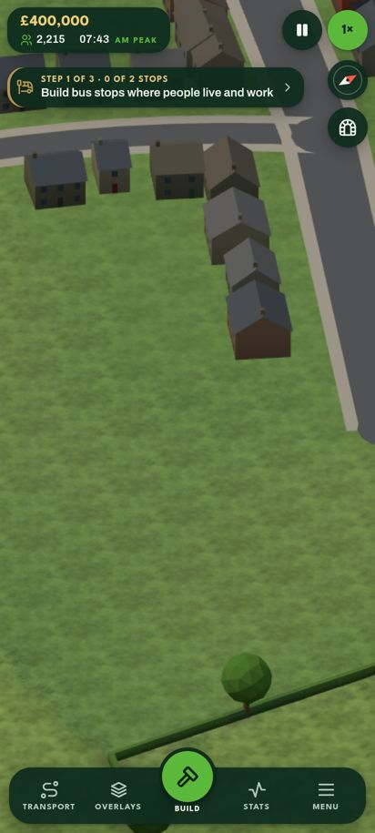
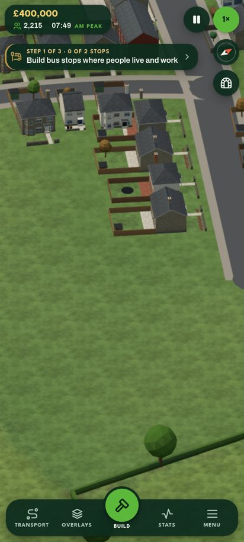
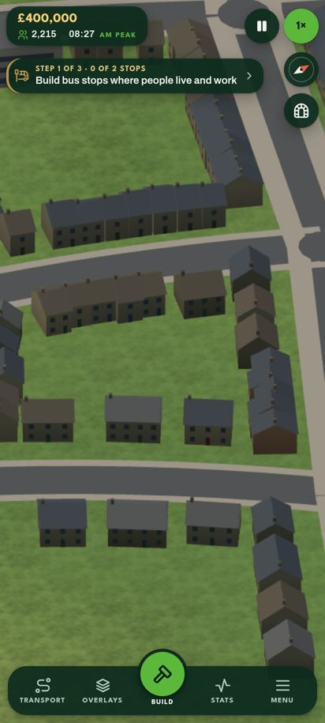
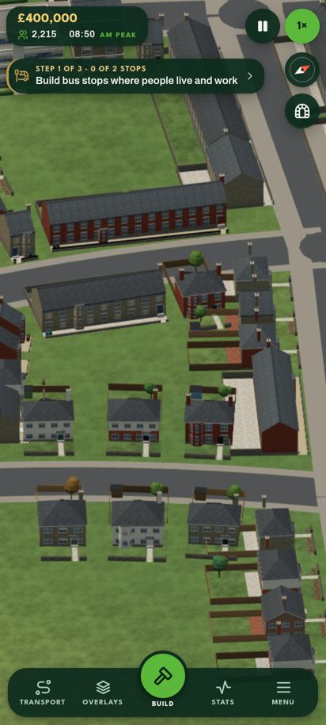

# Buildings that fit their place (`vernacular.ts`, `buildgen.ts`)

On a generated map every house, terrace, shop and village building is built in the tradition of the
place it stands in, and of the age of its street. `?vern=` forces a tradition.

## Where the tradition comes from

`vernacular.ts` is pure (no three.js, no DOM) and deterministic from the map's seed, so a worker
building a tile gets the same answer as the page.

- **Province.** A map lies in one part of Britain, picked from its seed and relief: lowland maps in
  the south-east or the Midlands, mountain maps in the north, west or Scotland.
- **Rock.** Each settlement takes the rock under its centre (a whole village shares one stone). The
  terrain's geology query goes in through `setGeology((x, z) => rock)`; until the terrain session's
  lands, a smooth seeded field about 2.5 km across draws from the province's rocks.
- **Tradition.** The rock and province give the tradition:

| Rock | Tradition | Walls and roofs |
|---|---|---|
| limestone | Cotswold | honey rubble and ashlar, stone-mullioned windows, steep stone-slate roofs, coped gables |
| gritstone (granite in the north) | Pennine | dark gritstone, mullions, low stone-flag roofs, weavers' cottages |
| slate | Lakeland / Wales | whitewash or grey slate stone, slate roofs, round chimneys |
| granite (south and west) | Cornish | whitewash and granite, slate, now and then thatch, Cornish hedges |
| granite, sandstone (Scotland) | Scottish | harling in white, ochre, pink and grey with stone margins, crow-stepped gables, sandstone tenements in towns |
| chalk | Downland flint | flint with brick dressings and quoins, clay tile, thatch, flint garden walls, round-towered churches |
| clay (Midlands) | Midland brick | red brick and clay tile, some timber frame, brick garden walls |
| clay, sandstone (south-east) | Wealden | tile hanging over brick, white and black weatherboard, timber frame, hipped tile roofs |
| sandstone (west) | Marches | black-and-white timber frame, jettied, red sandstone |

- **Climate.** The other styles have one climate each: `arctic` builds Nordic painted timber (falu
  red, ochre, white, pale blues and greens) under snow, with white corner boards and bargeboards,
  gabled wooden town houses and a white church with a black steeple; `desert` builds earth-rendered,
  flat-roofed villages (parapets, vigas, roof terraces, water tanks, the odd wind tower) and
  whitewashed Mediterranean towns (shutters, iron balconies, terracotta, bell towers).
- **Era.** How far a plot is from its settlement's centre sets its era: a medieval core, then
  Georgian, Victorian, 1930s, post-war and modern rings (a city's twice as wide; a village's old
  street is its whole core). The era picks the form (cottage, polite Georgian house, villa, semi,
  post-war house, new build) and the walls: local stone before the railways, Victorian slate
  everywhere, reconstituted stone on Cotswold new builds.

## What follows it

Houses, terraces, shops and the village's church, pub, hall, surgery, corner shop and station
(`vBuild`, `vCivic`); flats abroad (British towns keep the generic blocks); factories take the local
walling; garden walls and fences, front yards and garden trees (conifers in the North, cypresses and
olives in the south, palms in the desert). Offices, towers, schools, petrol stations and sheds are the
same everywhere, as they are.

## Cost

The regional walls reuse the facade and roof materials by colour, and a tradition uses fewer
distinct walls than the old mix, so chunks merge into fewer draw calls. Region seed 7 at the same
views (412 x 915): temperate 487 → 427 and 643 → 512 calls, triangles +1%; arctic 323 → 270,
395 → 372, 475 → 408 calls. Load time unchanged within noise.

## Finish

Every building (not only the regional ones) has a little more depth: fascia boards, gutters and
verge boards on pitched roofs, ridge tiles, a plinth where the walls meet the ground, glass with a
reveal's shadow and a glint of sky, sills with shadows under them, and ambient occlusion from
vertex colours (walls darker over their first couple of metres, roofs towards the eaves). Front doors are let into the wall: the wall is cut round the opening (each door takes the place of
the ground-floor window in its bay), lined with painted reveals, with the door set back behind a
frame and a fanlight. Garden walls are textured in the local walling, hedges leafy, roofs
weathered, and garden trees fork into layered crowns. None of
it adds a material; it adds a few dozen triangles a house.

**On a slope** (`setGround`, `standLevel`): the drape lifts every vertex by the ground under it, which
shears a building on a hill (floors, windows and roof all tilt). Given the ground's height, a
building stands level at the highest ground under its walls instead: everything from 15 cm up is
lifted level, while wall feet, the plinth's foot, paving and the yard follow the ground. The plinth
then fills the downhill side like a basement course. The ground drop under a building is capped at
3 m (a steeper plot digs into the hill instead). Four looks at the plot's corners skip the work on
level ground, which is where places mostly stand, so loading costs the same.

## Scenery up close (`game/dress.ts`)

On the 50 km map only the live play area's places are the game's own. The others, and those in the
live area that aren't live yet, are drawn by world50's tiles (`worldmap/tilegen.ts`) as plain boxes,
which is right from afar but meant a town there stayed boxes however close you zoomed. Now, once the
view is below 700 m, the near tiles close under it are **dressed**:
- The same buildings, from the plan's own `settlementScene`, are built with buildgen: walls in the
  place's tradition, windows, doors, roofs, chimneys, gardens with fences and trees.
- Terraces along a street side become one row, and runs of shops a parade.
- The work is metered at 5 ms a frame, or 20% of a slow frame up to 30 ms. A 1 km town tile takes
  a few seconds on a phone.
- Residential and main streets get trees on their verges, a seeded 13–21 m apart with gaps, clear of junctions and buildings (two instanced draw calls a tile).
- Each tile is merged into one mesh per material, and only then are the tile's plain buildings
  (their own `bld` mesh, near detail only) hidden, in the same frame.
- Dressed tiles more than 2.5 km from the view are let go.

The building style resolver sees every place on the map, so a far town takes its own stone.

| A town 7 km out, before | after |
|---|---|
|  |  |
| A city, before | after |
|  |  |

## Seeing it

- `/buildings-demo.html?vern=cotswold`: one tradition, a street per era plus the civic buildings;
  the arrows step through the traditions.
- `?map=region&seed=7&vern=scots` forces a tradition on a region.
- `vernacular.test.ts` checks determinism, one tradition per settlement, every British tradition
  turning up across forty seeds, climates, eras and the geology hook.
